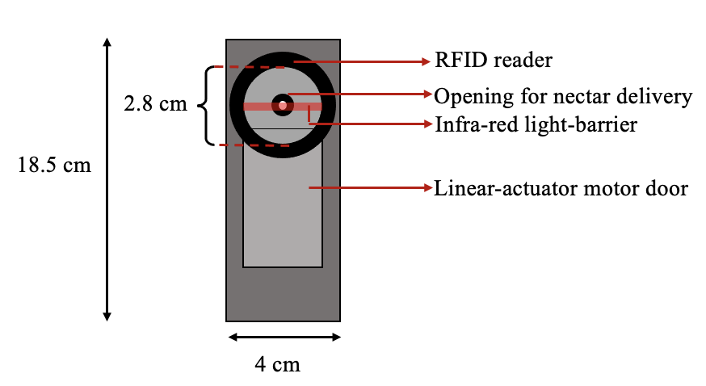

```{css style settings, echo = FALSE}
blockquote {
    margin: 0 0 20px;
    font-size: 14px;
}
```
---

```{r Reading-in-the-packages, include = FALSE}
# clearing the environment
rm(list = ls())

# installing the required packages if needed and loading them
if (!require(rmarkdown)) {
  install.packages("rmarkdown")
}
if (!require(reshape2)) {
  install.packages("reshape2")
}
if (!require(tufte)) {
  install.packages("tufte")
}
if (!require(rticles)) {
  install.packages("rticles")
}
if (!require(knitr)) {
  install.packages("knitr")
}
if (!require(shiny)) {
  install.packages("shiny")
}
if (!require(scales)) {
  install.packages("scales")
}
if (!require(broom)) {
  install.packages("broom")
}
if (!require(tidyverse)) {
  install.packages("tidyverse")
}
if (!require(gluedown)) {
  install.packages("gluedown")
}
if (!require(glue)) {
  install.packages("glue")
}
if (!require(ggthemes)) {
  install.packages("ggthemes")
}
if (!require(lubridate)) {
  install.packages("lubridate")
}
if (!require(ggpubr)) {
  install.packages("ggpubr")
}
if (!require(gridExtra)) {
  install.packages("gridExtra")
}
if (!require(Hmisc)) {
  install.packages("Hmisc")
}
if (!require(brms)) {
  install.packages("brms")
}
if (!require(bayesplot)) {
  install.packages("bayesplot")
}
if (!require(bayestestR)) {
  install.packages("bayestestR")
}
```

```{r setup, include=FALSE}
knitr::opts_chunk$set(
  echo = FALSE, 
  message = FALSE, 
  warning = FALSE, 
  fig.align = "center", 
  fig.pos = "H")
```

```{r Themes, include = FALSE}

# creating two themes for all the plots

theme_sine <- function() {
  theme_pubr() +
    theme(
      axis.text = element_text(size = 8, family = "Times"),
      axis.title = element_text(size = 10, family = "Times"),
      strip.text.x = element_text(size = 10, family = "Times"),
      strip.text.y = element_text(size = 10, family = "Times"),
      legend.text = element_text(size = 10, family = "Times"),
      legend.title = element_text(size = 12, face = "bold", family = "Times")
    )
}

theme_sine2 <- function() {
  theme_bw() +
    theme(
      axis.text = element_text(size = 8, family = "Times"),
      axis.title = element_text(size = 10, family = "Times"),
      strip.text.x = element_text(size = 10, family = "Times"),
      strip.text.y = element_text(size = 10, family = "Times"),
      legend.text = element_text(size = 10, family = "Times"),
      legend.title = element_text(size = 12, face = "bold", family = "Times")
    )
}
```

# Abstract

In this chapter I investigated how captive nectar-feeding bats of the species *Glossophaga mutica* allocate their effort between variable food sources whose relative profitability changed continuously. The bats were given a choice between an option whose reward output always had the same volume, and an option whose output fluctuated as a sinusoidal function of time. At its peak, the fluctuating output was higher than the fixed; at its trough, the fluctuating output was lower than the fixed. The bats were faced with four different rates of change of the fluctuating option and two levels of environmental richness as two possible volumes of the fixed option. I found that the bats tracked the profitable option under all experimental conditions by making a higher proportion of their visits to the reward that was currently better. They appear to alter their proportional visit allocation by increasing their foraging activity when their environment is in its leanest state, rather than waiting for the environment to enter a richer state again. The animals showed no evidence of anticipating better rewards in the near future. Consistent with the results of Chapter Two, the bats mostly allocate their choice behavior in accordance with the recent history of reinforcement they experienced at the available options. 

# Introduction

Animals forage for food in a world where the availability of resources varies constantly in both location and temporal availability. The experiments in chapter two showed that when faced with rewards that varied in their spatial location, nectar-feeding bats demonstrated a high degree of behavioral flexibility: they respond more swiftly with repeated experience of a changed location of a reward. In this chapter I explored the foraging behavior of the bats in an environment where sources of reward stayed fixed in their location but whose magnitude varied temporally and cyclically. The bats were faced with a choice between two options: one that yielded a fixed reward, and another whose magnitude varied as a sine function of time. By varying the rate of environmental change through the period of the sine function, and the richness of the environment through the size of the fixed reward, I explored how these aspects of the foraging environment influenced the bats’ choice behavior. 

Considering theoretically ideal foraging strategies when choosing between potential sources of food can be a good starting point to understand real foraging behaviors that are subject to physical and biological limitations. In many models of foraging behavior such as classic optimality theory and patch choice theory [@parker_optimality_1990], [@bartumeus_optimal_2009], [@schmid-hempel_stephens_1988], a basic premise is that a foraging animal’s behavior can be predicted by models that assume maximization of fitness, and, more specifically, that in many cases fitness is directly related to average net rate of energy gain over time. Rate of intake combines both the quantity of food as well as the time spent in obtaining it, as both of these should matter to a forager. As Stephens and Dunlap [@stephens_foraging_2017] put it: “… the hypothesis of rate maximization holds that natural selection favors behaviors that lead to high rates of food intake because animals that obtain food at a high rate will have more time and more resources to pursue other important activities.” This hypothesis derived from optimality theory can be falsified, distinct from optimality itself [@kacelink_starlings_1987]. 

Detecting and responding to changes in where and when food is available is an important aspect of foraging behavior. A variable or fluctuating resource might be poor now, but it may become much better in the future, such as a plant with inedible leaves that might produce sugar-rich fruits in a few days. Such a variable resource can be contrasted with, say, a stable resource that is always in the same rewarding state. A stable resource could be richer than the worst state of the variable alternative, but poorer than the best state of the variable alternative. To continue the example above, a plant with edible leaves with a low sugar-content would be better than a plant with completely inedible leaves but worse than the latter if it produces sugar-rich fruits. 
A perfectly rate-maximizing forager, foraging at a constant rate that tracks such environmental change, should allocate all its choices to the resource that currently offers the highest output compared to all the alternatives. This forager would be sensitive to how frequently the environment changes as well as how the alternatives compare to one another. A perfectly rate-maximizing forager that does not track environmental change would be sensitive only to the long-term average output of a resource. Such a non-tracking forager would disregard temporal fluctuations in which resource is currently the best alternative and would allocate all its choices to whichever resource has the highest long-term rate of energetic intake; it is only sensitive to the difference in the long-term average return of the available alternatives. 

Of course, real animals are neither perfect rate-maximizers nor perfect trackers of environmental change. Foraging animals can detect changes in reward magnitude or quality, but do not discriminate these properties perfectly. Several deviations from perfect discrimination are known. For instance, the precision of animals’ judgement of magnitude differences decreases with the magnitudes involved, a phenomenon known as Weber’s Law [@fechner_elemente_1860], [@kacelnik_risky_1998], [@augustin_empirical_2008], [@augustin_problem_2009], [@nachev_webers_2013]; they also show state- [@nonacs_state_2001], [@schuck-paim_state-dependent_2004] and context-dependent evaluation of reward options [@bateson_contextdependent_2003], [@vasconcelos_context-dependent_2013]; and must sort through sources of noise such as prey animals’ camouflage or escape attempts, and biotic environmental factors such as wind or water currents. As a consequence, animals frequently show partial preferences between alternative options instead of allocating 0 or 100% of their choices to the current best option. 

One influential model of choice behavior is the Matching Law, formally conceptualized by Herrnstein in 1961 [@herrnstein_law_1970] as: relative rates of responding or choice behavior are predicted by relative rates of reinforcement – 

$$\mathrm\displaystyle \frac{B_1}{B_1 + B_2} =\frac{R_1}{R_1 + R_2}$$

where: $B_1$ is the rate of responses to option 1; $B_2$ is the rate of responses to option 2; $R_1$ is the rate of reinforcement at option 1; $R_2$ is the rate of reinforcement at option 2. 
In this original formulation, the opposite was not true, namely rate of reinforcement was not proportional to rate of responding – these were concurrent variable interval schedules, and responding faster did not result in more reward. The critical result was that in spite of this, plotting the rate of responding at two alternatives against the rate of reward in those alternatives produces a line with a slope of 1. The Generalized Matching Equation suggested in 1974 (Baum 1974) to account for empirical deviations from the matching law. It adds two additional parameters that modulate allocation of behavior: bias and sensitivity to reinforcement. Bias is the preference of the animal for either alternative that cannot be explained by reinforcement alone: it is the Y-intercept of the line whose slope is determined by the s-parameter. The more sensitive to reinforcement an animal is, the more its choices prefer the alternative with a higher rate of reinforcement, so producing a line with a slope greater than 1. The modified equation is as follows:

$$\mathrm\displaystyle \log \frac {B_1}{B_2} = s\log \frac{R_1}{R_2} + \log b$$

Evidence for the matching law for the generalized matching law has been found in many species, including humans (see [@borrero_concurrent_2010] for a comprehensive review). A forager whose choices show a very high value of the s-parameter is one that shows an extreme preference for the better alternative, and in the most extreme possible case, is a pure rate-maximizer or ‘over-matcher’, showing an exclusive preference for the better alternative. Conversely, an animal with a very low value of the s-parameter is an ‘under-matcher’, whose choice behavior varies from proportional allocation in the direction of random choice. From the Matching Law perspective, a rate-maximizer is an extreme case of over-matching, and from the optimality perspective, a forager showing matching behavior is deviating from optimal behavior in the direction of random choice. 
Critically, the matching law applies to a situation where the foragers’ behavior did not determine the rate of reward, and the environment was in a steady state. Dynamic, rather than static scenarios, where resource properties change over time, are closer to the messy reality of real-world foraging. One simple but illuminating conceptual model of a dynamically changing environment was first proposed by Stephens [@stephens_economically_1987]. In this model a forager is faced with a variable option with two possible sub-types, i.e., states: a ‘bad’ and a ‘good’ one, and a stable alternative. The value of the stable option is better than the bad state of the variable option, but worse than its good state. The variable option changes probabilistically, i.e., the state of the variable option during an encounter will be the same in the next encounter with a certain fixed probability q. In order to know the state of the variable option, a forager must spend time and effort to sample it, and the model shows that in many circumstances it does not pay for a forager to sample. Sampling makes economic sense when the stable option and the variable option produce the same average returns in the long run; and when the variable option is more persistent (i.e. q is low), producing long runs of good and bad states. Some experimental studies have found evidence consistent with these predictions [@keasar_temporal_2013], [@shettleworth_tracking_1988], [@tamm_tracking_1987] see [@stephens_foraging_2007] for review), but no consistent effect of increasing the value of the variable option’s good state, which the model predicts should increase sampling. 

In a changing environment a forager must weigh recent experiences more heavily than past ones when the rate of change is high, because if state changes frequently older experience is not informative. A low rate of change makes averaging over the long-term more profitable. A prediction related to but distinct from this one is that high reliability of the information gained through sampling, i.e., high reliability of tracking, also means that present experiences should be weighted more than past. Reliability of the information gained through sampling of which alternative is the most profitable depends on how fast that information changes, but also on how discriminable the alternatives are. An environment where a slowly changing variable alternative is very similar in value to a completely stable alternative is one where tracking is not likely to lead to higher long-term rewards. 
In the experiments described in this chapter I took this line of thinking in a direction closer to the natural foraging environment of nectar-feeding bats by creating an environment that changed not probabilistically but predictably. I placed bats of the species *Glossophaga mutica* in an operant chamber with two sources of reward: a fixed source whose reward output was always the same volume; and a fluctuating source whose reward volume varied as a sine function of time. The experimental conditions varied two critical aspects of this environment – 

i) The rate of change of the environment: the period of the fluctuating option’s sine wave in volume had four possible values, ranging from 45 minutes to 6 hours. 

ii) The value of the stable alternative: the fixed option could yield one of two possible reward volumes, so creating two possible levels of environmental richness. 

I explored the correspondence between the bats’ choice behavior and the state of the environment, characterized by the following two properties: environmental richness and rate of change. I defined tracking behavior as the detection of and behavioral response to changes in the environment. The design of this experiment meant that the environment changed, not probabilistically, but according to a trend that was, in principle, predictable. This raised the interesting possibility that the bats might be able to predict the increase in the fluctuating reward volume when the sine function made its trend upwards. I calculated the proportion of visits to the fluctuating option made by the bats at each fluctuating volume and compared this proportion between the upward and downward trends of the volume. That is, I asked if the bats make a higher proportion of visits to a particular fluctuating volume when that volume was preceded by a recent history of larger volumes, or when that volume was preceded by a recent history of smaller volumes indicating that that larger volumes would be available in the near future. Was the bats’ behavior guided by recent reinforcement or could they anticipate future states of the world?
Glossophagine bats can discriminate between rewards based on their volumes [@tolch_psychometric_2007], [@nachev_psychophysics_2012]) and concentration [@nachev_webers_2013]. They also use their phenomenal spatial memory to remember and revisit rewarding locations [@thiele_hierarchical_2005], [@winter_foraging_2005], [@rose_learning_2016]. In experiments on discriminating between reward options, unless one of those options is entirely unrewarding, as in Chapter Two of this thesis, the bats do not show total or near-total absorption to one alternative. Instead, the bats probabilistically divide their choices between the alternatives based on how rewarding they are relative to each other. Based on these cognitive abilities and behavioral flexibilities, I dedicate this chapter to investigate the dynamics of bats’ allocation of effort between variable food sources. The protocol used in this chapter should serve to expose how allocation copes with varying temporal states, different mean richness, and the possibility of anticipating deterministic changes.


# Methods

## Subjects and housing

The experiment was done at Humboldt Universität between December 2019 and July 2020 in two stages. The two stages were carried out with two different sets of individual bats and were identical in design and procedure except for the reward volume of the fixed option (see **Experimental design** below).

Bats of the species *Glossophaga mutica* [@calahorra-oliart_cryptic_2021] from a captive colony at Humboldt Universität were used for the experiment. The colony was a breeding population housed at 18-24$^∘$C and 45-70% humidity on a 12-hour light-dark cycle (light phase: 0200 to 1400 CET; 0300 to 1500 CEST). In this colony every bat older than approximately a year (judged through the ossification of the finger joint - Brunet-Rossinni and Wilkinson 2009) had a permanent ID number, used here to distinguish the individuals. Some bats had previously been exposed to the experimental apparatus, and some bats were experimentally naive, but no bat had participated before in the experimental schedule used here. 16 animals completed the stage with the lean environment experimental condition: 11 females and 5 males. 18 animals completed the stage with the rich environment experiment: 10 females and 8 males (see **Supplementary material** for details).

## Experimental setup

*Reward*

The reward received by the bats during the experiment was also their main source of food. The reward was a 17 ± 0.2% by weight solution of sugar dissolved in water (prepared fresh every day or every other day), hereafter referred to as ‘nectar.’ The sugar consisted of a 1:1:1 mass-mixture of glucose, sucrose and fructose. The nectar was thus similar in composition and concentration to the nectar produced by wild chiropterophilous plants [@baker_sugar_1998].

*Experimental Apparatus*

The animals were placed in individual, adjacent cages (0.7 x 2.2 x 1.5 m) for the duration of the experiment. The experiment was carried out in batches of six bats at a time, and each individual progressed through the experiment independent of all the others. Each cage had an operant wall with two electronic reward-dispensing devices spaced approximately 30 cm apart, hereafter referred to as ‘flowers’ (Figures \@ref(fig:operant-wall), \@ref(fig:flower-cage-schematic), \@ref(fig:flower-parts)). Each flower had a circular opening with a door controlled by a linear-actuator motor that could move up and down. Just inside the opening was an infrared light barrier to detect visitation events. At the back of the flower was an opening through which nectar was supplied (Figure \@ref(fig:flower-parts)) through tubes. 

(ref:operant-wall) Photograph of an operant wall with its two flowers. Each bat was allowed exclusive access to one such wall

```{r, operant-wall, fig.cap = "(ref:operant-wall)", fig.width = 2, fig.height = 1}
p1 <- include_graphics("images/operant_wall.png")

p1
```

(ref:flower-cage-schematic) Schematic diagram of a cage and operant wall with flowers (not drawn to scale)

```{r, flower-cage-schematic, fig.cap = "(ref:flower-cage-schematic)", fig.width = 4, fig.height = 4}
p2 <- include_graphics("images/flower_cage_schematic.png")

p2
```

(ref:flower-parts) Diagram of a flower with its parts (not drawn to scale)

```{r, flower-parts, fig.cap = "(ref:flower-parts)", fig.width = 3, fig.height = 3}
p3 <- 

p3
```

The nectar tubes were connected to a syringe pump (Hamilton 25 mL glass syringe, Sigma Aldrich, Germany) in a branching design such that lengths of the tubes between the pump and each one of the flowers were equal.

The flowers and the pump were connected to a Windows PC which ran the experimental schedules and routine program to clean the system, and collected the raw data, using the custom software PhenoSoft Control (PhenoSys, Germany). 

## Experimental procedure

```{r pump-data}

# reading in the pump data from the subjective mean experiment
Pump_subjmean <- read.csv2("data/processed_data/Pump_subj.csv", sep = ";", header = TRUE)
# reading in the pump data from the objective mean experiment
Pump_objmean <- read.csv2("data/processed_data/Pump_obj.csv", sep = ";", header = TRUE)

# putting the two data-sets together 

Pump_data <- bind_rows(Pump_subjmean, Pump_objmean)

#calculating the pump fill time 
Filltime <- Pump_data %>% 
  filter(SystemMsg == "start pump" | SystemMsg == "end pump") %>% 
  mutate(interval = ifelse(SystemMsg == "start pump", as.numeric(difftime(lead(DateTime), DateTime, units = "secs")), "non-fill time")) %>% 
  select(DateTime, IdLabel, Cond, MsgValue1, interval) %>% 
  arrange(DateTime) %>% 
  filter(interval != "non-fill time", 
         interval < 300) %>% 
  mutate(interval = as.integer(interval)/60) %>% 
  summarise(mean_filltime = round(mean(interval), digits = 2),  
            sd_filltime = round(sd(interval), digits = 2))

# calculating the number of times the pump fills 
Fillnum <- Pump_data %>% 
  filter(SystemMsg == "start pump" | SystemMsg == "end pump") %>% 
  mutate(interval = ifelse(SystemMsg == "start pump", as.numeric(difftime(lead(DateTime), DateTime, units = "secs")), "non-fill time")) %>% 
  select(DateTime, Day, IdLabel, Cond, MsgValue1, interval) %>% 
  arrange(DateTime) %>% 
  filter(interval != "non-fill time", 
         interval < 300) %>%
  group_by(Day) %>% 
  summarise(pump_events = n()) %>% 
  ungroup() %>% 
  summarise(mean_fillnum = round(mean(pump_events), digits = 2), 
            sd_fillnum = round(sd(pump_events), digits = 2))
```

Data-collection was completely automated. The experimental animals were kept on the same light-dark cycle as when they were in the colony and were active during the dark phase when the data were collected. The animals were inspected daily. When a bat’s nightly nectar consumption was less than 25 kJ of energy it was given *ad-libitum* honey water for one hour before the start of the experiment. When the syringe was completely emptied through delivering rewards to the bats during the night it was refilled from the nectar reservoir. This event happened on average `r as.numeric(Filltime[1,1])` times per night (SD = ± `r as.numeric(Filltime[1,2])`), taking `r as.numeric(Fillnum[1,1])` minutes each time (SD = ± `r as.numeric(Fillnum[1,2])`). Visits to the flowers during such intervals were not rewarded.

In addition to their nectar rewards the bats were given supplemental food consisting of 0.2 g Nektar Plus (Nekton, Germany) and 0.3 g milk powder (Milasan “Folgemilch 2,” Sunval Baby Food, Germany) in 1 mL of water per animal. 
The tubing and pump were flushed daily with water and rinsed twice a week with 70% ethanol to prevent microbial growth. 
After they completed the experiment, the bats were weighed and returned to the colony (see Table 1 in the **Supplementary material**).

## Experimental conditions

Every night the bats were presented with a ‘fixed’ option and a ‘fluctuating’ option. The fixed option always yielded the same volume of reward when it was visited. When a bat made its first visit to the fluctuating option in an experimental night, it always received a reward of 25 $\mu$L, the maximum volume this option could yield. From this point onwards, the fluctuating volume varied as a sine function of the time elapsed since the first visit made to it, reaching a minimum of 2 $\mu$L and a maximum of 25 $\mu$L. 
There were two experimental treatments, concerning the period of fluctuation in the variable option and the fixed volume of the stable option, with four and two levels, respectively: 

* Rate of change of the fluctuating option – this was driven by the period of the sine function. The bats experienced four periods: 0.75 hours (45 minutes), 1.5 hours, 3 hours and 6 hours. 
* Overall richness of the environment, determined by the stable option’s volume – the bats experienced a rich environment where the fixed volume was 13.5 $\mu$L, and a lean environment where the fixed volume was 7 $\mu$L.  

These treatments and conditions are described in further detail below. 

## Experimental design

The volume of the fluctuating reward varied as a sine function of time. It started at the maximum when a bat made its first visit to the fluctuating option and then proceeded through the sine-function regardless of where the bats made visits. In the lean environment condition of the experiment, the fixed option was the geometric mean (7 $\mu$L) of the maximum (25 $\mu$L) and minimum (2 $\mu$L) values of the fluctuating option, and in the rich environment condition the fixed option was the arithmetic mean (13.5 $\mu$L) (see Nachev et al. 2012 for the rationale behind these intensity differences). 

The experiment proceeded through the following stages:

*Pre-training*

Bats were placed in the flight-cage and acclimatized to the new environment for one day. The flowers were covered to prevent access to them, and a small cup of honey water was placed on top of the flowers where the bats could easily reach them. 

*Training*

A drop of honey was applied both to the back of the opening in the flower and to the top of the flower. This was to guide the bats to the flowers, show them it was a source of food, and encourage them to poke their noses into the flower to trigger a nectar reward from the pump. 
Once a bat had made its first rewarded visit to either one of the flowers, the training schedule started and proceeded sequentially through five phases. After 50 visits to either flower, a phase ended and the next began.

1) **Initial**: The doors in front of both the flowers remained open, and the bats could visit either flower. The reward was 25 $\mu$L at both flowers.

2) **Forced 1**: This was a phase of forced alternation. One flower was open, the other blocked with its door. After a rewarded visit to a flower, the door in front of that flower closed and the other opened. This forced the bats to alternate their visits between the two flowers, ensuring that they learned the locations of both flowers and that both flowers could provide a reward. In this phase the reward volume differed between the flowers. Bats received either the fixed nectar volume (7 or 13.5 $\mu$L) and 2 $\mu$L (the minimum volume of the fluctuating option); or the fixed output and 25 $\mu$L (the maximum volume of the fluctuating option). Half the bats were given one volume pair, and the other half the other volume pair. The flower on which the higher volume was given was counter-balanced across animals.

3) **Free 1**: In this ad-libitum reward phase both flower doors were open.  Flower volumes differed as during Forced 1. A preference for the flower with higher volume was taken as indication of the ability to discriminate the reward volumes.

4) **Forced 2**: This was another phase of forced alternation as in Forced 1. The fixed output was the same as during Forced 1 but the other output switched to the maximum fluctuating volume (25 $\mu$L) if it had previously delivered the minimum (2 $\mu$L) and vice versa. Half the bats received the higher volume at the same flower as Forced 1 and the other half at the other flower.

5) **Free 2**: This was another ad-libitum reward phase similar to Free 1. The reward volumes at the flowers were the same as in Forced 2. The proportion of visits made to the higher volume of the two volume pairs by the bats was determined. 
After a bat had completed all five phases, the schedule repeated itself except for the Initial phase. This continued for the rest of the night. If a bat learned to trigger rewards and made visits but did not make a sufficient number to experience all five phases at least once, it had to repeat the Training stage on the next night. If the bat did not complete all five phases even on the second day of Training, it was removed from the experiment and replaced.

*Experiment*

The design of the main experimental stage is summarized in the schematic in Figure \@ref(fig:design-schematic). The treatment rate of environmental change was within-subject and had four levels:

* 0.75 hours
* 1.5 hours
* 3 hours
* 6 hours

During each experimental night the bats were given free choice between the fixed option and the fluctuating option. The fluctuating volume was calculated as follows:

$$ \mathrm{y(t)} = {\rm Asin(2\pi ft + \varphi) + D} $$
where:

* y(t) is the volume of nectar reward delivered by the flower per visit at time t
* A is the Amplitude of the wave in units of $\mu$L
* f is the frequency of the wave 
* t is the time interval in seconds since the start of the wave
* $\phi$ is the Phase, specifying in units of radians where the wave is when t = 0
* D is the Displacement, the difference between 0 and the center Amplitude in units of  $\mu$L

The treatment overall richness of the environment was within-group and had two levels. That is, the first group of bats always experienced one fixed volume, and the second group always experienced another fixed volume. The fixed volume for the treatment level ‘lean’ was 7 $\mu$L and 13.5 $\mu$L for the treatment level ‘rich’. Both groups of bats experienced all four levels of the rate of change treatment where the sinusoidal output of the fluctuating option varied with different periods. Each condition consisted of one period and one level of richness, and was given on two consecutive nights. Throughout an experimental night, the fixed and fluctuating options were assigned to one flower location each, and this location did not change during that night. However, on the second night of a condition the locations of the two options were reversed: the flower with the fixed option on the previous night was now the fluctuating option, and vice versa. This was to counterbalance the bats’ spontaneous side preferences. After the bats had experienced a condition for two nights, the next condition was given, so there were 4x2 or 8 experimental nights in total per animal. The order in which the bats experienced the levels of the rate of change treatment (i.e., the 4 periods of the sine function) was pseudo-randomized across animals.

After training, on the first night of the experiment the fluctuating option was assigned to the flower that each bat had made more visits to on the previous night during training, as it was assumed that the animals now had a slight preference for this location and would be more likely to visit it. At the start of each experimental night, the sine-function for the fluctuating output began when the bat made its first visit to the fluctuating option, starting with the maximum fluctuating volume (25 $\mu$L). This was a large reward to motivate the bats to make repeated visits to the fluctuating option so they could experience the change in volume (see **Supplementary material**) 

(ref:design-schematic) Schematic of the design of the experiment

```{r, design-schematic, fig.cap = "(ref:design-schematic)", fig.width = 4, fig.height = 4}

# x <- seq(0,4*pi,length.out=100)
# y <- sin(x)
# 
# sine <- tibble(x, y)
# 
# s <- sine %>%
# ggplot(aes(x, y)) +
#   geom_line(colour = "purple2", linewidth = 2) + 
#   theme_classic() +
#   geom_hline(yintercept = 0, colour = "limegreen", linewidth = 1) + 
#   geom_hline(yintercept = -0.5, colour = "limegreen", linewidth = 1)

p4 <- include_graphics("images/design_schematic.png")

p4
```

## Data analysis

The raw data consisted of visits to the flowers, recorded into CSV (comma-separated value) files by the PC. Each visit was logged as an event which included the date-time stamp, the ID of the bat, how long the photo-gate was interrupted and the volume of nectar dispensed to the bat. R (version 4.3.2) was used for all statistical analyses and creation of plots.

To investigate the bats’ tracking behavior the fluctuating volumes were rounded to the nearest whole value in $\mu$L (as the program calculated volumes from the sine function with three significant figures) and the proportion of visits made to the fluctuating option at each fluctuating volume was calculated for each experimental condition: the four levels of rate of environmental change and the two levels of environmental richness. This analysis showed how the bats distributed their visits between the two options – in other words, how they distributed their visits between spatial locations. After examining the results of this confirmatory analysis, I then performed exploratory analyses to investigate how the bats distributed their visits in time, i.e., did they adjust their allocation of effort between flowers following a systematic, time-dependent function of their relative profitability? 

Bats whose choice behavior tracked the state of the environment could either be guided by a recent history of reinforcement at the two available options, or they could potentially detect increasing or decreasing trends in reward volumes and so show anticipatory behavior. Any given fluctuating volume occurred either as part of a downward trend, as the fluctuating volumes followed the sinusoidal function towards the minimum value, or as part of an upward trend as the sinusoidal function moved towards its maximum value. I reasoned that the difference in the bats’ choice behavior between a volume when it was preceded by higher volumes, and when that same volume was preceded by lower volumes would indicate whether the bats showed anticipatory behavior or were led by recent reinforcement. This is interesting because the predictions are exactly opposite: for any given present volume, anticipation predicts a negative correlation between visit allocation and recent experienced volumes, while memory lagging (or hysteresis) predicts a positive correlation.
To analyze whether the bats’ choice behavior was trailing behind or predicting the fluctuating volumes (see Figure \@ref(fig:trailing-predicting-schematic), I fit a generalized linear mixed model (GLMM) to the data (see **Supplementary material** for the technical details of the model fitting). The model was fitted in a Bayesian framework using Hamiltonian Monte Carlo in the R package `brms` [@burkner_brms_2017], a front-end for `rstan` [@carpenter_stan_2017].

The fluctuating volumes were grouped into bins, and the proportion of visits to the fluctuating option was calculated in each bin. The two extreme volumes, 2 and 25 $\mu$L were excluded from the analysis. The lowest volume bin thus started at 3 $\mu$L. The size of the bin was the just-discriminable difference from 3, which is 3.16 $\mu$L (empirically verified by [@tolch_psychometric_2007]. Thus, the smallest volume bin was [3 - 6.16]. This bin size was applied consistently for the range of volumes to create 7 volume bins (see **Supplementary material** for a list of all the volume bins used in the analysis). I did not expect that the bats would be able to discriminate between the volume bins at the higher volumes as well as they did at the lower ones but reasoned that this would be evident in the data.

I classified data for the fluctuating volume as belonging either to a downward trend in the sine function or to an upward trend. This classification did not consider if a bat had actually experienced this trend from own sampling – as detailed above, the fluctuating volume varied as a sine function of time alone, regardless of the bats’ behavior after their first visit of the experimental night. 

The response variable in my model was the proportion of visits to the fluctuating option in the volume bins. The predictor variables were the fluctuating volumes, trend, the period of the sine function and the volume of the fixed option. I investigated the interaction of these four predictors on the response variable as a fixed effect, and allowed the intercepts and slopes due to the effect of volume alone to vary randomly with individual bat. I present plots of the conditional effects of the predictor variables with the mean as a measure of central tendency and the 89% quantile-based credible intervals for the intercept and slope coefficients (89% boundaries are the default for reporting credible intervals – [@mcelreath_statistical_2020]. 

(ref:trailing-predicting-schematic) Hypotheses underlying the analysis of the effect of fixed volume, fluctuating volume, trend of the fluctuating volume and period of the sine function on the visits to the fluctuating option. Any volume from the fluctuating option is part of either a downward or an upward trend. We explore two hypotheses with different predictions of the bats’ choice behavior at a time T1. If the bats’ estimate of the fluctuating volume is driven by their recent reinforcement history, i.e., they were ‘trailing’ in their estimate, we expected to see a higher proportion of visits to a fluctuating volume at the time T1 when it was part of a downward trend compared to an upward trend. We expected the opposite if the bats were ‘predicting’ the increase in the fluctuating volume.

```{r, trailing-predicting-schematic, fig.cap = "(ref:trailing-predicting-schematic)", fig.width = 5, fig.height = 5}

p5 <- 

p5
```

# Results

Most bats made visits to both options on both nights of an experimental condition, a condition being the combination of a particular level of richness and level of rate of change (Figure \@ref(fig:reversal-responsive-plots)). However, 4 out of the 16 bats in the lean level of the richness treatment and 4 out of the 18 bats in the rich level made near-exclusive visits to the same flower (i.e., the same spatial location) on both nights of at least one condition, despite the reversal of reward contingencies on consecutive nights and regardless of whether that flower was the fixed or the fluctuating option. The data from the reversal non-responsive bats (see **Supplementary material**) were not included in the statistical analyses. 

```{r, Reading-preparing-data, include = FALSE}
# reading in the main data from the subjective mean experiment
Main_all <- read.csv2("data/processed_data/Main_roc.csv", sep = ";", header = TRUE)

# setting the parameters for volume calculation, sine wave calculation and pump-step conversions
# pump steps for the maximum volume of the fluctuating option
maxsine_steps <- 76
# pump steps for the minimum volume of the fixed option
minsine_steps <- 6
# conversion factor between pump-steps and microLitres of volume
step_conv <- 0.324
# converting the rewards from pump-step units to microLitres
maxsine <- step_conv * maxsine_steps
minsine <- step_conv * minsine_steps
# setting the fixed volumes as variables
fixed1 <- step_conv * 22
fixed2 <- step_conv * 42
# setting the pump steps for the fixed option
fixed_steps <- 22 

# calculating the sine-wave for the bats, with the actual start time of the wave instead of when the bat made its first rewarded visit at the fluctuating option, as explained in the supplementary information

Main_all <- Main_all %>% 
  # adding the pump steps for the two fixed options
  mutate(Fixed_steps = ifelse(Experiment == "Subjective", 22, 42), 
         Fixed_vol = Fixed_steps * step_conv)

# inserting a space between the word "Bat" and the number of the animal
Main_all <- Main_all %>% 
  mutate(Bat_word = ifelse((str_detect(IdLabel, "Bat") == TRUE), "Bat", ""), 
         Bat_number = ifelse((str_detect(IdLabel, "Bat") == TRUE), as.integer(str_extract(IdLabel, "[0-9]+")), IdLabel), 
         IdLabel = ifelse(is.na(IdLabel), IdLabel, paste0(Bat_word, " ", Bat_number))) %>% 
  select(-Bat_word, -Bat_number)

# creating a lookup table to find the first occurrence of a visit to the flower that was fluctuating on a particular day 

fluc_visits <- Main_all %>% 
  ungroup() %>% 
  group_by(Experiment, Day, IdLabel, unitLabel) %>% 
  select(Experiment, Day, IdLabel, unitLabel, outFuncLabel) %>% 
  distinct() %>% 
  filter(str_detect(outFuncLabel, "sine") | str_detect(outFuncLabel, "fix"))

Main_all <- Main_all %>% 
  # removing the original outFuncLabel column
  select(-outFuncLabel)%>%
  # joining the lookup table to the Main table to correctly mark the unrewarded visits as fixed or fluctuating
  left_join(fluc_visits, by = c("Experiment", "Day", "IdLabel", "unitLabel")) 

# removing the now unnecessary look-up table 
rm(fluc_visits)

# adding a period-day column to the table
Main_all <- Main_all %>%
  mutate(
    Rev = "Rev",
    Period_day = ifelse(Reversal == 0, Period, paste0(Period, " ", Rev))
  ) %>%
  # removing the now redundant columns
  select(-Rev, -Reversal)

# creating a look-up table for calculating the sine wave

sinewave <- Main_all %>%
  # filtering only the visits to the fluctuating output
  filter(outFuncLabel == "sineRewOut") %>%
  # selecting relevant columns from the main table to calculate the sine wave
  select(Experiment, Day, IdLabel, Period, Period_day, timediff, Amplitude, Disp, Fixed_steps, vis_vol, Tracking) %>%
  # grouping appropriately
  group_by(Experiment, Day, IdLabel) %>%
  mutate(
    Period = as.numeric(str_remove(Period_day, "Rev")), 
    # adding a row counter
    rown = 1:n(),
    # adding a column with the number of points on the calculated sine wave
    reps = 360
  ) %>%
  # taking the first occurrence of the fluctuating output
  filter(rown == 1)

# noting the number of columns in the data frame
nsine <- as.numeric(ncol(sinewave))

# repeating the rows by the number of points on the wave so the whole sine wave can be calculated
sinewave <- sinewave[rep(row.names(sinewave), sinewave$reps), 1:nsine]

# adding a column with the actual time increments
sinewave <- sinewave %>%
  # removing the old row counter so it can be done over
  select(-rown) %>%
  group_by(Experiment, Day, IdLabel) %>%
   mutate(
    # calculating the row counter again
    rown = 1:n(),
    # calculating the time differences with the proper increments: 12 hours are divided among 360 points on the wave
    timediff = ifelse(rown == 1, timediff, (lag(timediff) + (12 / 360) * (rown - 1))),
    # creating a dummy time column to calculate the wave so it starts at the peak regardless of the timediff column
    wavetime = 0,
    wavetime = ifelse(rown == 1, 0, (lag(wavetime) + (12 / 360) * (rown - 1))),
    # converting the time values back to seconds
    Period = Period * 3600,
    # converting the dummy time column to seconds
    wavetime = wavetime * 3600,
    # calculating the sine wave values and converting from pump step values to microLitres
    sine_vol = (Amplitude * sin(2 * pi * (1 / Period) * wavetime + (pi / 2)) + Disp) * step_conv,
    Period = Period / 3600
  ) %>%
  # removing time points that occurred after 12 hours by the calculation
  filter(timediff <= 12) %>%
  # removing the now-unnecessary columns
  select(-wavetime, -reps, -rown)

```

```{r, echo=FALSE, warning=FALSE, message=FALSE}

# preparing the datasets with the sinewaves for the plots 
sine_tr_subj <- sinewave %>% 
  #Sinewave for the responsive bats in the subj exp
  filter(Tracking == "tracker", 
         Experiment == "Subjective") 

sine_tr_obj <- sinewave %>%
    #Sinewave for the responsive bats in the obj exp
  filter(Tracking == "tracker", 
         Experiment == "Objective")

sine_nt_subj <- sinewave %>% 
  #Sinewave for the non-responsive bats in the subj exp
  filter(Tracking == "non-tracker", 
         Experiment == "Subjective") 

sine_nt_obj <- sinewave %>%
    #Sinewave for the non-responsive bats in the obj exp
  filter(Tracking == "non-tracker", 
         Experiment == "Objective")

# preparing the right-hand axis for some of the following plots
optionchoice <- c("F", "V")
```

(ref:reversal-responsive-plots) Choice behavior of three representative reversal responsive bats from each of the two levels of the richness treatment. Rows show data of the same level of the rate of change treatment, split by the first and second night of that condition. The solid black line shows the volume of the fluctuating option; the turquoise points individual visits to the fluctuating option; and the red points visits to the fixed option. The dashed horizontal line represents the volume output of the fixed option. The blue lines are a smoothing function applied to the choices of the bats. **a)** Data from the lean level **b)** Data from the rich level

```{r, reversal-responsive-plots, echo=FALSE, warning=FALSE, message=FALSE, fig.align='center', fig.width = 10, fig.height = 12, fig.cap = "(ref:reversal-responsive-plots)"}

Main_subj_3bats <- Main_all %>% 
  #filtering out three representative bats from the subjective mean experiment
  filter(
    IdLabel == c("Bat 22", "Bat 30", "Bat 67"), 
         Experiment == "Subjective")

p6a <- Main_subj_3bats %>% 
  filter(Tracking == "tracker") %>%
  mutate(smooth = as.numeric(tsSmooth(StructTS(chosen, type = "level")))) %>%
  ggplot(aes(timediff)) +
  geom_line(data = sine_tr_subj  
            %>% filter(IdLabel == c("Bat 22", "Bat 30", "Bat 67")), 
            aes(timediff, sine_vol)
            ) +
  geom_point(aes(y = chosen, colour = outFuncLabel), alpha = 0.3, size = 1) +
  geom_line(aes(y = smooth), color = "cornflowerblue") +
  scale_x_continuous(breaks = seq(0,12,1)) +
  geom_hline(yintercept = 7, linetype = 2) +
  xlab("Time [hour]") +
  ylab(expression(paste("Volume output of the fluctuating option [", mu, "L]"))) +
  scale_y_continuous(limits = c(minsine, maxsine), 
                     sec.axis = sec_axis(~.,
                                         breaks = c(minsine, maxsine),
                                         labels = optionchoice)) + 
  facet_grid(Period_day ~ IdLabel, scales = "free_y") +
  theme_sine() +
  theme(plot.title = element_text(size=12)) +
  theme(legend.position = "none") +
  theme(strip.placement = "outside")

Main_obj_3bats <- Main_all %>% 
  #filtering out three representative bats from the subjective mean experiment
  filter(
    IdLabel == c("Bat 50", "Bat 105", "Bat 1"), 
         Experiment == "Objective")

p6b <- Main_obj_3bats %>% 
  #filter(Tracking == "tracker") %>%
  mutate(smooth = as.numeric(tsSmooth(StructTS(chosen, type = "level")))) %>%
  ggplot(aes(timediff)) +
  geom_line(data = sine_tr_obj 
            %>% filter(IdLabel == c("Bat 50", "Bat 105", "Bat 1")), 
            aes(timediff, sine_vol)
            ) +
  geom_point(aes(y = chosen, colour = outFuncLabel), alpha = 0.3, size = 1) +
  geom_line(aes(y = smooth), color = "cornflowerblue") +
  scale_x_continuous(breaks = seq(0,12,1)) +
  geom_hline(yintercept = 13.5, linetype = 2) +
  xlab("Time [hour]") +
  ylab(expression(paste("Volume output of the fluctuating option [", mu, "L]"))) +
  scale_y_continuous(limits = c(minsine, maxsine), 
                     sec.axis = sec_axis(~.,
                                         breaks = c(minsine, maxsine),
                                         labels = optionchoice)) + 
  facet_grid(Period_day ~ IdLabel, scales = "free_y") +
  theme_sine() +
  theme(plot.title = element_text(size=12)) +
  theme(legend.position = "none") +
  theme(strip.placement = "outside")

ggarrange(p6a, p6b, nrow= 2, labels = c("a)", "b)"))
```

For the reversal-responsive bats, the proportion of visits to the fluctuating option changed as the fluctuating volume changed. In every single experimental condition, all four sine wave periods and both levels of environmental richness, the bats made an increasing proportion of their visits to the fluctuating option as the fluctuating volume increased (Figure \@ref(fig:prop-fluctuating-visits)). This is held up by the statistical analysis, detailed in Figure \@ref(fig:trends-model-conditional-effects). 

In the rich level of the richness treatment the proportion of visits made by the bats to the fluctuating option increased to above 0.5 when the fluctuating volume exceeded the fixed volume of 13.5 $\mu$L, remaining below 0.5 when the fluctuating volume was lower than the fixed volume. This was the case during all four periods of the sine function. In the lean level of richness, while the proportion of visits to the fluctuating option still increased as the fluctuating volume increased, during the shortest period alone (0.75 h) the proportion of fluctuating visits was always higher than 0.5. For all the other periods, the proportion was below 0.5 when the fluctuating volume was lower than the fixed volume. 

(ref:prop-fluctuating-visits) Average proportion of visits to the fluctuating option with the change in the fluctuating volume for each experimental condition. The purple, blue, green and yellow lines indicate the experimental condition, i.e., the period of the sine function. The orange lines indicate the ratio of the fluctuating volume to the sum of the fixed and fluctuating volumes, capturing state of the environment. Vertical dashed lines indicate the fixed volume and horizontal dotted lines indicate a proportion of 0.5, or an equal number of visits to both options. 

```{r prop-fluctuating-visits, fig.cap = "(ref:prop-fluctuating-visits)", fig.width = 6, fig.height = 4}

# calculating the overall proportion of visits to the fluctuating option at different fluctuating outputs

overall_pref <- Main_all %>% 
  filter(Tracking == "tracker") %>% 
  ungroup() %>% 
  mutate(volume = round(sine_vol), 
         # marking the fluctuating visits
         pref_fluc = ifelse(outFuncLabel == "sineRewOut", 1, 0)) %>% 
  group_by(Experiment, Period, volume) %>% 
  group_modify(~ mean_cl_boot(.x$pref_fluc, conf.int = 0.95)) %>%
  # re-labelling the experiments
  mutate(Experiment = ifelse(Experiment == "Objective", "Rich level", "Lean level"),
        # putting in the fixed volumes
         fixed_vol = ifelse(Experiment == "Rich level", 13.5, 7)) %>% 
  # removing the extreme fluctuating values
  filter(volume > 2 & volume < 25) %>% 
  mutate(Period = as.factor(Period))

# creating a small look-up table with just the fixed volumes for the plot below
fixed_vol <- tibble(Experiment = c("Lean level", "Rich level"), fixed_vol = c(7, 13.5))

p7 <- overall_pref %>% 
  ggplot(aes(volume, y)) + 
  geom_line(aes(group = Period, colour = Period)) + 
  facet_grid(.~Experiment) + 
  ylim(0,1) + 
  ylab("Proportion of visits to \n the fluctuating option") + 
  xlab(expression(paste("Fluctuating volume [", mu, "L]"))) + 
  geom_vline(data = fixed_vol, aes(xintercept = fixed_vol), linetype = "dashed") + 
  geom_hline(yintercept = 0.5, linetype = "dotted") + 
  scale_color_viridis_d() + 
  theme_sine2() + 
  theme(legend.position = "bottom")
  

p7
```

An exploratory analysis of the temporal distribution of activity showed that out of all the visits made over an experimental night, the highest proportion of visits made by the bats, ignoring allocation between the options, occurred during the peaks and troughs of the sine function (Figure \@ref(fig:fix-fluc-number-visits)a). That is, the bats were most active when the fluctuating volume was at its extreme high and low values, and the two options most discriminable. They maintained a steady rate of activity at all the intermediate fluctuating volumes. I further analyzed these data by splitting the visits by which option they were made to, which showed an interesting trend (Figure \@ref(fig:fix-fluc-number-visits)b). 

(ref:fix-fluc-number-visits) **a)** Percentage of visits out of the total number of visits made during a night at each fluctuating volume. The purple, blue, green and yellow lines indicate the level of the rate of change treatment, i.e., the 4 periods **b)** Number of visits made to the fixed and fluctuating options at each fluctuating volume. Top row: data from the lean level of the richness treatment; bottom row: rich level. The blue lines are the counts of visits made to the fluctuating option, and the red lines are the counts of visits made to the fixed option. The vertical dashed lines indicate the fixed volume. 

```{r fix-fluc-number-visits, fig.cap = "(ref:fix-fluc-number-visits)", fig.width = 6, fig.height = 3.5}

night_count <- Main_all %>% 
  ungroup() %>% 
  arrange(DateTime) %>% 
  select(Experiment, Period_day, IdLabel) %>% 
  distinct() %>% 
  group_by(Experiment,IdLabel) %>% 
  mutate(night_count = 1:n())

panel_split_average_counts <- Main_all %>% 
  filter(Tracking == "tracker") %>% 
  ungroup() %>% 
  left_join(night_count, by = c("Experiment", "Period_day", "IdLabel")) %>% 
  mutate(volume = round(sine_vol), 
         # marking the fluctuating visits
         pref_fluc = ifelse(outFuncLabel == "sineRewOut", 1, 0), 
         night_count = ifelse(night_count%%2 == 1, night_count + 1, night_count), 
         night_count = night_count/2) %>% 
  mutate(Period_day = as.factor(Period_day), 
         night_count = as.factor(night_count)) %>% 
  separate(Period_day, c("Period", "Rev"), sep = " ") %>% 
  select(-Rev) %>%
  group_by(Experiment, Period, volume, outFuncLabel) %>% 
  summarise(count_visits = n()) %>% 
  # ungroup() %>%
  # group_by(Experiment, night_count, Period_day, volume, count_visits) %>%   
  # group_modify(~ mean_cl_boot(.x$pref_fluc, conf.int = 0.95)) %>%
  # re-labelling the experiments
  mutate(Experiment = ifelse(Experiment == "Objective", "Rich", "Lean")
        # putting in the fixed volumes
         #fixed_vol = ifelse(Experiment == "Lean", 13.5, 7)
        )
  # removing the extreme fluctuating values
  #filter(volume > 2 & volume < 25) %>% 


p8 <- panel_split_average_counts %>% 
   mutate(outFuncLabel = ifelse(outFuncLabel == "fixRewOut", "Fixed", "Fluctuating"), 
          fixed_vol = ifelse(Experiment == "Rich", 13.5, 7)) %>%
   rename(Option = outFuncLabel) %>%
   #filter(Experiment == "Rich") %>% 
  ggplot(aes(volume, count_visits)) + 
  geom_line(aes(group = Option, colour = Option), linewidth = 0.6) +
  geom_vline(aes(xintercept = fixed_vol), linetype = "dashed") + 
  scale_y_continuous(breaks = seq(0, 3000, 500)) + 
  ylab("Raw number of visits") + 
  xlab("Fluctuating volume") + 
  ylim(0, 3000) + 
  facet_grid(Experiment~Period, scales = "free_y") + 
  #ggtitle("Rich environment condition") + 
  #scale_color_viridis_d() + 
  theme_sine2() + 
  theme(legend.position = "bottom")

p8

```

As one might expect, the bats made more visits to the fixed option when the fluctuating volume was low, and more to the fluctuating option when the fluctuating volume was high. However, at both levels of environmental richness the longer the period of the fluctuating option, the more visits were made to the fixed option when the fluctuating volume was at its lowest. There was no corresponding increase to the number of fluctuating visits when the fluctuating volume was at its highest. In other words, the slower the rate of change of the environment, the more active the bats were when the environment was at its poorest state in that condition. 

The proportion of fluctuating visits made at a particular fluctuating volume when that volume was preceded by higher rewards (part of a decreasing trend) was compared to the proportion made to the same volume when preceded by lower rewards (part of an increasing trend). The conditional effects plot from this model shown in Figure \@ref(fig:trends-model-conditional-effects) indicate the posterior distributions of the proportion of fluctuating visits (ordinate) made in each of the 8 experimental conditions (4 sine function periods, 2 fixed volumes) at the different fluctuating volumes (abscissa), when those volumes was part of a decreasing trend (red lines) or increasing trend (blue lines). The red and blue lines thus encapsulate the posterior estimates of the proportion of fluctuating visits made by all the bats, over both nights that the bats experienced a sine function period. (Note that this sample size is different at the two levels of environmental richness: N = 12 for lean, N = 14 for rich.) The shaded red and blue areas around the lines indicate the 89% credible intervals of the posterior distributions. 

At the lean level of the richness treatment, when the rate of change is the fastest (0.75 hours – Figure \@ref(fig:trends-model-conditional-effects)a, left-most vertical panel), the red and blue areas overlap, indicating that the preceding volumes to a fluctuating volume – whether higher or lower – did not make a huge difference to the bats’ choice behavior at any volume.  At the intermediate rates of change (1.5 hours and 3 hours – Figure \@ref(fig:trends-model-conditional-effects)a, middle two vertical panels), the red and blue areas do not overlap at all, and the red line is higher: higher preceding volumes were associated with a higher proportion of fluctuating visits. At the slowest rate of change (6 hours – Figure \@ref(fig:trends-model-conditional-effects)a, right-most vertical panel), the credible intervals just barely overlap. There seems to be an effect of the upwards/downwards trend at this slow rate of change when the environment is lean, but it is not a very significant one.  

At the rich level of the richness treatment, the picture is a little more mixed. At the fastest rate of change (0.75 hours – Figure \@ref(fig:trends-model-conditional-effects)b, left-most vertical panel), similar to the lean level, there is a near-complete overlap of the 89% credible intervals of the effect of the trend. At a sine function period of 1.5 hours (Figure \@ref(fig:trends-model-conditional-effects)b, second-left vertical panel), the credible intervals do not show much of an overlap, but they do so at the other intermediate period of 3 hours (Figure \@ref(fig:trends-model-conditional-effects)b, second-right vertical panel). At the slowest rate of change (6 hours – Figure \@ref(fig:trends-model-conditional-effects)b, right-most vertical panel), there is a clear gap between the credible intervals, indicating an effect of preceding volumes on the proportion of fluctuating visits the bats make. 
Except at the fastest rates of change, in all experimental conditions, the posterior estimates for proportion of fluctuating visits made during a decreasing trend in fluctuating volumes is higher than during an increasing trend. There also seems to be a larger effect of trend when the environment overall is lean rather than rich. 

(ref:trends-model-conditional-effects) Conditional effects plot from the model of the effect of period, fixed volume, fluctuating volume and trend on the proportion of visits to the fluctuating option, showing the four-way interaction between period, trend (upward or downward), fluctuating volume and fixed volume. Thick lines indicate the mean of the posterior distribution and shaded areas the 89% credible intervals. **a)** Lean level of environmental richness with fixed volume = 7 $\mu$L **b)** Rich level of environmental richness with fixed volume = 13.5 $\mu$L)

```{r trends-model-conditional-effects, fig.cap = "(ref:trends-model-conditional-effects)", echo = FALSE, warning = FALSE, message = FALSE, fig.width = 12, fig.height = 4}

# calculating the minimum bin size for 3 microLitres - creating a function to do this for any relative intensity

# creating a function to calculate the lower volume for a volume pair for a given relative intensity

jnd_volume_lower <- function(rel_int, v1) {

  r <- rel_int/2

  numerator <- v1 - r*v1
  denominator <- (1 + (rel_int/2))

  v2 <- numerator/denominator

  v2
}

# creating a function to calculate the upper volume for a volume pair for a given
# relative intensity
jnd_volume_upper <- function(rel_int, v2) {

r <- rel_int/2
v1 <- ((r + 1)/(1- r))*v2

v1
}

# setting the volume binsize
vol_binsize <- round(jnd_volume_upper(0.69, 3) - 3, digits = 2)
volbins_sequence <- seq(3, 27, by = vol_binsize)
 
# cutting the time periods so that up and down trends can be classified by time and not by volume

cut_0.75 <- seq(0, 43200, by = 0.75*3600/2)
cut_1.5 <- seq(0, 43200, by = 1.5*3600/2)
cut_3 <- seq(0, 43200, by = 3*3600/2)
cut_6 <- seq(0, 43200, by = 6*3600/2)
  
Trends_data <- Main_all %>%
  # filtering out only the experimental times
  filter(timediff <= 12) %>%
  # taking the required columns
  select(DateTime, Experiment, Amplitude, Disp, Period, Period_day, Tracking, IdLabel, timediff, outFuncLabel, Fixed_steps, sine_steps, sine_vol, reinforce1value) %>%
  ungroup() %>%
  group_by(Experiment, Period_day, IdLabel, outFuncLabel) %>%
  # marking the first visit to the fluctuating option
  mutate(vis_count = 1:n(),
         # temporarily converting the period to seconds for the calculation of the wave
         Period = Period*3600) %>%
  # noting the wavetime at the first visit to the fluctuating option
  mutate(wavetime = ifelse(outFuncLabel == "sineRewOut" & vis_count == 1, 0, NA)) %>%
  ungroup() %>%
  group_by(Experiment, Period_day, Tracking, IdLabel) %>%
  # marking the visits made before the first visit to the fluctuating option
  fill(wavetime, 0, .direction = "up") %>%
  # creating a helper column to mark the visits made before and after the start of the sine
  # function
  mutate(wave_or_no = case_when(wavetime == 0 & outFuncLabel == "fixRewOut" ~ "pre-wave",
                                TRUE ~ as.character("wave"))) %>%
  ungroup() %>%
  group_by(Experiment, Period_day, Tracking, IdLabel, wave_or_no) %>%
  # creating a column with the time for the sine function
  mutate(DateTime = as.POSIXct(DateTime), 
    wavetime = case_when(wavetime == 0 ~ 0,
                              is.na(wavetime) ~ ((as.numeric(difftime(DateTime, min(DateTime), units = "secs"))))),
         # calculating the wave - a sanity check for what the program records as the wave
         calculated_wave = (Amplitude * sin(2 * pi * (1 / Period) * wavetime + (pi / 2)) + Disp) * step_conv,
         # converting the Period back to the unit of hours
         Period = Period/3600) %>%
  ungroup() %>%
  group_by(Experiment, Period_day, Tracking, IdLabel) %>%
  # cutting the time of the sine function so that the trends can be marked properly instead
  # of going by the volumes experienced
  mutate(trend_sections = case_when(Period == 0.75 ~ as.numeric(cut(wavetime, cut_0.75, include.lowest = TRUE)),
                                    Period == 1.5 ~ as.numeric(cut(wavetime, cut_1.5, include.lowest = TRUE)),
                                    Period == 3 ~ as.numeric(cut(wavetime, cut_3, include.lowest = TRUE)),
                                    Period == 6 ~ as.numeric(cut(wavetime, cut_6, include.lowest = TRUE))
                                    ),
         # marking the down and up trends
         trend = ifelse(trend_sections %% 2 == 0, "increasing", "decreasing")) %>%
  # removing the extreme values of the volumes because the upward and downward trends don't
  # apply to the extreme values
  filter(sine_vol <= 24 & sine_vol >= 3) %>%
  # binning the volumes based on the minimum discriminable difference from 3 microLitres
  mutate(volume_bins_seq = cut(sine_vol, breaks=volbins_sequence)) %>%
  # taking the lower volume of the bin
  separate(volume_bins_seq, sep = ",", into = c('col1', 'col2')) %>%
  select(-col2) %>%
  mutate(volume_bins = as.numeric(str_extract(col1, "[0-9]+")),
         # calculating the choices for the fluctuating option
         choice_fluc = ifelse(outFuncLabel == "sineRewOut", 1, 0)) %>%
  select(-col1) %>% 
  mutate(Experiment = ifelse(Experiment == "Objective", "Low contrast", "High contrast"))

# plotting it all out 

Up <- Trends_data %>%
  filter(Tracking == "tracker",
         trend == "increasing") %>%
  ungroup() %>%
  group_by(Experiment, Period, IdLabel, trend, volume_bins) %>%
  summarise(pref_fluc = mean(choice_fluc))

fixedvol <- data.frame(Experiment = c("High contrast", "Low contrast"), fixedvol = c(7, 13.5))


Trends_summ <- Trends_data %>% 
  filter(Tracking == "tracker") %>% 
  ungroup() %>% 
  mutate(Experiment = ifelse(Experiment == "High contrast", "Lean environment", "Rich environment")) %>% 
  group_by(Experiment, Period, trend, volume_bins) %>% 
  summarise(mean = mean(choice_fluc)) %>% 
  mutate(trend = ifelse(trend == "down", "decreasing", "increasing"))

# creating a dataset for the model 
Trends_model <- Trends_data %>% 
  # taking out the tracking animals, which are also the ones that fit the NRMSE criterion for 
  # inclusion 
  filter(Tracking == "tracker") %>%
  ungroup() %>% 
  mutate(trend = ifelse(trend == "down", "decreasing", "increasing")) %>% 
  select(Experiment, Period, IdLabel, trend, volume_bins, choice_fluc) %>%
  group_by(Experiment, Period, IdLabel, trend, volume_bins) %>% 
  # calculating success and failures for each unit of the predictor variables 
  summarise(choice_fluc_success = sum(choice_fluc), 
            total_choices = n()) %>% 
  # making the Period a categorical variable
  mutate (Period = as.factor(Period))

# m.trends.volumebins.allvaryingslopes <-
#   brm(data = Trends_model, family = binomial,
#       choice_fluc_success | trials(total_choices) ~ Period:trend:Experiment:volume_bins +
#       (1 + volume_bins|IdLabel),
#       # should allow intercept to vary by bat
#       prior = c(prior(normal(0, 1), class = Intercept),
#                 prior(normal(0, 1), class = b),
#                 prior(cauchy(0, 1), class = sd),
#                 prior(lkj(2), class =cor)
#       ),
#       iter = 4000, warmup = 2000, chains = 4, cores = 4, thin = 3,
#       control = list(adapt_delta = 0.8, max_treedepth = 12),
#       seed = 12)

# save(m.trends.volumebins.allvaryingslopes, file = "m.trends.volumebins.allvaryingslopes.rda")

load("data/processed_data/m.trends.volumebins.allvaryingslopes.rda")

conditions <- make_conditions(m.trends.volumebins.allvaryingslopes, "Experiment")

# New facet label names for Experiment
Experiment <- c("Lean environment", "Rich environment") 
names(Experiment) <- c("Lean environment", "Rich environment") 

# p12 <- plot(conditional_effects(m.trends.volumebins.allvaryingslopes, "Period:trend", 
#                          conditions = conditions, prob = 0.89), cat_args = c(size = 1.5), plot = FALSE)[[1]] + 
#   ylim(0,1) + 
#   xlab("Period") + 
#   ylab("Proportion of visits to the fluctuating output") + 
#   theme_sine2() + 
#   #facet_grid(.~Experiment, labeller = labeller(Experiment = Experiment)) + 
#   geom_hline(yintercept = 0.5, linetype = "dashed") + 
#   geom_vline(xintercept = 13.5, linetype = "dotted") +
#   theme(legend.position = "top", 
#         legend.title = element_blank())

conditions <- 
  list(Period = rep(c(0.75, 1.5, 3, 6)), 
       Experiment = rep(c("High contrast"), each = 4))

p13 <- plot(conditional_effects(m.trends.volumebins.allvaryingslopes, "volume_bins:trend", 
                           conditions = conditions, prob = 0.89), plot = FALSE)[[1]] + 
  ylim(0,1) + 
  xlab("Fluctuating volume") + 
  ylab("Proportion of visits to the fluctuating output") + 
  theme_sine2() + 
  facet_grid(.~Period) + 
  geom_hline(yintercept = 0.5, linetype = "dashed") + 
  geom_vline(xintercept = 7, linetype = "dotted") +
  theme(legend.position = "top", 
        legend.title = element_blank())

conditions <- 
  list(Period = rep(c(0.75, 1.5, 3, 6)), 
       Experiment = rep(c("Low contrast"), each = 4))

p14 <- plot(conditional_effects(m.trends.volumebins.allvaryingslopes, "volume_bins:trend", 
                         conditions = conditions, prob = 0.89), plot = FALSE)[[1]] + 
  ylim(0,1) + 
  xlab("Fluctuating volume") + 
  ylab("Proportion of visits to the fluctuating output") + 
  theme_sine2() + 
  facet_grid(.~Period) + 
  geom_hline(yintercept = 0.5, linetype = "dashed") + 
  geom_vline(xintercept = 13.5, linetype = "dotted") +
  theme(legend.position = "top", 
        legend.title = element_blank())

ggarrange(p13, p14, ncol= 2, labels = c("a)", "b)"), common.legend = TRUE)
```


# Discussion

In this chapter I explored the way bats’ choice behavior responded to an environment that changed deterministically. The change was determined by two salient features of the environment: rate of change, implemented as the period of the fluctuating reward; and overall richness, determined by the volume of the fixed reward. The bats showed clear tracking behavior, making a higher proportion of visits to the fluctuating option when its volume was higher than the fixed volume (Figure \@ref(fig:prop-fluctuating-visits)). The proportion of fluctuating visits to each fluctuating volume within each level of environmental richness was more or less the same at all four rates of environmental change. The sole exception was the fastest rate of change at the lean level of richness: the bats made a much higher proportion of visits to the fluctuating option, higher than 50% even at those parts of the sine function when the fixed option was more profitable. There was a difference between the two levels of richness: at the lean level, the proportion of fluctuating visits was higher at each fluctuating volume compared to the same volume at the rich level. This is reflective of the relative profitability of the two fixed options at the lean and rich levels. 

It is noteworthy that about 75% of the bats divided their choices proportionately in this way between the two options depending on their relative profitability. The remaining 25% of the bats showed complete absorption to one side. This was not absorption to the option that had a higher long-term rate of return, but rather an absorption to one location. This cannot be explained by reinforcement at the two options as the locations of these options reversed every night and so is a clear example of extreme side-bias in some of the bats. This seems to indicate that at least for these individuals, satiation was possible in this environment even when the large differences in relative profitability of the two options were disregarded in their foraging behavior – their overall nectar consumption per night was approximately the same as the bats without the extreme side-bias (see **Supplementary material**). 

A proportionate division of visits between the fixed and fluctuating options could be done in different ways. One way could be to always make the same number of visits per night under all the experimental conditions and adjust how many of those visits are allocated to the fixed and fluctuating option depending on the parameters of that condition – how fast the environment changes and how rich the fixed alternative is. Another way could be to adjust overall activity levels and increase or decrease the number of visits made at different states of the environment. When faced with an environment that fluctuates between rich and lean states, a forager could either wait out or rest during the lean states and forage only when the going is good, so to speak. Or the forager could work harder and forage more during the lean states to maintain the same level of energetic intake in all states of the environment. Both period and the overall richness of the environment could influence which of these behaviors a forager chooses. A lean state cannot be waited out if the forager would starve, or if the intake during rich states is insufficient to sustain the forager during the lean states.  

The results of my exploratory analysis show that the bats do not adjust the proportions of a certain set number of visits per night. Instead, they increase their foraging activity when the fluctuating output is at its largest and smallest and the two options at their most discriminable, responding to different environmental states by altering the amount of work they do (Figure \@ref(fig:fix-fluc-number-visits)a). This foraging activity is allocated differently to the two options (Figure \@ref(fig:fix-fluc-number-visits)b). Splitting the foraging visits between the fixed and fluctuating options, an interesting trend emerges. 
For each fluctuating volume, the bats maintain more or less the same level of activity at the fluctuating option at all 4 rates of change and both levels of environmental richness. This is not true of the activity levels at the fixed option. The slower the rate of environmental change, the higher the level of foraging activity at the fixed option when it is the profitable one, i.e., when the environment in that experimental condition is in its poorest state. This effect seemed even stronger at the rich level of environmental richness (red lines in Figure \@ref(fig:fix-fluc-number-visits)b). 

The environment of the bats in my experiment was a closed economy: the bats’ interactions with the environment alone determined their food intake. In an open economy it is the experimenter that determines an animal’s total food and water intake [@hursh_behavioral_1984]. Comparing models of foraging in an open and a closed economy, [@houston_value_1989] demonstrate that the optimal proportion of time an animal spends foraging increases as the rate of energetic gain increases in an open economy but decreases as the rate of energetic gain increases in a closed economy. Essentially, a rich environment in a closed economy should result in less time spent foraging than in a lean environment. When the fluctuating volume was lower than the fixed volume and the rate of change of the fluctuating volume was slowest the bats experienced the leanest state of the environment. The exploratory analysis revealed that under such lean circumstances the bats do indeed work harder in this closed economy. At both levels of the fixed option, we see that the bats show increasing activity when the fluctuating volume is lower than the fixed, and as the fluctuating volume takes longer and longer to cycle through all the possible values. The increase in activity in the leanest environmental state is driven entirely through increased activity at the fixed option alone. Visits to the fluctuating option at each of its possible volumes remained similar across all the rates of change. However, when the bats are in an overall richer environment with a higher fixed alternative, they make more visits to the fixed option at lower fluctuating volumes than when the fixed option is lower – the opposite of what one might expect based on the mathematical predictions of behavior in a closed economy. 

The explanation for this seeming contradiction could be due to another factor in the mathematical models: how much energetic reserves an animal has. Nectar-feeding bats get almost all their daily energetic intake from the small amounts of nectar in individual flowers, and the hovering flight necessary to tap flower nectar is energetically demanding [@voigt_energetic_1999]. Their field metabolic rate is very high [@voigt_field_2006] and the bats have a very low capacity to store body fat [@kelm_high_2011]. Consequently, the bats cannot afford to go hungry for very long. They cannot wait out a lean period of 3 hours as in the 6-hour period of the fluctuating option, though they could easily wait out 22 minutes in the 45-minute period. They become more active the longer they have to wait for the environment to become richer because they must, and direct that activity at the fixed option, which can most easily be discriminated as the more rewarding one at that time. 

At fluctuating volumes lower than the maximum, the constant change added to the noise in the bats’ perception of which option was currently more rewarding. Animals do not obtain precise, unvarying estimates of the magnitudes of rewards; rather, the representation of that magnitude in their memories is approximated by a normal distribution whose mean is the magnitude but whose precision (standard deviation) increases with the mean [@kacelnik_risky_1998] (see also [@rosenstrom_scalar_2016]). This is what happened when the bats made visits to the fixed option. When visiting the fluctuating option however, each visit was like taking snapshots of a continuous video – static estimates of a dynamic entity. Unlike the foragers in the Stephens model [@stephens_economically_1987] and its derivatives, the bats in my experiment were not faced with a probabilistically changing environment but a deterministically changing one. Further, the changes were not discrete but continuous. Sampling was not the only way to know the output of the fluctuating option – in principle, it was predictable. Consistent with the results of the serial reversal experiment in Chapter Two however, I showed that the bats are guided by recent experience and show no evidence of anticipation. 

Even if the bats could discriminate the two options perfectly with no noise in their estimates, their evaluation of the state of the environment was a little bit behind its actual state. The faster the rate of change, the bigger the lag and the less reliable the estimate. My analysis showed that the effect of recent reinforcement history depended on both rate of change and environmental richness. At the fastest rate of change, there was no effect of recent experience on choice behavior; at slower rates of change, the effect was evident, if not strong. 

# Supplementary Material

## Weights and sexes of the experimental bats

The bats were chosen at random from the captive breeding colony at Humboldt Universität, Berlin, comprising both male and female animals. The animals comprised both sexes and were all of similar weight at both the start and end of the experiment. The weights and sexes of the experimental bats are summarized in Table \@ref(tab:lean-level-bats) and \@ref(tab:rich-level-bats)

(ref:lean-level-bats) Sexes and weights of the bats in the lean level of the richness treatment

```{r lean-level-bats, echo = FALSE}

bats_subjmean <- read.csv2("data/processed_data/exp_bats_subjmean.csv", header = TRUE, sep = ",", na.strings = "NA", check.names = FALSE)

t1 <- kable(bats_subjmean, align = "c", padding = 0, booktabs = TRUE, caption = "Sexes and weights of the bats in the lean level of the richness treatment")

t1
```

(ref:rich-level-bats) Sexes and weights of the bats in the rich level of the richness treatment

```{r rich-level-bats, echo = FALSE}

bats_objmean <- read.csv2("data/processed_data/exp_bats_objmean.csv", header = TRUE, sep = ",", na.strings = "NA", check.names = FALSE)

t2 <- kable(bats_objmean, align = "c", padding = 0, booktabs = TRUE, caption = "Sexes and weights of the bats in the rich level of the richness treatment")

t2
```

## Volume of nectar consumed per night

(ref:volume-consumed-per-night) Volume of nectar consumed in mL per night. Colored points indicate each individual bat’s nectar consumption on each night of the experiment, corresponding to the levels of the rate of change treatment. The dashed line indicates the average volume of nectar consumed by each group of bats (reversal responsive or non-responsive) in each level of the richness treatment (lean and rich)

```{r volume-consumed-per-night, fig.cap = "(ref:volume-consumed-per-night)", echo = FALSE, warning = FALSE, message = FALSE}

vol_consumed <- Main_all %>% 
  ungroup() %>% 
  group_by (Experiment, Tracking, IdLabel, Period_day) %>% 
  summarise(vol_bat_night = (sum(vis_vol)/1000))

vol_consumed <- vol_consumed %>%
  ungroup() %>%
  group_by(Experiment, Tracking) %>%
  mutate(average_vol = mean(vol_bat_night), 
         Tracking = ifelse(Tracking == "tracker", "Reversal responsive", "Reversal non-responsive"))

# plot of bat volume consumption
p10 <- vol_consumed %>% 
  mutate(Experiment = ifelse(Experiment == "Subjective", "Lean", "Rich")) %>% 
  ggplot(aes(Period_day, vol_bat_night)) + 
  geom_point(aes(group = IdLabel, fill = IdLabel, alpha = 0.3), color = "black", pch = 21) +  
  scale_y_continuous(limits = c(0, 40), breaks = c(seq(0, 40, by = 5))) +
  geom_hline(aes(yintercept=average_vol), linetype = "dashed") + 
  xlab("Experimental night") + 
  ylab("Volume consumed per night (mL)") +
  facet_grid(Experiment~Tracking) + 
  theme_sine2() + 
  theme(legend.position = "none")

p10
```

## Activity of the reversal responsive bats

(ref:all-responsive-bats-plots) Choice behavior of all the reversal responsive bats. Rows show data of the same level of the rate of change treatment, split by the first and second night of that condition. The solid black line shows the volume of the fluctuating option; the turquoise points individual visits to the fluctuating option; and the red points visits to the fixed option. The dashed horizontal line represents the volume output of the fixed option. The blue lines are a smoothing function applied to the choices of the bats. **a)** Data from the lean level of the richness treatment **b)** Data from the rich level of the richness treatment

```{r all-responsive-bats-plots, echo=FALSE, fig.align='center', fig.cap="(ref:all-responsive-bats-plots)", fig.width= 10, fig.height=24, message=FALSE, warning=FALSE}

# check <- Main_all %>% 
#   filter(Experiment == "Subjective") %>% 
#   ungroup() %>% 
#   select(IdLabel) %>% 
#   distinct()

Subj_trackers_group1 <- Main_all %>% 
  filter(
    IdLabel == c("Bat 22", "Bat 45", "Bat 43", "Bat 67"), 
         Experiment == "Subjective")

Subj_trackers_group2 <- Main_all %>% 
  filter(
    IdLabel == c("Bat 30", "Bat 77", "Bat 16", "Bat 95"), 
         Experiment == "Subjective")

Subj_trackers_group3 <- Main_all %>% 
  filter(
    IdLabel == c("Bat 100", "Bat 80", "Bat 46", "Bat 103"), 
         Experiment == "Subjective")

p11 <- Subj_trackers_group1 %>% 
  filter(Tracking == "tracker") %>%
  mutate(smooth = as.numeric(tsSmooth(StructTS(chosen, type = "level")))) %>%
  ggplot(aes(timediff)) +
  geom_line(data = sine_tr_subj  
            %>% filter(IdLabel == c("Bat 22", "Bat 45", "Bat 43", "Bat 67")), 
            aes(timediff, sine_vol)
            ) +
  geom_point(aes(y = chosen, colour = outFuncLabel), alpha = 0.3, size = 1) +
  geom_line(aes(y = smooth), color = "cornflowerblue") +
  scale_x_continuous(breaks = seq(0,12,1)) +
  geom_hline(yintercept = 7, linetype = 2) +
  xlab("Time [hour]") +
  ylab(expression(paste("Volume output of the fluctuating option [", mu, "L]"))) +
  scale_y_continuous(limits = c(minsine, maxsine), 
                     sec.axis = sec_axis(~.,
                                         breaks = c(minsine, maxsine),
                                         labels = optionchoice)) + 
  facet_grid(Period_day ~ IdLabel, scales = "free_y") +
  theme_sine() +
  theme(plot.title = element_text(size=12)) +
  theme(strip.placement = "outside") + 
  theme(legend.position = "none")

p12 <- Subj_trackers_group2 %>% 
  filter(Tracking == "tracker") %>%
  mutate(smooth = as.numeric(tsSmooth(StructTS(chosen, type = "level")))) %>%
  ggplot(aes(timediff)) +
  geom_line(data = sine_tr_subj  
            %>% filter(IdLabel == c("Bat 30", "Bat 77", "Bat 16", "Bat 95")), 
            aes(timediff, sine_vol)
            ) +
  geom_point(aes(y = chosen, colour = outFuncLabel), alpha = 0.3, size = 1) +
  geom_line(aes(y = smooth), color = "cornflowerblue") +
  scale_x_continuous(breaks = seq(0,12,1)) +
  geom_hline(yintercept = 7, linetype = 2) +
  xlab("Time [hour]") +
  ylab(expression(paste("Volume output of the fluctuating option [", mu, "L]"))) +
  scale_y_continuous(limits = c(minsine, maxsine), 
                     sec.axis = sec_axis(~.,
                                         breaks = c(minsine, maxsine),
                                         labels = optionchoice)) + 
  facet_grid(Period_day ~ IdLabel, scales = "free_y") +
  theme_sine() +
  theme(plot.title = element_text(size=12)) +
  theme(strip.placement = "outside") + 
  theme(legend.position = "none")

p13 <- Subj_trackers_group3 %>% 
  filter(Tracking == "tracker") %>%
  mutate(smooth = as.numeric(tsSmooth(StructTS(chosen, type = "level")))) %>%
  ggplot(aes(timediff)) +
  geom_line(data = sine_tr_subj  
            %>% filter(IdLabel == c("Bat 100", "Bat 80", "Bat 46", "Bat 103")), 
            aes(timediff, sine_vol)
            ) +
  geom_point(aes(y = chosen, colour = outFuncLabel), alpha = 0.3, size = 1) +
  geom_line(aes(y = smooth), color = "cornflowerblue") +
  scale_x_continuous(breaks = seq(0,12,1)) +
  geom_hline(yintercept = 7, linetype = 2) +
  xlab("Time [hour]") +
  ylab(expression(paste("Volume output of the fluctuating option [", mu, "L]"))) +
  scale_y_continuous(limits = c(minsine, maxsine), 
                     sec.axis = sec_axis(~.,
                                         breaks = c(minsine, maxsine),
                                         labels = optionchoice)) + 
  facet_grid(Period_day ~ IdLabel, scales = "free_y") +
  theme_sine() +
  theme(plot.title = element_text(size=12)) +
  theme(strip.placement = "outside") + 
  theme(legend.position = "none")

##### 
# pulling out bats
Obj_trackers_group1 <- Main_all %>% 
  filter(
    IdLabel == c("Bat 101", "Bat 105", "Bat 5", "Bat 50"), 
         Experiment == "Objective")

Obj_trackers_group2 <- Main_all %>% 
  filter(
    IdLabel == c("Bat 74", "Bat4", "Bat 39", "Bat 3"), 
         Experiment == "Objective")

Obj_trackers_group3 <- Main_all %>% 
  filter(
    IdLabel == c("Bat 1", "Bat 70", "Bat 19"), 
         Experiment == "Objective")

Obj_trackers_group4 <- Main_all %>% 
  filter(
    IdLabel == c("Bat 69", "Bat 47", "Bat 43"), 
         Experiment == "Objective")

p14 <- Obj_trackers_group1 %>% 
  mutate(smooth = as.numeric(tsSmooth(StructTS(chosen, type = "level")))) %>%
  ggplot(aes(timediff)) +
  geom_line(data = sine_tr_obj 
            %>% filter(IdLabel == c("Bat 101", "Bat 105", "Bat 5", "Bat 50")), 
            aes(timediff, sine_vol)
            ) +
  geom_point(aes(y = chosen, colour = outFuncLabel), alpha = 0.3, size = 1) +
  geom_line(aes(y = smooth), color = "cornflowerblue") +
  scale_x_continuous(breaks = seq(0,12,1)) +
  geom_hline(yintercept = 13.5, linetype = 2) +
  xlab("Time [hour]") +
  ylab(expression(paste("Volume output of the fluctuating option [", mu, "L]"))) +
  scale_y_continuous(limits = c(minsine, maxsine), 
                     sec.axis = sec_axis(~.,
                                         breaks = c(minsine, maxsine),
                                         labels = optionchoice)) + 
  facet_grid(Period_day ~ IdLabel, scales = "free_y") +
  theme_sine() +
  theme(plot.title = element_text(size=12)) +
  theme(strip.placement = "outside") + 
  theme(legend.position = "none")

p15 <- Obj_trackers_group2 %>% 
  mutate(smooth = as.numeric(tsSmooth(StructTS(chosen, type = "level")))) %>%
  ggplot(aes(timediff)) +
  geom_line(data = sine_tr_obj 
            %>% filter(IdLabel == c("Bat 74", "Bat4", "Bat 39", "Bat 3")), 
            aes(timediff, sine_vol)
            ) +
  geom_point(aes(y = chosen, colour = outFuncLabel), alpha = 0.3, size = 1) +
  geom_line(aes(y = smooth), color = "cornflowerblue") +
  scale_x_continuous(breaks = seq(0,12,1)) +
  geom_hline(yintercept = 13.5, linetype = 2) +
  xlab("Time [hour]") +
  ylab(expression(paste("Volume output of the fluctuating option [", mu, "L]"))) +
  scale_y_continuous(limits = c(minsine, maxsine), 
                     sec.axis = sec_axis(~.,
                                         breaks = c(minsine, maxsine),
                                         labels = optionchoice)) + 
  facet_grid(Period_day ~ IdLabel, scales = "free_y") +
  theme_sine() +
  theme(plot.title = element_text(size=12)) +
  theme(strip.placement = "outside") + 
  theme(legend.position = "none")


p16 <- Obj_trackers_group3 %>% 
  mutate(smooth = as.numeric(tsSmooth(StructTS(chosen, type = "level")))) %>%
  ggplot(aes(timediff)) +
  geom_line(data = sine_tr_obj 
            %>% filter(IdLabel == c("Bat 1", "Bat 70", "Bat 19")), 
            aes(timediff, sine_vol)
            ) +
  geom_point(aes(y = chosen, colour = outFuncLabel), alpha = 0.3, size = 1) +
  geom_line(aes(y = smooth), color = "cornflowerblue") +
  scale_x_continuous(breaks = seq(0,12,1)) +
  geom_hline(yintercept = 13.5, linetype = 2) +
  xlab("Time [hour]") +
  ylab(expression(paste("Volume output of the fluctuating option [", mu, "L]"))) +
  scale_y_continuous(limits = c(minsine, maxsine), 
                     sec.axis = sec_axis(~.,
                                         breaks = c(minsine, maxsine),
                                         labels = optionchoice)) + 
  facet_grid(Period_day ~ IdLabel, scales = "free_y") +
  theme_sine() +
  theme(plot.title = element_text(size=12)) +
  theme(strip.placement = "outside") + 
  theme(legend.position = "none")

p17 <- Obj_trackers_group4 %>% 
  mutate(smooth = as.numeric(tsSmooth(StructTS(chosen, type = "level")))) %>%
  ggplot(aes(timediff)) +
  geom_line(data = sine_tr_obj 
            %>% filter(IdLabel == c("Bat 69", "Bat 47", "Bat 43")), 
            aes(timediff, sine_vol)
            ) +
  geom_point(aes(y = chosen, colour = outFuncLabel), alpha = 0.3, size = 1) +
  geom_line(aes(y = smooth), color = "cornflowerblue") +
  scale_x_continuous(breaks = seq(0,12,1)) +
  geom_hline(yintercept = 13.5, linetype = 2) +
  xlab("Time [hour]") +
  ylab(expression(paste("Volume output of the fluctuating option [", mu, "L]"))) +
  scale_y_continuous(limits = c(minsine, maxsine), 
                     sec.axis = sec_axis(~.,
                                         breaks = c(minsine, maxsine),
                                         labels = optionchoice)) + 
  facet_grid(Period_day ~ IdLabel, scales = "free_y") +
  theme_sine() +
  theme(plot.title = element_text(size=12)) +
  theme(strip.placement = "outside") + 
  theme(legend.position = "none")

ggarrange(p11, p12, p13, nrow = 3, labels = c("a)"))
ggarrange(p14, p15, p16, p17, nrow = 4, labels = c("b)"))

```

## Activity of the reversal non-responsive bats

(ref:reversal-nonresponsive-plots) Choice behaviour of all the bats that did not respond to the reversals. Rows show data of the same experimental condition. The solid black line shows the volume of the fluctuating option; the turquoise points individual visits to the fluctuating option, and the red points visits to the fixed option. The dashed horizontal line represents the volume output of the fixed option. a) Data from the high contrast experiment b) Data from the low contrast experiment. 
 
```{r, reversal-nonresponsive-plots, echo=FALSE, warning=FALSE, message=FALSE, fig.align='center', fig.width = 10, fig.height = 12, fig.cap = "(ref:reversal-nonresponsive-plots)"}

Main_subj_nt <- Main_all %>% 
  # filtering out the non-responsive bats
  filter(Tracking == "non-tracker", 
         Experiment == "Subjective")

p18 <- Main_subj_nt %>% 
  filter(Tracking == "non-tracker") %>%
  ggplot(aes(timediff)) +
  geom_line(data = sine_nt_subj,  
            #%>% filter(IdLabel == c("Bat 22", "Bat 30", "Bat 67")), 
            aes(timediff, sine_vol)
            ) +
  geom_point(aes(y = chosen, colour = outFuncLabel), alpha = 0.3, size = 1) +
  #geom_line(aes(y = smooth), color = "cornflowerblue") +
  scale_x_continuous(breaks = seq(0,12,1)) +
  geom_hline(yintercept = 7, linetype = 2) +
  xlab("Time [hour]") +
  ylab(expression(paste("Volume output of the fluctuating option [", mu, "L]"))) +
  scale_y_continuous(limits = c(minsine, maxsine), 
                     sec.axis = sec_axis(~.,
                                         breaks = c(minsine, maxsine),
                                         labels = optionchoice)) + 
  facet_grid(Period_day ~ IdLabel, scales = "free_y") +
  theme_sine() +
  theme(plot.title = element_text(size=12)) +
  theme(legend.position = "none") + 
  theme(strip.placement = "outside")

Main_obj_nt <- Main_all %>% 
  filter(Tracking == "non-tracker", 
         Experiment == "Objective")

p19 <- Main_obj_nt %>% 
  filter(Tracking == "non-tracker") %>%
  #mutate(smooth = as.numeric(tsSmooth(StructTS(chosen, type = "level")))) %>%
  ggplot(aes(timediff)) +
  geom_line(data = sine_nt_obj,  
            #%>% filter(IdLabel == c("Bat 22", "Bat 30", "Bat 67")), 
            aes(timediff, sine_vol)
            ) +
  geom_point(aes(y = chosen, colour = outFuncLabel), alpha = 0.3, size = 1) +
  #geom_line(aes(y = smooth), color = "cornflowerblue") +
  scale_x_continuous(breaks = seq(0,12,1)) +
  geom_hline(yintercept = 13.5, linetype = 2) +
  xlab("Time [hour]") +
  ylab(expression(paste("Volume output of the fluctuating option [", mu, "L]"))) +
  scale_y_continuous(limits = c(minsine, maxsine), 
                     sec.axis = sec_axis(~.,
                                         breaks = c(minsine, maxsine),
                                         labels = optionchoice)) + 
  facet_grid(Period_day ~ IdLabel, scales = "free_y") +
  theme_sine() +
  theme(plot.title = element_text(size=12)) +
  theme(legend.position = "none") +
  theme(strip.placement = "outside")

ggarrange(p18, p19, nrow = 2, labels = c("a)", "b)"))
```

## Details of the statistical analysis

The proportion of fluctuating visits made in each of the following volume bins were used to analyze whether the bats were trailing behind or anticipating the fluctuating volume: 
[3.00 - 6.16]; [6.16 - 9.32]; [9.32 - 12.48]; [12.48 - 15.64]; [15.64 - 18.80]; [18.80 - 21.96]; [21.96 – 24]

The data from all the bats were pooled together in the same model, though the treatment richness was within-group and the treatment rate of change was within-subject. I reasoned that there was no bias in the selection of the animals, as it was done randomly from the captive colony, and no bias due to sex or weight as Tables 1 and 2 in this supplementary material show. 

The Bayesian generalized linear mixed-models fitted in brms used weakly-informative priors. The slopes and intercepts were given a Normal distribution with a mean of 0, and a standard deviation drawn from a Cauchy distribution with a mean of 0 and a standard deviation of 1. All the models were estimated using 4 chains with a thinning interval of 3. The models investigating the effect of trend, fluctuating volume and rate of change on the proportion of visits to the fluctuating option used 1200 warm-up samples and 1800 post-warm-up samples. A Bernoulli likelihood function was used, specifying the number of trials to take into account that the data were repeated measure. Trend, rate of change, fluctuating output and their 2-way interactions modelled as fixed effects, with fluctuating output as a continuous predictor and the other two as categorical predictors. Random slopes and intercepts were used to fit regression lines for the individual bats. 
Visual inspection of the trace plots, the number of effective samples, the Gelman-Rubin convergence diagnostic ($\hat R$) and the calculation of posterior predictions for the same clusters were all used to assess the fit of the models. In all the models the ($\hat R$) was equal to 1 for all the chains.

# References