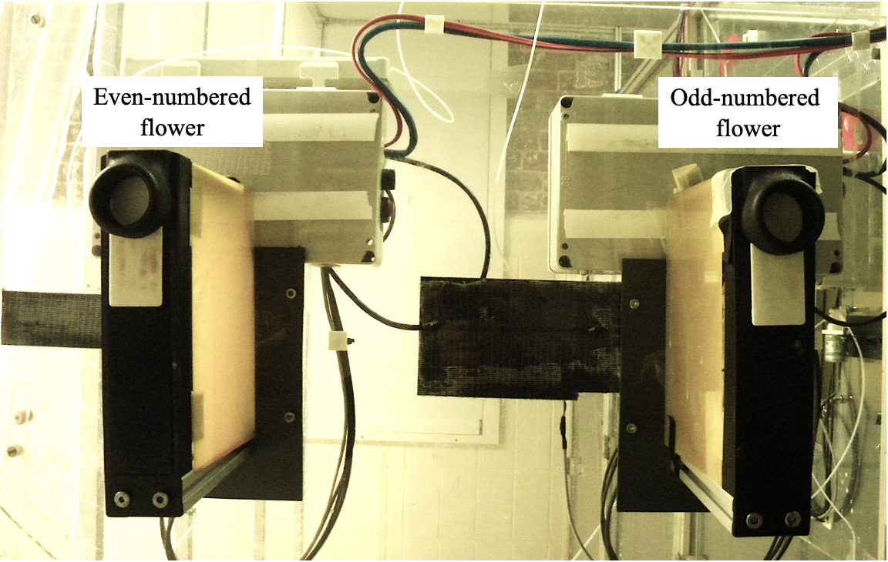

```{css style settings, echo = FALSE}
blockquote {
    margin: 0 0 20px;
    font-size: 14px;
}
```
---

Shambhavi Chidambaram^1,2^, Alex Kacelnik^3^, York Winter^1,2**\***^, Vladislav Nachev^1^

^1^ Institute of Biology, Humboldt University, Berlin, Germany

^2^ Berlin School of Mind and Brain, Humboldt University, Berlin, Germany

^3^ Department of Zoology, University of Oxford

^**\***^**For correspondence:** york.winter\@hu-berlin.de

**Present Address:** Institute of Biology, Humboldt University, Philippstr. 13, 10115 Berlin, Germany

```{r setup, include=FALSE}
knitr::opts_chunk$set(
  echo = FALSE, 
  message = FALSE, 
  warning = FALSE, 
  fig.align = "center", 
  fig.pos = "H")
```

```{r Reading-in-the-packages}
# clearing the environment
 rm(list = ls())

# installing the required packages if needed and loading them
if (!require(rmarkdown)) {
  install.packages("rmarkdown")
}
if (!require(reshape2)) {
  install.packages("reshape2")
}
if (!require(tufte)) {
  install.packages("tufte")
}
if (!require(rticles)) {
  install.packages("rticles")
}
if (!require(knitr)) {
  install.packages("knitr")
}
# if (!require(kableExtra)) {
#   install.packages("kableExtra")
# }
if (!require(shiny)) {
  install.packages("shiny")
}
if (!require(scales)) {
  install.packages("scales")
}
if (!require(broom)) {
  install.packages("broom")
}
if (!require(tidyverse)) {
  install.packages("tidyverse")
}
if (!require(gluedown)) {
  install.packages("gluedown")
}
if (!require(glue)) {
  install.packages("glue")
}
if (!require(ggthemes)) {
  install.packages("ggthemes")
}
if (!require(lubridate)) {
  install.packages("lubridate")
}
if (!require(ggpubr)) {
  install.packages("ggpubr")
}
if (!require(gridExtra)) {
  install.packages("gridExtra")
}
if (!require(Hmisc)) {
  install.packages("Hmisc")
}
if (!require(brms)) {
  install.packages("brms")
}
if (!require(bayesplot)) {
  install.packages("bayesplot")
}
```

```{=html}
<style>
body {
text-align: justify}
</style>
```

```{r Themes-and-CI-functions}

# creating two themes for all the plots

theme_sine <- function() {
  theme_pubr() +
    theme(
      axis.text = element_text(size = 8, family = "Times"),
      axis.title = element_text(size = 10, family = "Times"),
      strip.text.x = element_text(size = 10, family = "Times"),
      strip.text.y = element_text(size = 10, family = "Times"),
      legend.text = element_text(size = 10, family = "Times"),
      legend.title = element_text(size = 12, face = "bold", family = "Times")
    )
}

theme_sine2 <- function() {
  theme_bw() +
    theme(
      axis.text = element_text(size = 8, family = "Times"),
      axis.title = element_text(size = 10, family = "Times"),
      strip.text.x = element_text(size = 10, family = "Times"),
      strip.text.y = element_text(size = 10, family = "Times"),
      legend.text = element_text(size = 10, family = "Times"),
      legend.title = element_text(size = 12, face = "bold", family = "Times")
    )
}

 # writing a function to automate the reporting of an estimate and error bars
report_m_ci_perc <- function(tbl, par = "_r_", brackets = "round") {
  open_bracket <- case_when(
    brackets == "round" ~ "(",
    brackets == "square" ~ "[",
    brackets == "squiggly" ~ "{",
    brackets == "none" ~ "",
    TRUE ~ str_sub(brackets, 1, 1)
  )
  
  close_bracket <- case_when(
    brackets == "round" ~ ")",
    brackets == "square" ~ "]",
    brackets == "squiggly" ~ "}",
    brackets == "none" ~ "",
    TRUE ~ str_sub(brackets, 2, 2)
  )
  
  tbl <- tbl %>% 
    mutate(CI = paste0(open_bracket, "95% CI ", ymin, ", ", ymax, close_bracket))
  
    return(glue("{tbl$y}% {tbl$CI}"))
}

# writing a function to make a table to get estimates and error bars as a model output

model_outputs <- function(model, fixed_effects) {
  
# creating a table with the required values for the forest plot
t1 <- fixef(model, 
            probs = c(0.055, 0.945)) %>%
  as_tibble() %>%
  mutate(
    `Fixed effect` = fixed_effects,
    Estimate = round(Estimate, digits = 2),
    Q5.5 = round(Q5.5, digits = 2),
    Q94.5 = round(Q94.5, digits = 2)
  ) %>%
  # renaming the credibility intervals column
  mutate("89% Credibility intervals" = paste0("[", Q5.5, ", ", Q94.5, "]")) %>%
  filter(`Fixed effect` != "Intercept") %>%
  rename(labels = `Fixed effect`) %>%
  select(labels, Estimate, `89% Credibility intervals`) %>%
  mutate(All = paste0(Estimate, " ", `89% Credibility intervals`)) %>%
  select(labels, All)
}

# setting the maximum value on the x axis to locate the labels
max_xvalue_output <- function(model, fixed_effects) {
  
max_xvalue <- fixef(model, 
                    probs = c(0.055, 0.945))%>%
  as_tibble() %>%
  mutate(
    `Fixed effect` = fixed_effects,
    Estimate = round(Estimate, digits = 2),
    Q5.5 = round(Q5.5, digits = 2),
    Q94.5 = round(Q94.5, digits = 2)
  ) %>%
  filter(`Fixed effect` != "Intercept") %>%
  select(Q94.5) %>%
  filter(Q94.5 == max(Q94.5)) %>%
  as.numeric()
}
```

# Introduction

Different changes in animals' environments happen on different time-scales, spanning many orders of magnitude [@buhusi_what_2005]. Seasonal changes such as the shedding of leaves happen at intervals of several months to a year; circadian changes like the sun rising happen once per day; environmental changes like flowers refilling with nectar occur on the order of hours. Animals use different mechanisms - physiological, cognitive, or a combination of both - in order to deal with these time-based changes. An example of a physiological mechanism  is the fluctuation of the levels of the hormones serotonin and melatonin with a twenty-four rhythm, inducing sleep and wakefulness at the appropriate time of the day [@khullar_role_2012], without requiring any cognition on the part of an animal. Cognitive mechanisms are those by which an animal can acquire, process, store and act on information from its environment [@shettleworth_cognition_2010]. An example of a cognitive mechanism is when rats are trained to press a lever at an arbitrary time interval a few seconds long in order to receive a reward [@matell_interval_2003]. 

When an animal's behaviour allows it to obtain information about the current state of its environment, the animal can perceive changes to that state and translate it into a behavioural response. In this way animals can 'track' a changing environment [@dunlap_tracking_2012]. When an environment changes very rapidly any information that is gained by tracking it becomes outdated very soon. When an environment changes so slowly there is no consequence in the animal's lifetime, the effort spent in tracking it does not yield usable information. There is an advantage in tracking environmental change that happens at an intermediate rate: fast enough to be detected but slow enough that there is time to mount a behavioural response to it.  

One of the most important changes animals deal with changes in food availability, which can happen on the order of several months or a few minutes. If these changes happen at regular time-intervals a foraging animal might keep track of the passage of time. If the change is unpredictable and not preceded by any sort of cue, an animal can sample its environment to track its state. Environment tracking studies typically focus on the problem of sampling with a choice between two options [@stephens_economically_1987;  @shettleworth_tracking_1988; @tamm_tracking_1987]. One of these options has a fixed value, and the other varies between two states: a 'good' state that has a higher value than the fixed option, and a 'bad' state that has a lower value. If the variable option switches between its good and bad state unpredictably and not based on a cue, a foraging animal can only know the state of the fluctuating option by sampling it. 'Sampling' in this sense of the word is to visit an option that is currently estimated as unprofitable in comparison to its alternative. 

In reality many animals forage in environments where they must choose between multiple options that are simultaneously available, and their perception of the difference between the options is subject to the Weber-Fechner Law (Fechner, 1860; [@kacelnik_risky_1998]. This law states that the just-noticeable difference to a stimulus is proportional to the magnitude of the stimulus. For example adding one biscuit to a plate of two biscuits is much more noticeable than adding one biscuit to a plate of a hundred biscuits.  

Nectar-feeding bats can visit several hundred flowers every night [@voigt_field_2006], and can discriminate between the nectar rewards they receive at these flowers based on volume [@toelch_psychometric_2007] and concentration [@nachev_webers_2013]. Though flowers and the plants that bear them are fixed in space, nectar levels in bat-pollinated flowers can replenish themselves [@lemke_foraging_1984]. That is, the flowers fluctuate between 'good' states (full of nectar) and 'bad states' (empty of nectar), but the switch between these states is not abrupt. When a bat visits a flower that is full and empties it, the state of the flower has switched from 'good' to 'bad' abruptly. This state change is experienced by the bat, who can no longer exploit the flower at that point in time. The switch from 'bad' to 'good' however is gradual, as the secretion of flower nectar can take several hours. 

The results described in chapter two of this thesis give some insight into the way the Glossophagine bat species *Glossophaga commissarisi* chooses between options with changing reward properties. The task the bats faced was a serial reversal task: out of two potentially rewarding options or 'flowers', one flower was rewarding and the other was non-rewarding. After a fixed number of visits had been made, the two flowers simultaneously reversed their rewarding properties - the rewarding flower became non-rewarding and the non-rewarding flower became rewarding. This was an unsignalled and abrupt switch between the 'good' and 'bad' states of the flower. The decision-making behaviour of the bats changed in response to this environmental change. The bats behaved in a way that was consistent with reinforcement learning. That is, when the bats received reward, i.e., reinforcement, at a flower, they increased the visits they made to it and when they received no reinforcement at a flower, they decreased the visits made to it; this occurred every time there was a reversal. 

In the serial reversal task the flowers' change between the 'good' and the 'bad' states was not based on either the passage of time (as it is in a natural environment) or on a probabilistic schedule (as it has previously been modeled). Nevertheless there was a subtle time-component to the animals' behaviour in the serial reversal task. If every single experience of reinforcement or no reinforcement influenced the behaviour of the bats then there would be a gradual approach to a point where exactly half the visits are made to each flower, regardless of its rewarding properties. Instead, every time a reversal occurred, the bats' behaviour changed in accordance with their most recent experience of the rewarding properties of the options, and the bats made a consistently high number of visits to the rewarding flower. The bats' experiences of reward and no reward in the most recent past seemed to influence their behaviour much more than experiences further in the past.

We aimed to explore the cognitive strategies used by nectar-feeding bats when faced with an environment that changed state based on the passage of time. This was a scenario closer to the natural situation of gradual change in the rewarding properties of the available options. Two experiments were done with captive bats of the species *Glossophaga mutica*, which is closely related to the species *Glossophaga commissarisi* [@calahorra-oliart_cryptic_2021]. 

In both experiments bats were given a choice between two options: a 'fixed' option; and a 'fluctuating' option. The fixed option always yielded the same volume of reward when the bats made a visit to it. The reward output of the fluctuating option varied as a sine function of time; the peak output of the sine wave was larger than output of fixed option, and the trough was smaller than the fixed option. The bats experienced four possible periods of the sine function (defined as the time period between two successive peaks or two successive troughs of the wave) at the fluctuating option: 0.75 hours (45 minutes); 1.5 hours; 3 hours and 6 hours.  

In the first experiment we aimed to choose reward volumes such that the fixed option was the 'subjective mean' of the peak and trough of the fluctuating option: the difference between the maximum output of the sine wave and the fixed option would be perceived the same way as the difference between the minimum output of the sine wave and the fixed option, based on the psychometric curve for volume discrimination in *G. mutica* [@toelch_psychometric_2007]. In the second experiment the fixed option was the arithmetic average of the peak and trough of the fluctuating option - the 'objective mean'. 

This was an exploratory study and were not designed to test the predictions of specific hypotheses. Rather, we aimed to explore aspects of the bats' decision-making behaviour in a temporally-varying environment and potentially generate hypotheses that would be the basis of confirmatory experiments. The aims of the study were as follows. First, we wanted to see if the bats showed a behavioural response corresponding to the changing foraging environment, i.e., did the bats show tracking? Second, if there is tracking, how do both the rate of change of the environment, and the contrast between the fixed and fluctuating options influence it? Third, we wanted to infer what the bats' expectations of the state of the environment were, and what informed those expectations. Did the animals rely on reinforcement at an option in the recent past to guide their decision-making behaviour, or did they perceive the structure of the temporal change and accurately avoid the fluctuating option until it became more profitable than the fixed option? 

# Materials and Methods

## Subjects and housing

Both experiments were done at the Cognitive Neurobiology Lab at the Humboldt Universität zu Berlin: the subjective mean experiment in December, 2019; the objective mean experiment in June and July, 2020. The experiments were performed with two different sets of individual bats, and were identical in their design and procedure except for the one critical difference of the volume of reward delivered by the fixed option (see **Experiment Schedule** below). 

Bats of the species *Glossophaga mutica* from a captive colony at the Humboldt Universität were used for the experiment. The colony was a breeding population housed at 18-24$^\circ$C and 45-70% humidity on a 12-hour light-dark cycle (light phase: 0200 to 1400 CET; 0300 to 1500 CEST). In this colony every bat older than approximately a year (judged through the ossification of the finger joint - Brunet-Rossinni and Wilkinson, 2009) was assigned a permanent ID number, which shall be referred to from now on to distinguish the individuals. The bats that were selected for the experiment were a mix of animals that had previously been exposed to the system, and naive ones. None of the bats had participated in such an experiment, or a similar one, before. 16 animals completed the subjective mean experiment: 11 females and 5 males. 18 animals completed the objective mean experiment: 10 females and 8 males. 

## Experimental Setup

The experimental setup was common to both experiments. 

### Reward

The reward received by the bats during the experiment was also their main source of food. The reward was a 17% by weight solution of sugar dissolved in water (prepared fresh everyday or every other day), hereafter referred to as 'nectar'. The sugar consisted of a 1:1:1 mass-mixture of glucose (“Traubenzucker”, Müller’s Mühle GmbH, Germany), sucrose (“Zucker”, Belbake, Südzucker AG, Germany) and fructose (“Fruchtzucker”, Hamburger Zuckerhandelsgesellschaft mbH, Germany). The nectar was thus similar in composition and concentration to the nectar produced by wild chiropterophilous plants [@baker_sugar_1998].

### Experimental Apparatus

The animals were placed in individual, adjacent cages (0.7 x 2.2 x 1.5 m) for the duration of the experiment. As there were six cages in total the experiment was carried out in batches of six bats at a time, and each individual progressed through the experiment independently of all the others. Each cage had an operant wall with two electronic reward-dispensing devices spaced approximately 30 cm apart, hereafter referred to as 'flowers' (figure \@ref(fig:operant-wall)). Each flower had a circular head and a door controlled by a linear-actuator motor that could move up and down. Just inside the head of the flowers was an infra-red light barrier, and at the back of the flower was a Teflon tube that supplied the nectar to the flower(figure \@ref(fig:flower-cage-schematic)). Each Teflon tube was connected to a short piece of soft peroxide-silicone tube that ran through a pinch-valve. 

(ref:operant-wall) Photograph of operant wall

```{r, operant-wall, fig.cap = "(ref:operant-wall)"}
p1 <- 

p1
```

(ref:flower-cage-schematic) a) Schematic of cage and operant wall with flowers b) Schematic of a flower with its parts

```{r, flower-cage-schematic, fig.cap = "(ref:flower-cage-schematic)"}

p2 <- include_graphics("images/flower_cage_schematic.png")

p3 <- include_graphics("images/flower_parts.png")

# ggarrange isn't working for some reason - this bit done manually in word
ggarrange(p2, p3, ncol = 2, labels = c("a)", "b)"))
```

The Teflon tubes were connected to a syringe pump in a branching design that ensured the length of tube between every flower and the pump was exactly equal to 470 cm. The pump was placed outside the cages on a shelf, inaccessible to the bats. The syringe of the pump was a Hamilton 25 mL glass syringe (Sigma Aldrich, Germany) and connected to the tubing system of the flowers through five pinch valves on the pump. These pinch valves controlled the flow of liquid from the pump to the system and from a reservoir of liquid to the pump. The reservoir (500 mL thread bottle, Roth, Germany) was filled with fresh nectar every day and connected to the syringe through the valves. 

The flowers and the pump were connected by ethernet cables to a laptop computer (ThinkPad, IBM) that stood outside the cages. This computer ran the experimental schedule and the program used to clean and fill the systems using the PhenoSoft Control program (Phenosys, GmBH, Germany). To trigger a reward a bat had to place its nose inside the flower and break the infra-red light barrier. This sent a signal to the computer, which triggered the pinch-valve to open and the pump to move the correct number of steps. 

## General Experimental Procedure

Data-collection was completely automated and happened for 12 hours every day. The experimental animals were kept on the same light-dark cycle as the bats in the colony and were active during the dark phase, which is when the data were collected. The experiment was prepared everyday in the morning during the light phase. The animals were inspected everyday to make sure they were healthy and flying well. Then a preliminary analysis of the data from the previous night was done everyday on the laptop running the experimental program using a Shiny App written in R, to make sure the program had been executed correctly and the bats had drunk sufficient nectar. The minimum quantity of nectar was an amount that yielded 25 kiloJoules of energy. Any bat that drank less than this amount was given honey water for an hour before the start of the experiment. 

The old nectar was flushed from the system using the automated PhenoSoft program and fresh nectar refilled. Twice a week, the pump and tubing system was thoroughly cleaned with 70% ethanol and de-calcified water to remove pathogens. 

At approximately 1800 h the data were checked to see if all the bats had made at least two visits to the flowers, and thus learned to trigger rewards. If bats had not made visits, they received ad-libitum honey water for the rest of the experimental night and they were replaced with another animal on the next night. 

The bats were given supplemental food in addition to the nectar from the flowers. 0.2 g of a powdered nectar mixture (NEKTAR-Plus, NEKTON, Germany) and 0.3 g of milk powder (Milasan "Folgemilch 2", Sunval Baby Food, Germany) mixed in approximately 1 mL of water, and 2 mL of plain water were given to each bat. These supplements were put into Eppendorf tubes attached to the operant wall of the cage, about 87 cm below the flowers. The additional food was such that the bats would prefer to visit the flowers instead, both because the flowers were at a more comfortable height for the animals and because the nectar had a higher sugar content and was preferred to the milk powder-nectar supplement mix. The additional food was given firstly to supply micronutrients to the bats while they were in the experiment, and secondly to ensure the animals received a sufficient number of calories in case there was a technical system failure or the bats did not make a sufficient number of visits to the flowers. No technical failures occurred during either experiment.

Once an animal had completed the experiment, it was removed from the cage, weighed to see if it had lost weight since the start of the experiment, released back into the colony and replaced with another bat.

```{r}

# reading in the pump data from the subjective mean experiment
Pump_subjmean <- read.csv2("data/processed_data/Pump_subj.csv", sep = ";", header = TRUE)
# reading in the pump data from the objective mean experiment
Pump_objmean <- read.csv2("data/processed_data/Pump_obj.csv", sep = ";", header = TRUE)

# putting the two data-sets together 

Pump_data <- bind_rows(Pump_subjmean, Pump_objmean)

#calculating the pump fill time 
Filltime <- Pump_data %>% 
  filter(SystemMsg == "start pump" | SystemMsg == "end pump") %>% 
  mutate(interval = ifelse(SystemMsg == "start pump", as.numeric(difftime(lead(DateTime), DateTime, units = "secs")), "non-fill time")) %>% 
  select(DateTime, IdLabel, Cond, MsgValue1, interval) %>% 
  arrange(DateTime) %>% 
  filter(interval != "non-fill time", 
         interval < 300) %>% 
  mutate(interval = as.integer(interval)/60) %>% 
  summarise(mean_filltime = round(mean(interval), digits = 2),  
            sd_filltime = round(sd(interval), digits = 2))

# calculating the number of times the pump fills 
Fillnum <- Pump_data %>% 
  filter(SystemMsg == "start pump" | SystemMsg == "end pump") %>% 
  mutate(interval = ifelse(SystemMsg == "start pump", as.numeric(difftime(lead(DateTime), DateTime, units = "secs")), "non-fill time")) %>% 
  select(DateTime, Day, IdLabel, Cond, MsgValue1, interval) %>% 
  arrange(DateTime) %>% 
  filter(interval != "non-fill time", 
         interval < 300) %>%
  group_by(Day) %>% 
  summarise(pump_events = n()) %>% 
  ungroup() %>% 
  summarise(mean_fillnum = round(mean(pump_events), digits = 2), 
            sd_fillnum = round(sd(pump_events), digits = 2))
```

During the experimental night, when the syringe of the pump had been fully emptied, the pump had to refill with nectar from the reservoir. This event happened on average `r as.numeric(Filltime[1,1])` times per night (SD = ± `r as.numeric(Filltime[1,2])`), taking `r as.numeric(Fillnum[1,1])` minutes each time (SD = ± `r as.numeric(Fillnum[1,2])`). During this time, if the bats made visits to the flowers, they did not receive any reward. 

## Experiment Schedule 

In both experiments, one option was the 'fixed' option and the other was the 'fluctuating' option. The fluctuating option delivered a reward that varied as a sine function of time, starting at its maximum volume when a bat made its first visit to the fluctuating option, and proceeding through the sine-function regardless of where the bat made its subsequent visits. In the Subjective Mean experiment the reward delivered by the fixed option was selected so that the volume pairs of the fixed option and the minimum output of the sine-wave, and the fixed option and the maximum output of the sine-wave were, in principle, equally discriminable. In the Objective Mean experiment, the output of the fixed option was the arithmetic mean of the peak and trough volumes of the fluctuating option. The maximum volume of the fluctuating option, i.e., the peak of the sine-wave, was 25 $\mu$L, and the minimum was 2 $\mu$L, so the output of the fixed option was 7 $\mu$L in the Subjective Mean experiment and 13.5 $\mu$L in the Objective Mean experiment. 

The experiment proceeded through the following stages: 

### Pre-training

On the first day of the experiment the bats were placed inside the cages and allowed to acclimatize to the new environment. The flowers were covered with a towel to prevent the animals accessing them, and containers of honey water were placed on top of the covered flowers, which the bats found easily. On this day alone no other food was given, not even the supplementary mixture. Food was only available at the location of the flowers. No data were recorded by the computer on this day, and the amount of honey-water consumed was not monitored.  

### Training

Shortly before 1400 h, the towels were removed from the flowers so the bats could access them. To teach the bats to put their noses into the flower head and trigger the reward, a drop of honey was applied to the back of the flower and a drop to the top of the flower. 

The training proceeded in five phases that repeated throughout the night. Whenever the bats completed 50 visits to both flowers in total, the phase ended and the next began. 

1. **Initial:** The doors in front of the flowers remained open, and the bats could pay a visit to whichever flower they wanted. The bats received a reward volume of 25 $\mu$L at both flowers.

2. **Forced 1:** This was a phase of forced alternation. At the start of this phase, the door in front of one of the flowers moved up to prevent access to it, forcing the bat to visit the other one. After a visit was made and the reward collected, the door of the visited flower would move up to block access to it, and door of the other flower would open. In this way the bat was forced to alternate its visits to the two flowers and so ensure that the locations of both flowers were learned. In this phase there was a difference in reward volume between the two flowers. Two pairs of volumes were possible: the fixed output and 2 $\mu$L; or the fixed output and 25 $\mu$L. Depending on which experiment it was, the fixed output was either 7 $\mu$L (the subjective mean) or 13.5 $\mu$L (the objective mean). Half the bats were given one volume pair, and the other half the other volume pair. The flower on which the higher volume was given was counter-balanced across animals. 

3. **Free 1:** This was a phase of ad-libitum reward similar to the Initial phase: both flower doors were open so both flowers were freely accessible to the bats. The volume differences of the Forced 1 phase were maintained. As the bats were free to visit both flowers, the preference of the bats for the flower that gave the higher volume was taken as indication of the discriminability of the volumes.

4. **Forced 2:** This phase was the same as the Forced 1 phase except the volume pairs were different. Those bats that received the fixed output vs. 2 $\mu$L volume pair in the Forced 1 phase now received 25 $\mu$L vs. the fixed output and *vice versa*. Half the bats received the higher volume at the same flower as Forced 1 and the other half at the other flower.

5. **Free 2:** This was similar to the Free 1 phase, in that both flowers were accessible and reward was ad-libitum, but the reward volumes at the flowers were the same as those in the phase Forced 2. In this way the bats' preferences for the higher volume of both volume pairs was determined.

After the bats had completed all five phases, the schedule repeated itself  except for the Initial phase. This continued for the rest of the night. If a bat learned to trigger rewards and made visits, but not a sufficient number to experience all five phases at least once it had to repeat the Training stage on the next night. If the bat did not complete all five phases even on the second day of Training it was removed from the experiment and replaced. 

### Main Experiment

The bats experienced four experimental conditions, corresponding to four periods of the sine wave: 

* 0.75 hours
* 1.5 hours
* 3 hours
* 6 hours

During each experimental night the bats were given free choice between the fixed option and the fluctuating option whose output varied by a sine function of time. The output of the fluctuating option followed the formula: 

$$ \mathrm{y(t)} = {\rm Asin(2\pi ft + \varphi) + D} $$

where: 

* A is the Amplitude of the wave, or the distance between the peak and the mid-value of the wave
* f is the frequency of the wave, or the reciprocal of the wave period in seconds 
* t is the time point in seconds since the start of the wave
* $\varphi$ is the Phase, specifying in units of radians where the wave is when t = 0 
* D is the Displacement, or a center Amplitude that is not 0

The bats first experienced a condition for a night, during which the fixed and fluctuating options were assigned to a flower location each, and this location did not change. On the following night there was a reversal of options, i.e., a reversal of the reward contingencies of the flowers: the flower that had previously been the fixed option was now the fluctuating, and *vice versa*. This was done to control for a location preference by the bats. After the bats had experienced a condition on two successive nights in this way, the next condition was given, so there were 4x2 or 8 experimental nights in total (in addition to the training). The order of the conditions was pseudo-randomized across animals. 

On the first night of the main experiment the fluctuating option was assigned to the flower that each bat had made more visits to overall on the previous training night, as it was assumed that the animals now had a slight preference for this flower. From then on the reversal of reward contingencies between the two flowers happened every night. At the start of each experimental night, the sine-function that determined the fluctuating output did not begin until the bat made a visit to the fluctuating output. Then the bat experienced the peak of the wave, i.e., the highest possible fluctuating output (25 $\mu$L). This was a large reward, and designed to motivate the bats to make repeated visits to the fluctuating option so they could experience the change in the output (see **Supplementary Information**). 

(ref:design-schematic) Schematic of the design of the subjective mean and objective mean experiments

```{r, design-schematic, fig.cap = "(ref:design-schematic)"}
p4 <- include_graphics("images/design_schematic.png")

p4
```

## Data analysis 

The raw data from these experiments were logged as events by a computer and  recorded in comma-separated value (CSV) files. Each event included the date and time of the event, the animal that made the event, the duration of interruption of the photo-gate and the volume of nectar dispensed. The CSV files were then read into R, which was used for all statistical analyses and creation of plots.

A bat had to experience the reward contingencies of both options on every night to be included for the statistical analysis. In practice this meant that the bat had to make at least one rewarded visit to both options every night. 

The bats experienced the reward volumes in the fluctuating options as part of either a downward trend, when the fluctuating output was decreasing, or part of an upward trend, when the fluctuating output was increasing. In both cases the volume difference between the fixed and the fluctuating options was exactly the same but the difference was in the volume differences experienced just before. The bats could use their past experience in one of two ways: they could either estimate an option as being more rewarding based on their reinforcement at that option in the recent past; or they could estimate an option as being more rewarding based on their experience of an increasing reward output at that option, despite the recent past reinforcement being comparatively low. In the first case, we would expect the proportion of visits to any volume of the fluctuating option to be higher when that volume was part of a downward trend; in the second case, we would expect the proportion of visits to be higher when the volume was part of an upward trend. We also considered the specific case of the volume pair 7 vs. 13.5 $\mu$L. In the subjective mean experiment this situation arose when the fluctuating output was 13.5 $\mu$L because the fixed output was always 7 $\mu$L; in the objective mean experiment it arose when the fluctuating output was 7 $\mu$L as the fixed output was always 13.5 $\mu$L. The volume pair was discriminable by the bats, and if there were no effect of trend, the preference for the higher volume should be higher than 50% in all the experimental conditions. 

In both the experiments, we investigated the effect of trend, volume of the fluctuating output and rate of change of the fluctuating option on the proportion of visits to the fluctuating option. In both the experiments we also created separate models of one specific pair of volumes: 7 and 13.5 $\mu$L. In the subjective mean experiment this was when the fluctuating output was 13.5 $\mu$L, and in the objective mean experiment this was when the fluctuating output was 7 $\mu$L. We investigated the effect of trend on the proportion of visits made to the higher volume in this pair (13.5 $\mu$L) in both experiments. The proportion of visits to the fluctuating output was calculated as the number of visits to the fluctuating output divided by the sum of the number of visits to the fluctuating output and the number of visits to the fixed option in that category. The proportion of visits to the higher volume of a volume pair was calculated in a similar manner. 

Generalized linear mixed-models were fitted in a Bayesian framework using Hamiltonian Monte Carlo in the R package `brms` [@burkner_brms_2017], which is a front-end for `rstan` [@carpenter_stan_2017]. The technical details of these models are provided in the **Supplementary section**. We present plots of the conditional effects of the predictor variables, with the parameter values of the models provided in the **Supplementary section**. We report the mean as a measure of central tendency and the 89% quantile-based credible intervals for the parameters. (89% boundaries are the default for reporting credible intervals - @mcelreath_statistical_2020). 

We investigated whether seasonality, i.e., a regular and repeating change, was present in the bats' choice data by fitting a cosinor model to the time-series data of the bats' visits to the fluctuating option. This was done using the R package `season` [@barnett_analysing_2012]. Such a model describes a seasonal pattern using a sinusoid. A generalized linear model using a sine and a cosine term was fit to the data from each bat for each rate of change. Together these terms describe the sinusoid. A *p*-value was thus calculated, with an alpha level of 0.05. 

All statistical analyses and creation of plots were done in R.

# Results

## A majority of bats responded to the reversal of location of the two options

```{r, reading-preparing-data}
# reading in the pump data from the subjective mean experiment
Main_all <- read.csv2("data/processed_data/Main_roc.csv", sep = ";", header = TRUE)

# setting the parameters for volume calculation, sine wave calculation and pump-step conversions
# pump steps for the maximum volume of the fluctuating option
maxsine_steps <- 76
# pump steps for the minimum volume of the fixed option
minsine_steps <- 6
# conversion factor between pump-steps and microLitres of volume
step_conv <- 0.324
# converting the rewards from pump-step units to microLitres
maxsine <- step_conv * maxsine_steps
minsine <- step_conv * minsine_steps
# setting the fixed volumes as variables
fixed1 <- step_conv * 22
fixed2 <- step_conv * 42
# setting the pump steps for the fixed option
fixed_steps <- 22 

# calculating the sine-wave for the bats, with the actual start time of the wave instead of when the bat made its first rewarded visit at the fluctuating option, as explained in the supplementary information

Main_all <- Main_all %>% 
  # adding the pump steps for the two fixed options
  mutate(Fixed_steps = ifelse(Experiment == "Subjective", 22, 42), 
         Fixed_vol = Fixed_steps * step_conv)

# inserting a space between the word "Bat" and the number of the animal
Main_all <- Main_all %>% 
  mutate(Bat_word = ifelse((str_detect(IdLabel, "Bat") == TRUE), "Bat", ""), 
         Bat_number = ifelse((str_detect(IdLabel, "Bat") == TRUE), as.integer(str_extract(IdLabel, "[0-9]+")), IdLabel), 
         IdLabel = ifelse(is.na(IdLabel), IdLabel, paste0(Bat_word, " ", Bat_number))) %>% 
  select(-Bat_word, -Bat_number)

# creating a lookup table to find the first occurrence of a visit to the flower that was fluctuating on a particular day 

fluc_visits <- Main_all %>% 
  ungroup() %>% 
  group_by(Experiment, Day, IdLabel, unitLabel) %>% 
  select(Experiment, Day, IdLabel, unitLabel, outFuncLabel) %>% 
  distinct() %>% 
  filter(str_detect(outFuncLabel, "sine") | str_detect(outFuncLabel, "fix"))

# joining the lookup table to the Main table to correctly mark the unrewarded visits as fixed or fluctuating 

Main_all <- Main_all %>% 
  # first removing the original outFuncLabel column
  select(-outFuncLabel)

Main_all <- left_join(Main_all, fluc_visits, by = c("Experiment", "Day", "IdLabel", "unitLabel")) 

# removing the now unnecessary look-up table 
rm(fluc_visits)

# adding a period-day column to the table

Main_all <- Main_all %>%
  mutate(
    Rev = "Rev",
    Period_day = ifelse(Reversal == 0, Period, paste0(as.character(Period), " ", Rev))
  ) %>%
  # removing the now redundant columns
  select(-Rev, -Reversal)

# creating a look-up table for calculating the sine wave

sinewave <- Main_all %>%
  # filtering only the visits to the fluctuating output
  filter(outFuncLabel == "sineRewOut") %>%
  # selecting relevant columns from the main table to calculate the sine wave
  select(Experiment, Day, IdLabel, Period, Period_day, timediff, Amplitude, Disp, Fixed_steps, vis_vol, Tracking) %>%
  group_by(Experiment, Day, IdLabel) %>%
  mutate(
    Period = as.numeric(str_remove(Period_day, "Rev")), 
    # adding a row counter
    rown = 1:n(),
    # adding a column with the number of points on the calculated sine wave
    reps = 360
  ) %>%
  # taking the first occurrence of the fluctuating output
  filter(rown == 1)

# noting the number of columns in the data frame
nsine <- as.numeric(ncol(sinewave))

# repeating the rows by the number of points on the wave so the whole sine wave can be calculated
sinewave <- sinewave[rep(row.names(sinewave), sinewave$reps), 1:nsine]

# adding a column with the actual time increments
sinewave <- sinewave %>%
  # removing the old row counter so it can be done over
  select(-rown) %>%
  group_by(Experiment, Day, IdLabel) %>%
   mutate(
    # calculating the row counter again
    rown = 1:n(),
    # calculating the time differences with the proper increments: 12 hours are divided among 360 points on the wave
    timediff = ifelse(rown == 1, timediff, (lag(timediff) + (12 / 360) * (rown - 1))),
    # creating a dummy time column to calculate the wave so it starts at the peak regardless of the timediff column
    wavetime = 0,
    wavetime = ifelse(rown == 1, 0, (lag(wavetime) + (12 / 360) * (rown - 1))),
    # converting the time values back to seconds
    Period = Period * 3600,
    # converting the dummy time column to seconds
    wavetime = wavetime * 3600,
    # calculating the sine wave values and converting from pump step values to microLitres
    sine_vol = (Amplitude * sin(2 * pi * (1 / Period) * wavetime + (pi / 2)) + Disp) * step_conv,
    Period = Period / 3600
  ) %>%
  # removing time points that occurred after 12 hours by the calculation
  filter(timediff <= 12) %>%
  # removing the now-unnecessary columns
  select(-wavetime, -reps, -rown)

```

```{r, echo=FALSE, warning=FALSE, message=FALSE}

# preparing the datasets with the sinewaves for the plots 
sine_tr_subj <- sinewave %>% 
  #Sinewave for the responsive bats in the subj exp
  filter(Tracking == "tracker", 
         Experiment == "Subjective") 

sine_tr_obj <- sinewave %>%
    #Sinewave for the responsive bats in the obj exp
  filter(Tracking == "tracker", 
         Experiment == "Objective")

sine_nt_subj <- sinewave %>% 
  #Sinewave for the responsive bats in the subj exp
  filter(Tracking == "non-tracker", 
         Experiment == "Subjective") 

sine_nt_obj <- sinewave %>%
    #Sinewave for the responsive bats in the obj exp
  filter(Tracking == "non-tracker", 
         Experiment == "Objective")

# preparing the right-hand axis for some of the following plots
optionchoice <- c("F", "V")
```

Two behavioural strategies were observed in the main experimental phase. The locations of the fixed and fluctuating options were always reversed between the two flowers on the second night of a condition to control for the bats' location preferences. While most of the bats made visits to both options on both nights, a minority did not. 4 out of the 16 bats in the subjective mean experiment, and 3 out of the 18 bats in the objective mean experiment, made near-exclusive visits to the same flower on both nights of a condition, regardless of whether that flower was the fixed or the fluctuating option. We designated these bats the 'reversal non-responsive' bats, as reversing the location of the fixed and fluctuating options induced no observable behavioural response. 

Figure \@ref(fig:nonresp) shows the overall activity of the reversal non-responsive bats. The first time point of the sine function was the first visit made by a bat to the fluctuating option. This meant that on those nights the fixed option was assigned to the preferred flower of a reversal non-responsive bat, the bat never experienced the changing output of the fluctuating option and was thus 'uninformed' of all the available options - these animals were excluded from statistical analyses.

(ref:nonresp) Choice behaviour of all the reversal non-responsive bats in the two experiments. Each row is one night of experimental condition, i.e., the two nights for each of the four wave periods, and each column an individual bat. The solid black line represents the output of the fluctuating option and the red points each individual visit made by a bat. The red points to the top of the plots are visits made to the fluctuating option and those at the bottom of the plots are visits made to the fixed option. The dashed horiontal line represents the volume output of the fixed option. a) Reversal non-responsive bats in the subjective mean experiment b) Reversal non-responsive bats in the objective mean experiment
 
```{r, nonresp, echo=FALSE, warning=FALSE, message=FALSE, fig.align='center', fig.width = 8, fig.height = 11, fig.cap = "(ref:nonresp)"}

Main_subj_nt <- Main_all %>% 
  filter(Tracking == "non-tracker", 
         Experiment == "Subjective")

p5 <- Main_subj_nt %>% 
  filter(Tracking == "non-tracker") %>%
  #mutate(smooth = as.numeric(tsSmooth(StructTS(chosen, type = "level")))) %>%
  ggplot(aes(timediff)) +
  geom_line(data = sine_nt_subj,  
            #%>% filter(IdLabel == c("Bat 22", "Bat 30", "Bat 67")), 
            aes(timediff, sine_vol)
            ) +
  geom_point(aes(y = chosen), colour = "red", alpha = 0.05, size = 1) +
  #geom_line(aes(y = smooth), color = "cornflowerblue") +
  scale_x_continuous(breaks = seq(0,12,1)) +
  geom_hline(yintercept = 7, linetype = 2) +
  xlab("Hour") +
  ylab(expression(paste("Volume output of the fluctuating option [", mu, "L]"))) +
  scale_y_continuous(limits = c(minsine, maxsine), 
                     sec.axis = sec_axis(~.,
                                         breaks = c(minsine, maxsine),
                                         labels = optionchoice)) + 
  facet_grid(Period_day ~ IdLabel, scales = "free_y") +
  theme_sine() +
  theme(plot.title = element_text(size=12)) +
  theme(strip.placement = "outside")

Main_obj_nt <- Main_all %>% 
  filter(Tracking == "non-tracker", 
         Experiment == "Objective")

p6 <- Main_obj_nt %>% 
  filter(Tracking == "non-tracker") %>%
  #mutate(smooth = as.numeric(tsSmooth(StructTS(chosen, type = "level")))) %>%
  ggplot(aes(timediff)) +
  geom_line(data = sine_nt_obj,  
            #%>% filter(IdLabel == c("Bat 22", "Bat 30", "Bat 67")), 
            aes(timediff, sine_vol)
            ) +
  geom_point(aes(y = chosen), colour = "red", alpha = 0.05, size = 1) +
  #geom_line(aes(y = smooth), color = "cornflowerblue") +
  scale_x_continuous(breaks = seq(0,12,1)) +
  geom_hline(yintercept = 13.5, linetype = 2) +
  xlab("Hour") +
  ylab(expression(paste("Volume output of the fluctuating option [", mu, "L]"))) +
  scale_y_continuous(limits = c(minsine, maxsine), 
                     sec.axis = sec_axis(~.,
                                         breaks = c(minsine, maxsine),
                                         labels = optionchoice)) + 
  facet_grid(Period_day ~ IdLabel, scales = "free_y") +
  theme_sine() +
  theme(plot.title = element_text(size=12)) +
  theme(strip.placement = "outside")

ggarrange(p5, p6, nrow = 2, labels = c("a)", "b)"))

```

The animals that did respond to the reversal showed a change in their choice behaviour corresponding to the output of the sine wave. This is represented in Figure \@ref(fig:responsive). 

(ref:responsive) Choice behaviour of three representative reversal responsive bats from each of the two experiments. Each row is one night of experimental condition, i.e., the two nights for each of the four wave periods, and each column an individual bat. The solid black line represents the output of the fluctuating option and the red points each individual visit made by a bat. The red points to the top of the plots are visits made to the fluctuating option and those at the bottom of the plots are visits made to the fixed option. The blue lines are a smoothing function applied to the choices of the bats. The dashed horiontal line represents the volume output of the fixed option. a) Three of the reversal responsive bats in the subjective mean experiment b) Three of the reversal responsive bats in the objective mean experiment

```{r, responsive, echo=FALSE, warning=FALSE, message=FALSE, fig.align='center', fig.width = 8, fig.height = 11, fig.cap = "(ref:responsive)"}

Main_subj_3bats <- Main_all %>% 
  filter(
    #IdLabel == c("Bat 22", "Bat 30", "Bat 67"), 
         Experiment == "Subjective")

p7 <- Main_subj_3bats %>% 
  filter(Tracking == "tracker") %>%
  mutate(smooth = as.numeric(tsSmooth(StructTS(chosen, type = "level")))) %>%
  ggplot(aes(timediff)) +
  geom_line(data = sine_tr_subj,  
            # %>% filter(IdLabel == c("Bat 22", "Bat 30", "Bat 67")), 
            aes(timediff, sine_vol)
            ) +
  geom_point(aes(y = chosen), colour = "red", alpha = 0.05, size = 1) +
  geom_line(aes(y = smooth), color = "cornflowerblue") +
  scale_x_continuous(breaks = seq(0,12,1)) +
  geom_hline(yintercept = 7, linetype = 2) +
  xlab("Hour") +
  ylab(expression(paste("Volume output of the fluctuating option [", mu, "L]"))) +
  scale_y_continuous(limits = c(minsine, maxsine), 
                     sec.axis = sec_axis(~.,
                                         breaks = c(minsine, maxsine),
                                         labels = optionchoice)) + 
  facet_grid(Period_day ~ IdLabel, scales = "free_y") +
  theme_sine() +
  theme(plot.title = element_text(size=12)) +
  theme(strip.placement = "outside")

Main_obj_3bats <- Main_all %>% 
  filter(
    #IdLabel == c("Bat 50", "Bat 101", "Bat 1"), 
         Experiment == "Objective")

p8 <- Main_obj_3bats %>% 
  filter(Tracking == "tracker") %>%
  mutate(smooth = as.numeric(tsSmooth(StructTS(chosen, type = "level")))) %>%
  ggplot(aes(timediff)) +
  geom_line(data = sine_tr_obj, 
            # %>% filter(IdLabel == c("Bat 50", "Bat 101", "Bat 1")), 
            aes(timediff, sine_vol)
            ) +
  geom_point(aes(y = chosen), colour = "red", alpha = 0.05, size = 1) +
  geom_line(aes(y = smooth), color = "cornflowerblue") +
  scale_x_continuous(breaks = seq(0,12,1)) +
  geom_hline(yintercept = 13.5, linetype = 2) +
  xlab("Hour") +
  ylab(expression(paste("Volume output of the fluctuating option [", mu, "L]"))) +
  scale_y_continuous(limits = c(minsine, maxsine), 
                     sec.axis = sec_axis(~.,
                                         breaks = c(minsine, maxsine),
                                         labels = optionchoice)) + 
  facet_grid(Period_day ~ IdLabel, scales = "free_y") +
  theme_sine() +
  theme(plot.title = element_text(size=12)) +
  theme(strip.placement = "outside")

ggarrange(p7, p8, nrow = 2, labels = c("a)", "b)"))

p7
```

## The responsive bats tracked the rate of change of the fluctuating volume

The behaviour of the responsive bats seemed to correspond to the state of the environment, which was determined by the volume output of the fluctuating option. The analysis showed that the bats made a higher proportion of visits to the fluctuating option when its volume output was higher. This effect seemed to be influenced by both the rate of change of the environment (the period of the fluctuating option) and the contrast between the fixed and the fluctuating options. 

In the subjective mean experiment - when the volume of the fixed option was much lower than in the objective mean experiment - the faster the rate of change, the higher the number of visits to the fluctuating option. At the fastest rate the bats made the majority of their visits to the fluctuating option regardless of its volume. At the two slowest rates the bats made the majority of their visits to the fixed option when it was higher than the fluctuating option (figure \@ref(fig:period-volume-effect)a).

In the objective mean experiment the rate of change of the environment had a smaller effect on the number of visits to the fluctuating option. At all four rates of change the bats made the majority of their visits to whichever option had a higher output at that time, with approximately 50% of their visits to either option when the output of the two options was equal. Nevertheless, there did seem to be an effect of the rate of change. At fluctuating volumes higher than the fixed, the bats made a higher number of visits to the fluctuating option when the rate of change was slower. At fluctuating volumes lower than the fixed, the bats made a lower number of visits to the fluctuating option when the rate of change was slower (figure \@ref(fig:period-volume-effect)b). 

(ref:period-volume-effect) a) Conditional effects of the volume and the rate of change of the fluctuating option on the proportion of visits to the fluctuating option in the subjective mean experiment b) Conditional effects of the volume and the rate of change of the fluctuating option on the proportion of visits to the fluctuating option in the objective mean experiment. Dashed vertical lines represent the volumes of the fixed options and dotted horizontal lines a 50% preference for the fluctuating option. Thick coloured lines are means and shaded areas are 89% credible intervals, drawn from the posterior distributions

```{r, period-volume-effect, fig.cap = "(ref:period-volume-effect)", fig.width = 7, fig.height = 3}
# loading the models of the effect of trend, volume and period on the choice for the fluctuating option, one for each experiment 
# Trends_model_subj <- Updown %>%
#   ungroup() %>% 
#   filter(Experiment == "Subjective", 
#          Tracking == "tracker") %>% 
#   select(Period, IdLabel, trend, sine_vol, outFuncLabel) %>% 
#   mutate(sine_vol = round(sine_vol), 
#          Period = as.factor(Period)) %>% 
#   arrange(Period, IdLabel) %>% 
#   rename(Bat = IdLabel, 
#          sine_choice = outFuncLabel)

# m.trends.subj <-
#   brm(data = Trends_model_subj, family = bernoulli,
#       sine_choice ~ Period + trend + sine_vol + Period:trend + Period:sine_vol +
#         (1 + Period:trend + Period:sine_vol | Bat), # random slopes 
#       prior = c(prior(normal(0, 5), class = Intercept),
#                 prior(normal(0, 5), class = b),
#                 prior(cauchy(0, 1), class = sd)),
#       iter = 3000, warmup = 1200, chains = 4, cores = 5, thin = 3, 
#       control = list(adapt_delta = 0.9, max_treedepth = 12),  
#       seed = 12)

# save(m.trends.subj, file = "m.trends.subj.2000iter.rda")
load("data/processed_data/m.trends.subj.2000iter.rda")

# Trends_model_obj <- Updown %>%
#   ungroup() %>% 
#   filter(Experiment == "Objective", 
#          Tracking == "tracker") %>% 
#   select(Period, IdLabel, trend, sine_vol, outFuncLabel) %>% 
#   mutate(sine_vol = round(sine_vol), 
#          Period = as.factor(Period)) %>% 
#   arrange(Period, IdLabel) %>% 
#   rename(Bat = IdLabel, 
#          sine_choice = outFuncLabel)

# m.trends.obj <-
#   brm(data = Trends_model_obj, family = bernoulli,
#       sine_choice ~ Period + trend + sine_vol + Period:trend + Period:sine_vol +
#         (1 + Period:trend + Period:sine_vol | Bat), # random slopes 
#       prior = c(prior(normal(0, 5), class = Intercept),
#                 prior(normal(0, 5), class = b),
#                 prior(cauchy(0, 1), class = sd)),
#       iter = 3000, warmup = 1200, chains = 4, cores = 5, thin = 3, 
#       control = list(adapt_delta = 0.9, max_treedepth = 12),  
#       seed = 12)


# save(m.trends.obj, file = "m.trends.obj.3000iter.rda")
load("data/processed_data/m.trends.obj.3000iter.rda")

# creating a list of conditions so the conditional effects can be calculated
# from the models
int_conditions <- list(Period = c("0.75", "1.5", "3", "6"), trend = c("down", "up"), sine_vol = seq(2, 25, by = 1))

# calculating the conditional effects from the subjective mean model
m_trends_subj <- conditional_effects(m.trends.subj, int_conditions = int_conditions, nsamples = 100, prob = 0.89)

# calculating the conditional effects from the objective mean model
m_trends_obj <- conditional_effects(m.trends.obj, int_conditions = int_conditions, nsamples = 100, prob = 0.89)

# plotting the interaction of period and volume for the subjective mean exp
p9 <- plot(m_trends_subj, plot = FALSE, line_args = c(alpha = 0.25)) [[5]] +
  ylim(0,1) + 
  geom_hline(yintercept = 0.5, linetype = "dotted") + 
  geom_vline(xintercept = 7, linetype = "dashed") + 
  ylab("Proportion of choices to \n the fluctuating option") + 
  xlab("Volume of the fluctuating option") + 
  theme_sine() + 
  scale_color_viridis_d(option = "inferno") + 
  scale_fill_viridis_d(option = "inferno")

# plotting the interaction of period and volume for the objective mean exp
p10 <- plot(m_trends_obj, plot = FALSE, line_args = c(alpha = 0.25)) [[5]] +
  ylim(0,1) + 
  geom_hline(yintercept = 0.5, linetype = "dotted") + 
  geom_vline(xintercept = 13.5, linetype = "dashed") + 
  ylab("Proportion of choices to \n the fluctuating option") + 
  xlab("Volume of the fluctuating option") + 
  theme_sine() + 
  scale_color_viridis_d(option = "inferno") + 
  scale_fill_viridis_d(option = "inferno")

ggarrange(p9, p10, ncol = 2, labels = c("a)", "b)"), common.legend = TRUE, legend = "bottom")
```

The analysis of whether there was seasonality in the bats' choices showed that, despite the response to the changing volumes (figure \@ref(fig:period-volume-effect)) of the fluctuating output, the bats' choice behaviour did not seem to show a rhythm corresponding to the fluctuating output in most cases (Table \@ref(tab:rhythmicity)). 

```{r, rhythmicity}
# reading in the results of the cosinor models 
rhythmicity_subj_results <- read.csv2("data/processed_data/rhythmicity_subj_results.csv", sep = ";", header = TRUE)

rhythmicity_obj_results <- read.csv2("data/processed_data/rhythmicity_obj_results.csv", sep = ";", header = TRUE)

# counting how many bats show significant rhythmicity and for which periods 
count_sig_subj <- rhythmicity_subj_results %>% 
  ungroup() %>% 
  distinct() %>%
  group_by(Period, significant) %>% 
  summarise (count = n()) %>% 
  mutate(Experiment = "Subjective mean")

count_sig_obj <- rhythmicity_obj_results %>% 
  ungroup() %>% 
  distinct() %>%
  group_by(Period, significant) %>% 
  summarise (count = n()) %>% 
  mutate(Experiment = "Objective mean")

count_sig <- bind_rows (count_sig_subj, count_sig_obj) %>% 
  rename(Significant = significant, 
         `Number of bats` = count) %>% 
  mutate(Significant = ifelse(Significant == TRUE, "Yes", "No"))

kable(count_sig, align = 'c', caption = "Summary of which bats showed significant rhythmicity at which rates of change", booktabs = TRUE, format = "simple", table.attr = "style='width:5%;'")
```

## Recent past experience, not anticipation of future reward, influences the bats' choice behaviour 

When the bats experienced a fluctuating volume as part of a downward trend, their preference for it was higher for almost all the conditions in both experiments (figure \@ref(fig:trends-period-effect-empirical-data)). In two conditions in the objective mean experiment there did not seem to be a large difference between the two trends, but in no condition was the preference for a fluctuating volume higher when that volume was part of an upward trend. 

When the bats experienced the volume pair 7 vs. 13.5 $\mu$L in the subjective mean experiment, the preference for the higher output (the fluctuating output) seemed to be a higher when it was part of a downward trend, with the one exception of the fastest rate of change. In the objective mean experiment, the preference for the higher output (the fixed output) was higher when the fluctuating output was undergoing an upward trend. These effects were small, and the average preference was higher than 50% in all the conditions. However, the pattern of a consistently higher preference for the higher volume was not observed. 

```{r memory-anticipation-spread, echo=FALSE, warning=FALSE, message=FALSE, fig.align='center', fig.width = 6, fig.height = 6, fig.cap = "(ref:memory-anticipation-spread)"}

# setting minimum difference between volumes for them to be perceived as different. Can be 0
mindiff <- 0 # THIS NEEDS TO BE SELECTED PROPERLY

# creating a table to calculate preferences for when volumes are part of an 
# increasing or decreasing trend

Trends <- Main_all %>% 
  select(Experiment, DateTime, IdLabel, outFuncLabel, Fixed_steps, sine_steps, sine_vol, reinforce1value, Period, Period_day, Tracking) %>%
  group_by(Experiment, Period, Tracking, IdLabel) %>%
  mutate(sine_vol = round(sine_vol, digits = 0), 
         Prof = case_when(outFuncLabel == "sineRewOut" & reinforce1value >= Fixed_steps ~ 1,
                          outFuncLabel == "sineRewOut" & reinforce1value < Fixed_steps ~ 0,
                          outFuncLabel == "fixRewOut" & reinforce1value >= sine_steps ~ 1,
                          outFuncLabel == "fixRewOut" & reinforce1value < sine_steps ~ 0), 
         # one of the following lines can be commented out depending on how 'up' and 'down' are classified
         trend = ifelse((sine_vol - lag(sine_vol)) > mindiff, "up", ifelse((sine_vol - lag(sine_vol)) < -(mindiff), "down", "same")), 
         #accounting for the difference
         outFuncLabel = ifelse(outFuncLabel == "sineRewOut", 1, 0)) %>% 
  # filtering out the visits that were not clearly classified as upwards or downwards
  filter(!is.na(trend), 
         trend != "same", 
         Tracking == "tracker") %>%
  group_by(Experiment, Period, Tracking, trend, sine_vol) %>%
  summarise(pref_fluc = mean(outFuncLabel))

fixedvol <- data.frame(Experiment = c("Subjective", "Objective"), fixedvol = c(7, 13.5))
```

```{r memory-anticipation-spread-plot-not-executed}
# plotting the summary line alone with spread of points from the empirical data
Trends %>%
  rename(`Trend of fluctuating option` = trend) %>%
  ggplot(aes(sine_vol, pref_fluc, colour = `Trend of fluctuating option`)) +
  geom_jitter() +
  geom_smooth() +
  ylim(0,1.2) +
  facet_grid(Experiment~Period, scales = "free") +
  xlab ("Volume of the fluctuating option") +
  ylab("Proportion of choices to the fluctuating option") +
  geom_vline(data = fixedvol, aes(xintercept = fixedvol), linetype = 2) +
  geom_hline(yintercept = 0.5, linetype = 3) +
  theme(legend.text = "Trend of fluctuating output") +
  theme_sine2()

```

```{r, difference-between-trends-not-executed}
# calculating the difference in preference when a volume is part of a downward vs upward trend
Updown <- Main_all %>%
  select(DateTime, IdLabel, outFuncLabel, Fixed_steps, sine_steps, sine_vol, reinforce1value, Period, Period_day, Tracking, Experiment) %>%
  filter(sine_vol < 24 & sine_vol > 2) %>%
  group_by(Experiment, Period, Tracking, IdLabel) %>%
  mutate(#sine_vol = round(sine_vol),
         Prof = case_when(outFuncLabel == "sineRewOut" & reinforce1value >= Fixed_steps ~ 1,
                          outFuncLabel == "sineRewOut" & reinforce1value < Fixed_steps ~ 0,
                          outFuncLabel == "fixRewOut" & reinforce1value >= sine_steps ~ 1,
                          outFuncLabel == "fixRewOut" & reinforce1value < sine_steps ~ 0),
         # one of the following lines can be commented out depending on how 'up' and 'down' are classified
         trend = ifelse((sine_vol - lag(sine_vol)) > mindiff, "up", ifelse((sine_vol - lag(sine_vol)) < -(mindiff), "down", "same")),
         # accounting for the difference
         outFuncLabel = ifelse(outFuncLabel == "sineRewOut", 1, 0)) %>%
  filter(!is.na(trend)) %>%
  group_by(Experiment, Period, Tracking, IdLabel, trend, sine_vol) %>%
  summarise(pref_fluc = mean(outFuncLabel))

#
Up <- Updown %>%
  filter(trend == "up",
         Tracking == "tracker")

Down <- Updown %>%
  filter(trend == "down",
         Tracking == "tracker")

  Up %>%
  ggplot(aes(sine_vol, pref_fluc)) +
  geom_line(aes(group = IdLabel, colour = trend), stat = "smooth", method = "loess", alpha = 0.3, size = 0.5) +
  geom_line(data = Down, aes(group = IdLabel, colour = trend), stat = "smooth", method = "loess", alpha = 0.3, size = 0.5) +
  #geom_smooth(data = Trends, aes(colour = trend), se = FALSE) +
  ylim(0,1.2) +
  facet_grid(Experiment ~ Period) +
  xlab ("Volume of the fluctuating option") +
  ylab("Proportion of choices to the fluctuating option") +
  geom_vline(data = fixedvol, aes(xintercept = fixedvol), linetype = 2) +
  geom_hline(yintercept = 0.5, linetype = 3) +
  theme_bw()

#Find the difference between up and down and plot it the same way to see the effect of period and fixed vol
# Diff_trend <- left_join(Up, Down, by = c("Experiment", "Period", "Tracking", "IdLabel", "sine_vol")) %>%
#   rename(Down = trend.y, Up = trend.x, pref_down = pref_fluc.y, pref_up = pref_fluc.x) %>% 
#   mutate(diff = pref_down - pref_up) %>% 
#   filter(!is.na(diff))
# 
# Diff_pooled <- Diff_trend %>%
#   group_by(Experiment, Period, Tracking, sine_vol) %>%
#   summarise(diff = mean(diff))
# 
# Diff_trend %>% 
#   ggplot(aes(sine_vol, diff)) + 
#   geom_line(aes(group = IdLabel), stat = "smooth", method = "loess", alpha = 0.3) + 
#   geom_smooth(data = Diff_pooled, se = FALSE) + 
#   ylim(-1, 1) + 
#   geom_hline(yintercept = 0, linetype = 2) + 
#   facet_grid(Experiment~Period) + 
#   xlab("Volume of the fluctuating option") + 
#   ylab("Diff in preference for fluctuating option: \n downward trend - upward trend") +
#   theme_bw() 
```

(ref:trends-period-effect-empirical-data) a) Conditional effects of the rate of change of the fluctuating output on the proportion of visits to the fluctuating option for each volume of the fluctuating option when the volume was part of a downward trend and an upward trend in the fluctuating output in the subjective mean experiment b) Conditional effects of the rate of change of the fluctuating output on the proportion of visits to the fluctuating option for each volume of the fluctuating option when the volume was part of a downward trend and an upward trend in the fluctuating output in the subjective mean experiment. The dashed horizontal lines represents a 50% preference for the fluctuating option; the dashed vertical lines represent the volume of the fixed option. The lines represent the estimates drawn from the posterior distributions of the models; the shaded areas are the 89% credible intervals. The points are the raw data from the bats. Thick coloured lines are means and shaded areas are 89% credible intervals, drawn from the posterior distributions

```{r trends-period-effect-empirical-data, fig.cap = "(ref:trends-period-effect-empirical-data)"}

# making the conditions for the 3-way interaction for the two experiments
conditions_subj <- make_conditions(m.trends.subj, "Period")

conditions_obj <- make_conditions(m.trends.obj, "Period")

# calculating the 3-way conditional effects for the two experiments
m_trends_subj_3way <- conditional_effects(m.trends.subj, effects = "sine_vol:trend", conditions = conditions_subj, prob = 0.89, nsamples = 100)

m_trends_obj_3way <- conditional_effects(m.trends.obj, effects = "sine_vol:trend", conditions = conditions_obj, prob = 0.89, nsamples = 100)

# making a table of the empirical data with some placeholders so it can be plotted over the model results 
Trends_3way_plot <- Trends %>% 
  rename(`Trend of the fluctuating output` = trend) %>% 
  mutate(lower__ = -1, 
         upper__ = -1, 
         effect2__ = `Trend of the fluctuating output`)

# plotting the interaction of trend and period for the subjective mean experiment
p11 <- plot(m_trends_subj_3way, plot = FALSE, line_args = c(alpha = 0.2))[[1]] +
  geom_jitter(data = Trends_3way_plot %>% filter(Experiment == "Subjective"),
              aes(sine_vol, pref_fluc, colour = `Trend of the fluctuating output`), alpha = 0.75, size = 0.4) + 
  ylim(0,1) + 
  geom_hline(yintercept = 0.5, linetype = "dotted") +
  geom_vline(xintercept = 7, linetype = "dashed") + 
  ylab("Proportion of choices to \n the fluctuating option") +
  xlab("Fluctuating output") + 
  facet_grid(.~Period) +
  theme_sine2()

# plotting the interaction of trend and period for the objective mean experiment
p12 <- plot(m_trends_obj_3way, plot = FALSE, line_args = c(alpha = 0.2))[[1]] +
  geom_jitter(data = Trends_3way_plot %>% filter(Experiment == "Objective"),
              aes(sine_vol, pref_fluc, colour = `Trend of the fluctuating output`), alpha = 0.75, size = 0.4) +
  ylim(0,1) + 
  geom_hline(yintercept = 0.5, linetype = "dotted") +
  geom_vline(xintercept = 13.5, linetype = "dashed") + 
  ylab("Proportion of choices to \n the fluctuating option") +
  xlab("Fluctuating volume") + 
  facet_grid(.~Period) +
  guides(color = guide_legend(title = "Trend of the fluctuating output")) + 
  theme_sine2()

ggarrange(p11, p12, nrow = 2, labels = c("a)", "b)"), font.label = list(face = "plain", 
                                                                        #family = "Times New Roman", 
                                                                        size = 8), common.legend = TRUE, legend = "bottom")
```

```{r, fix-fluc-points-pref}
########
#Fixed vs fluctuating - 7 vs 13.5 split by upwards and downwards
########
#Mark upwards and downwards
min_diff <- 0 #set minimum difference between volumes for them to be perceived as different. Can be 0

#mindiff <- 1.5

# calculating preferences for when volumes are part of an increasing or decreasing trend
Trend_2fix <- Main_all %>% 
  select(DateTime, IdLabel, outFuncLabel, Fixed_steps, sine_steps, sine_vol, reinforce1value, Period, Period_day, Tracking, Experiment) %>%
  group_by(Experiment, Period, Tracking, IdLabel) %>%
  mutate(Prof = case_when(outFuncLabel == "sineRewOut" & reinforce1value >= Fixed_steps ~ 1,
                          outFuncLabel == "sineRewOut" & reinforce1value < Fixed_steps ~ 0,
                          outFuncLabel == "fixRewOut" & reinforce1value >= sine_steps ~ 1,
                          outFuncLabel == "fixRewOut" & reinforce1value < sine_steps ~ 0), 
    sine_vol = round(sine_vol, digits = 0),
         trend = ifelse((sine_vol - lag(sine_vol)) > min_diff, "up", ifelse((sine_vol - lag(sine_vol)) < -(min_diff), "down", "same"))) %>%  
  #calculating whether it is an upwards or downwards trend
  filter(!is.na(trend), #removing NAs
         trend != "same", #filtering out where the volumes were the same
         Tracking == "tracker") %>% #only the trackers
  ungroup() %>%
  mutate( #Adding a column to note which choices are made when the volume pair to choose between is 7 v 13.5      
    Equal = ifelse(Experiment == "Subjective" & sine_vol <= (fixed2 + mindiff) & sine_vol >= (fixed2 - mindiff), 1, 
            ifelse(Experiment == "Objective" & sine_vol <= (fixed1 + mindiff) & sine_vol >= (fixed1 - mindiff), 1, 0)), 
    #re-labelling Experiment so that it's clear which is fixed and which is fluctuating      
    Experiment = ifelse(Experiment == "Subjective", "Fl = 13.5", "Fx = 13.5")) %>%
  #only selecting the choices we need
  filter(Equal != 1) %>% 
  #this column is redundant now
  select(-Equal) %>% 
  group_by(Experiment, Period, Tracking, IdLabel, trend) %>%
  #Calculating the preference for the higher volume
  summarise(pref_high = mean(Prof)) 

#Summary vs spread 
Trend_2fixsum <- Trend_2fix %>%
  ungroup() %>%
  filter(Tracking == "tracker") %>%
  group_by(Experiment, Period, trend) %>%
  group_modify(~ mean_cl_boot(.x$pref_high, conf.int = 0.95))

# dodge <- position_dodge(width=0.1)
```

(ref:fix-fluc-period-trend-effects-empirical-data) a) Conditional effect of the rate of change of the fluctuating option on the proportion of visits to the option yielding 13.5 $\mu$L (the fluctuating option) compared to the option yielding 7 $\mu$L (the fixed option) in the subjective mean experiment, when the fluctuating option was decreasing and increasing. Dashed horizontal line represents a 50% preference for the option yielding 13.5 $\mu$L b) Conditional effect of the rate of change of the fluctuating option on the proportion of visits to the option yielding 13.5 $\mu$L (the fixed option) compared to the option yielding 7 $\mu$L (the fluctuating option) in the objective mean experiment, when the fluctuating option was decreasing and increasing. Dashed horizontal line represents a 50% preference for the option yielding 13.5 $\mu$L. Black points are the means and bars are 89% credible intervals, drawn from the posterior distributions. Coloured points are the raw data from the bats

```{r, fix-fluc-period-trend-effects-empirical-data, fig.cap = "(ref:fix-fluc-period-trend-effects-empirical-data)", fig.width = 5, fig.height = 5}

# Trend_2fix_indvis <- Main_all %>% 
#   select(DateTime, IdLabel, outFuncLabel, Fixed_steps, sine_steps, sine_vol, reinforce1value, Period, Period_day, Tracking, Experiment) %>%
#   group_by(Experiment, Period, Tracking, IdLabel) %>%
#   mutate(Prof = case_when(outFuncLabel == "sineRewOut" & reinforce1value >= Fixed_steps ~ 1,
#                           outFuncLabel == "sineRewOut" & reinforce1value < Fixed_steps ~ 0,
#                           outFuncLabel == "fixRewOut" & reinforce1value >= sine_steps ~ 1,
#                           outFuncLabel == "fixRewOut" & reinforce1value < sine_steps ~ 0), 
#          sine_vol = round(sine_vol, digits = 0),
#          trend = ifelse((sine_vol - lag(sine_vol)) > min_diff, "up", ifelse((sine_vol - lag(sine_vol)) < -(min_diff), "down", "same"))) %>%  
#   #calculating whether it is an upwards or downwards trend
#   filter(!is.na(trend), #removing NAs
#          trend != "same", #filtering out where the volumes were the same
#          Tracking == "tracker") %>% #only the trackers
#   ungroup() %>%
#   mutate( #Adding a column to note which choices are made when the volume pair to choose between is 7 v 13.5      
#     Equal = ifelse(Experiment == "Subjective" & sine_vol <= (fixed2 + mindiff) & sine_vol >= (fixed2 - mindiff), 1, 
#                    ifelse(Experiment == "Objective" & sine_vol <= (fixed1 + mindiff) & sine_vol >= (fixed1 - mindiff), 1, 0)), 
#     #re-labelling Experiment so that it's clear which is fixed and which is fluctuating      
#     Experiment = ifelse(Experiment == "Subjective", "Fl = 13.5", "Fx = 13.5")) %>%
#   #only selecting the choices we need
#   filter(Equal != 1) %>% 
#   #this column is redundant now
#   select(-Equal) %>% 
#   group_by(Experiment, Period, Tracking, IdLabel, trend) %>% 
#   mutate(Period = as.factor(Period))
# 
# Trend_2fix_indvis_subj <- Trend_2fix_indvis %>% 
#   filter(Experiment == "Fl = 13.5")
# 
# Trend_2fix_indvis_obj <- Trend_2fix_indvis %>% 
#   filter(Experiment == "Fx = 13.5")
# 
# m.fix.indvis.subj <-  
#   brm(Prof ~ Period + trend + Period:trend + (1 + Period:trend| IdLabel), 
#       data = Trend_2fix_indvis_subj, 
#       family = bernoulli, 
#       prior = c(prior(normal(0, 5), class = Intercept),
#                 prior(normal(0, 5), class = b),
#                 prior(cauchy(0, 1), class = sd)), 
#       iter = 2000, warmup = 1000, chains = 4, cores = 5, thin = 3, 
#       control = list(adapt_delta = 0.999, max_treedepth = 15),  
#       seed = 12)
# 
# save(m.fix.indvis.subj, file = "m.fix.indvis.subj.rda")
# 
# m.fix.indvis.obj <-  
#   brm(Prof ~ Period + trend + Period:trend + (1 + Period:trend| IdLabel), 
#       data = Trend_2fix_indvis_obj, 
#       family = bernoulli, 
#       prior = c(prior(normal(0, 5), class = Intercept),
#                 prior(normal(0, 5), class = b),
#                 prior(cauchy(0, 1), class = sd)), 
#       iter = 2000, warmup = 1000, chains = 4, cores = 5, thin = 3, 
#       control = list(adapt_delta = 0.999, max_treedepth = 15),  
#       seed = 12)
# 
# save(m.fix.indvis.obj, file = "m.fix.indvis.obj.rda")

# loading the models of the fixed volume comparisons 
load("data/processed_data/m.fix.indvis.subj.rda")

load("data/processed_data/m.fix.indvis.obj.rda")

# creating the list of conditions for both experiments to calculate the conditional effects so that the periods can be plotted as different facets - this is a 2-way interaction
conditions_subj <- make_conditions(m.fix.indvis.subj, "Period")

conditions_obj <- make_conditions(m.fix.indvis.obj, "Period")

# calculating the 2-way conditional effects for the two experiments
m_fix_indvis_subj <- conditional_effects(m.fix.indvis.subj, effects = "trend", conditions = conditions_subj, prob = 0.89, nsamples = 100)

# calculating the 2-way conditional effects for the two experiments
m_fix_indvis_obj <- conditional_effects(m.fix.indvis.obj, effects = "trend", conditions = conditions_subj, prob = 0.89, nsamples = 100)

# making a table of the empirical data with some placeholders so it can be plotted over the model results 
Trend_2fix_plot <- Trend_2fix %>% 
  rename(`Trend of the fluctuating output` = trend) %>% 
  mutate(lower__ = -1, 
         upper__ = -1, 
         effect2__ = `Trend of the fluctuating output`)

p13 <- plot(m_fix_indvis_subj, plot = FALSE, cat_args = c(size = 0.75))[[1]] +
  geom_point(data = Trend_2fix_plot %>% filter(Experiment == "Fl = 13.5", Tracking == "tracker"),
              aes(`Trend of the fluctuating output`, pref_high, group = IdLabel, color = IdLabel), alpha = 0.75, size = 0.4) +
  ylim(0,1) + 
  geom_hline(yintercept = 0.5, linetype = "dotted") +
  ylab("Proportion of choices to \n the fluctuating option") +
  xlab("Trend of the fluctuating volume") + 
  facet_grid(.~Period) +
  theme(legend.position = "none") + 
  theme_sine2()

p14 <- plot(m_fix_indvis_obj, plot = FALSE, cat_args = c(size = 0.75))[[1]] +
  geom_point(data = Trend_2fix_plot %>% filter(Experiment == "Fx = 13.5", Tracking == "tracker"),
              aes(`Trend of the fluctuating output`, pref_high, group = IdLabel, color = IdLabel), alpha = 0.75, size = 0.4) +
  ylim(0,1) + 
  geom_hline(yintercept = 0.5, linetype = "dotted") +
  ylab("Proportion of choices to \n the fluctuating option") +
  xlab("Trend of the fluctuating volume") + 
  facet_grid(.~Period) +
  theme(legend.position = "none") + 
  theme_sine2()

ggarrange(p13, p14, nrow = 2, labels = c("a)", "b)"), common.legend = TRUE)
```

```{r spread-of-point-empirical-data-only-not-executed}
#spread of the points
# Trend_2fix %>% 
#   filter(Tracking == "tracker") %>% 
#   ggplot() + 
#   geom_point(aes(trend, pref_high, color = IdLabel, group = IdLabel), size = 0.75) + 
#   geom_point(data = Trend_2fixsum, aes(trend, y), size = 0.9) +
#   geom_errorbar(data = Trend_2fixsum, aes(trend, ymax = ymax, ymin = ymin), position=dodge, width=0.25) +
#   facet_grid(Experiment~Period) + 
#   ylim(0,1) + 
#   xlab("Volume pairs") + 
#   ylab("Preference for 13.5 over 7") + 
#   geom_hline(yintercept = 0.5, linetype = 2) +
#   theme_bw() + 
#   theme(legend.position="none")

#The differences between up and down  
# Trend_2fix_diff <- Trend_2fix %>%
#   spread(trend, pref_high) %>% 
#   mutate(updowndiff = down - up)
# 
# Trend_2fixsum_diff <- Trend_2fix_diff %>% 
#   group_by(Experiment, Period) %>% 
#   group_modify(~ mean_cl_boot(.x$updowndiff, conf.int = 0.95)) %>% 
#   mutate(Period = as.factor(Period))

# Trend_2fix_diff %>% 
#   filter(Tracking == "tracker") %>% 
#   ungroup() %>%
#   mutate(Period = as.factor(Period)) %>%
#   ggplot() + 
#   geom_point(aes(Period, updowndiff, group = IdLabel), size = 0.75, colour = "blue", alpha = 0.5) + 
#   geom_point(data = Trend_2fixsum_diff, aes(Period, y), size = 0.9) +
#   geom_errorbar(data = Trend_2fixsum_diff, aes(Period, ymax = ymax, ymin = ymin), position=dodge, width=0.25) +
#   facet_grid(Experiment~.) + 
#   ylim(-1,1) + 
#   xlab("Period") +
#   ylab("(Downward trend - upward trend) \n in preference for 13.5 vs 7 with mean ± 95%CI") + 
#   geom_hline(yintercept = 0, linetype = 2) +
#   theme_bw() + 
#   theme(legend.position="none")

```

```{r fix-fluc-slopes-pref-not-executed}
#slopes for the plots in the chunk above

# Trend_2fix %>% 
#   filter(Tracking == "tracker") %>% 
#   ggplot() + 
#   geom_line(aes(trend, pref_high, color = "red", group = IdLabel), alpha = 0.5) + 
#   geom_line(data = Trend_2fixsum, aes(trend, y, color = "blue", group = Period)) +
#   facet_grid(Experiment ~ Period) + 
#   ylim(0,1) + 
#   xlab("Volume pairs") + 
#   ylab("Preference for 13.5 over 7") + 
#   geom_hline(yintercept = 0.5, linetype = 2) +
#   theme_bw() + 
#   theme(legend.position="none")

```

## Bats seem to have made more visits to the fluctuating option when the fixed output is smaller

It was not possible to directly estimate the effect of the fixed output on the bats' behaviour: the two fixed volumes were part of two separate experiments with a different set of individuals in each, and thus were not directly comparable. However, the data suggested that that the fixed volume affected the bats' choice behaviour. When the fixed volume was 7 $\mu$L the bats made fewer visits to the fixed option than when it was 13.5 $\mu$L. There appeared to be an interaction with the rate of change of the environment as well. In the objective mean experiment the bats made around half of their visits to the fixed option when it was equal to the fluctuating option, regardless of the rate of change. In the subjective mean experiment, this was only true for the two slowest rates of change. 

# Discussion and Conclusions

> "Living backwards!" Alice repeated in great astonishment. "I never heard of such a thing!"

> " — but there's one great advantage in it, that one's memory works both ways."

> "I'm sure mine only works one way," Alice remarked. "I can't remember things before they happen."

> "It's a poor sort of memory that only works backwards," the Queen remarked.

> `r quote_footer('***Alice$\'$s Adventures in Wonderland*****, Lewis Carroll**')`

## Verbal summary of the results 
1. Bats respond to time-based change 
2. How fine-grained this result is 
3. More visits to the fluctuating option when the trend is downward rather than upward 
4. A higher preference for a higher volume when that volume is part of a downward rather than an upward trend 

## Interpreting the results and tying them up with the aims and rationale 

1. Aim 1: to see if the a behavioural response corresponding to the state of the environment, i.e., is there tracking? -> Yes. Bats are capable of responding to an environment that changes in a time-based way on the order of hours, not just seconds
2. Aim 2: Refining aim 1, if there is tracking, how does the rate of change of the environment affect that?  -> The faster the change, the worse the tracking. The contrast is reflected as one might expect in the choice behaviour, but there is worse tracking when the fixed option is the subjective mean. 
3. Aim 3: What influences the bats' expectations of the current state of the environment? -> There's a higher pref for an option if its part of a downward trend rather than an upward one, meaning that the recent past experience of higher reward leads to higher expectation at an option. 
4. The role of satiation and why this is cognitive and not purely physiological. 

## What is known about the bats' cognitive strategies 
1. Connecting what the bats did to what was previously known about their cognitive strategies: volume discrimination; serial reversal learning; modelling in the Science paper – modelling was done (don't oversell this one too hard); nectar secretion rates chapter from Ulf's thesis. 
2. Was timing necessary at all or just a simple tracking of environmental change? Timing *could* have been used but the bats didn't use it. 
4. A description of what we think is happening: outlining reinforcement learning in the bats 

## What these results imply for the bats' foraging ecology and nectar-feeding animals in general

1. How do nectar levels in flowers change? 
2. Patch choice and the subjective/objective mean difference
3. Cannot project, so go by recent memory because of inter-individual competition; but we know they CAN project, like in the nectar-secretion rate experiment
4. Do bats keep a running tally of what was experienced recently in each patch? 
5. Connect with what is known about patch choice strategies and the Stephens model

## Time-based environmental change

1. Intermediate time-scales can be tracked with constant environmental input
2. The state of the environment is in no doubt because it is always accessible in this case, which could be a discouragement to use an internal sense of time. 
3. Animals can respond to changes on ecologically-relevant time-scales using cognitive strategies

\newpage


# Acknowledgements

We thank Zlata Shishkina for all her help with the data-collection. We thank Alexej Schatz for the programming of the PhenoSoft Control software. We thank the members of the Winter lab,   for many useful discussions. We also thank    for their comments and suggestions for the improvement of the manuscript.

# Author Contributions

**SC**: conceptualization, experimental methodology, data-collection, formal analysis, data curation, writing - original draft, writing - review and editing. **AK**: conceptualization, formal analysis, writing - review and editing, supervision. **YW**: conceptualization, resources, formal analysis, writing - review and editing, supervision. **VN**: conceptualization, experimental methodology, writing - review and editing, supervision.

# Funding

Open Access funding enabled by ... 

# Availability of data and code

All data and code are available in the Zenodo repository ...

# Declarations

## Funding

This work was funded by a scholarship from the Deutscher Akademischer Austauschdienst (DAAD) to SC. 

## Conflict of interest

YW owns PhenoSys equity

## Code availability

All data and code are available in the Zenodo repository ...

## Open Access

Licenses

# Electronic Supplementary Material {-}

\beginsupplement

## First visits to the fluctuating option and initiating the sine function

**should we include this or does it imply the bats were endangered or something?**
The first visit to the fluctuating option every night triggered the start of the sine function that determined the volumes of the fluctuating output. Thus, the bats' first experience of the fluctuating option was the peak of the sine function, 25 $\mu$L, from which point on the fluctuating output changed regardless of where the bats made visits. Most of the bats successfully triggered the start of the sine-wave and experienced the peak fluctuating volume as intended, but for a few individuals on a few experimental nights, their first visits to the fluctuating option were not properly recognised due to a technical error. This meant that the sine wave had begun and the fluctuating output was changing, but the bats had not experienced a reward at this option during their first visit to it. This raised the possibility that during their first rewarded visit to the fluctuating option the bats experience a low reward volume and so could have been less motivated to visit it again and experience the way the fluctuating output changed. 

The bats that experienced this 'false start' to the fluctuating option are summarized in figure \@ref(fig:first-visits-sine-wave). These bats were all responsive, meaning that they made visits to both options on all the experimental nights; and each of them only experienced a non-rewarding first visit to the fluctuating option on one night each. It seemed therefore that this technical error had little to no consequence to the bats and they were included in the statistical analyses without differentiating them in any way.

(ref:first-visits-sine-wave) Volumes experienced by a small number of bats at their first rewarded visit to the fluctuating option in a) the subjective mean experiment and b) the objective mean experiment. The black line represents the fluctuating output, the red dot represents when the first rewarded visit to the fluctuating option occurred.

```{r first-visits-sine-wave, fig.cap = "(ref:first-visits-sine-wave)", fig.height = 6, fig.width = 7}

# taking the calculated sinewave for the bats that missed the start of the wave in the subjective mean experiment 
wrong_start_sinewave_subj <- sinewave %>% 
  filter(Experiment == "Subjective") %>%
  mutate(wrongstart = case_when(IdLabel == "Bat 103" & Period_day == "0.75" ~ 1, 
                        IdLabel == "Bat 67" & Period_day == "0.75 Rev" ~ 1, 
                        IdLabel == "Bat 43" & Period_day == "6 Rev" ~ 1, 
                        IdLabel == "Bat 30" & Period_day == "6 Rev" ~ 1, 
                        TRUE ~ 0)) %>% 
  filter(wrongstart == 1) %>% 
  select(-wrongstart)

# finding the first visit to the fluctuating option for the subjective mean bats
first_fluc_subj <- Main_all %>%
  filter(Experiment == "Subjective") %>%
  mutate(wrongstart = case_when(IdLabel == "Bat 103" & Period_day == "0.75" ~ 1, 
                        IdLabel == "Bat 67" & Period_day == "0.75 Rev" ~ 1, 
                        IdLabel == "Bat 43" & Period_day == "6 Rev" ~ 1, 
                        IdLabel == "Bat 30" & Period_day == "6 Rev" ~ 1, 
                        TRUE ~ 0)) %>% 
  filter(wrongstart == 1) %>% 
  select(-wrongstart) %>% 
  filter(outFuncLabel == "sineRewOut", 
         !is.na(reinforce1value)) %>%
  group_by(Period_day, IdLabel) %>%
  mutate(rown = 1:n()) %>%
  filter(rown == 1) %>% 
  select(timediff, Period_day, IdLabel, vis_vol)

# plotting it out 
p15 <- wrong_start_sinewave_subj %>%
  ggplot() +
  geom_line(aes(timediff, sine_vol)) +
  geom_point(data = first_fluc_subj, aes(timediff, vis_vol), colour = "red") + 
  facet_wrap(Period_day ~ IdLabel, scales = "free") +
  scale_x_continuous(breaks = seq(0, 12, by = 1)) +
  ylab("Volume output of \n the fluctuating output") + 
  xlab("Hour") + 
  theme_sine2()

# taking the calculated sinewave for the bats that missed the start of the wave in the objective mean experiment 
wrong_start_sinewave_obj <- sinewave %>% 
  filter(Experiment == "Objective") %>%
  mutate(wrongstart = case_when(IdLabel == "Bat 39" & Period_day == "3 Rev" ~ 1, 
                        IdLabel == "Bat 68" & Period_day == "0.75 Rev" ~ 1, 
                        IdLabel == "Bat 43" & Period_day == "1.5" ~ 1,
                        TRUE ~ 0)) %>% 
  filter(wrongstart == 1) %>% 
  select(-wrongstart)

# finding the first visit to the fluctuating option for the subjective mean bats
first_fluc_obj <- Main_all %>%
  filter(Experiment == "Objective") %>%
  mutate(wrongstart = case_when(IdLabel == "Bat 39" & Period_day == "3 Rev" ~ 1, 
                        IdLabel == "Bat 68" & Period_day == "0.75 Rev" ~ 1, 
                        IdLabel == "Bat 43" & Period_day == "1.5" ~ 1, 
                        TRUE ~ 0)) %>% 
  filter(wrongstart == 1) %>% 
  select(-wrongstart) %>% 
  filter(outFuncLabel == "sineRewOut", 
         !is.na(reinforce1value)) %>%
  group_by(Period_day, IdLabel) %>%
  mutate(rown = 1:n()) %>%
  filter(rown == 1) %>% 
  select(timediff, Period_day, IdLabel, vis_vol)

# plotting it out
p16 <- wrong_start_sinewave_obj %>%
  ggplot() +
  geom_line(aes(timediff, sine_vol)) +
  geom_point(data = first_fluc_obj, aes(timediff, vis_vol), colour = "red") + 
  facet_wrap(Period_day ~ IdLabel, nrow = 2, scales = "free") +
  scale_x_continuous(breaks = seq(0, 12, by = 1)) +
  ylab("Volume output of \n the fluctuating output") + 
  xlab("Hour") + 
  theme_sine2()

ggarrange(p15, p16, nrow = 2, labels = c("a)", "b)"))
```

## Details of the statistical analyses 

The Bayesian generalized linear mixed-models fitted in `brms` used weakly-informative priors. The slopes and intercepts were given a Normal distribution with a mean of 0, and a standard deviation drawn from a Cauchy distribution with a mean of 0 and a standard deviation of 1. All the models were estimated using 4 chains with a thinning interval of 3. 

The models investigating the effect of trend, fluctuating volume and rate of change on the proportion of visits to the fluctuating option used 1200 warm-up samples and 1800 post-warm-up samples. A Bernoulli likelihood function was used with trend, rate of change, fluctuating output and their 2-way interactions modelled as fixed effects, with fluctuating output as a continuous predictor and the other two as categorical predictors. Random slopes and intercepts were used to fit regression lines for the individual bats. 

The models investigating the effect of trend and rate of change on the proportion of visits to the higher option of the volume pair 7 and 13.5 $\mu$L used 1000 warm-up samples and 1000 post-warm-up samples. A Bernoulli likelihood function was used with the categorical predictors trend, rate of change and their interactions modelled as fixed effects. Random slopes and intercepts were used to fit regression lines for the individual bats. 

Visual inspection of the trace plots, the number of effective samples, the Gelman-Rubin convergence diagnostic ($\hat R$) and the calculation of posterior predictions for the same clusters were all used to assess the fit of the models. In all the models the $\hat R$ was equal to 1 for all the chains.

## Coefficient values of predictor variables in the models 

(ref:forest-plot-trends-period-models) a) Forest plot of the estimates of the effect of Period, fluctuating volume and trend of the fluctuating volume on visits to the fluctuating option in the subjective mean experiment. b) Forest plot of the estimates of the effect of rate of change, fluctuating volume and trend of the fluctuating volume on visits to the fluctuating option in the subjective mean experiment. Circles represent the means of the posterior distributions of the intercept and slope coefficients, thick horizontal lines represent 50% credible intervals, and thin horizontal lines 89% credible intervals. The numbers in bold are the means of the posterior distributions and 89% credible intervals

```{r forest-plot-trend-period-models, fig.cap = "(ref:forest-plot-trends-period-models)", fig.height = 7, fig.width = 9}

# setting the colour scheme
color_scheme_set("darkgray")

# setting the fixed effects needed from the models
fixed_effects = c("b_Intercept", "b_Period1.5", "b_Period3", "b_Period6", "b_trendup", "b_sine_vol", "b_Period1.5:trendup", "b_Period3:trendup","b_Period6:trendup","b_Period1.5:sine_vol","b_Period3:sine_vol","b_Period6:sine_vol")

# taking the subjective mean model outputs for the fixed effects and turning it into a table
t1_estimates <- model_outputs(m.trends.subj, fixed_effects = fixed_effects)

# setting the maximum value
max_xvalue_subj <- max_xvalue_output(m.trends.subj, fixed_effects)

# creating the forest plot
p17 <- mcmc_intervals(m.trends.subj,
               pars = vars(1:12),
               prob_outer = 0.89, 
               point_size = 1.1
) + 
  scale_y_discrete(
    labels = c(
      "b_Intercept" = "Intercept",
      "b_Period1.5" = "1.5 h Period",
      "b_Period3" = "3 h Period",
      "b_Period6" = "6 h Period",
      "b_trendup" = "Upward trend", 
      "b_sine_vol" = "Fluctuating volume",
      "b_Period1.5:trendup" = "1.5 h Period:upward trend interaction",
      "b_Period3:trendup" = "3 h Period: upward trend interaction",
      "b_Period6:trendup" = "6 h Period: upward trend interaction",
      "b_Period1.5:sine_vol" = "1.5 h Period:fluctuating volume interaction",
      "b_Period3:sine_vol" = "3 h Period: fluctuating volume output",
      "b_Period6:sine_vol" = "6 h Period: fluctuating volume output"
      ),
    limits = c(
      "b_Period6:sine_vol",
      "b_Period3:sine_vol",
      "b_Period1.5:sine_vol",
      "b_Period6:trendup",
      "b_Period3:trendup",
      "b_Period1.5:trendup",
      "b_sine_vol",
      "b_trendup",
      "b_Period6",
      "b_Period3",
      "b_Period1.5",
      "b_Intercept"
      )
    ) +
  xlim(-2.5, 2) + 
  geom_vline(xintercept = 0) +
   geom_text(
     data = t1_estimates,
     aes((max_xvalue_subj + 0.1), y = c(12:1), label = All, fontface = "bold", family = "Times"), size = 3, hjust = 0
   ) +
  theme_sine2()

# taking the objective mean model outputs for the fixed effects and turning it into a table
t2_estimates <- model_outputs(m.trends.obj, fixed_effects = fixed_effects)

# setting the maximum value
#max_xvalue_obj <- max_xvalue_output(m.trends.obj, fixed_effects)

# creating the forest plot
p18 <- mcmc_intervals(m.trends.obj,
               pars = vars(1:12),
               prob_outer = 0.89,  
               point_size = 1.1
) + 
  scale_y_discrete(
    labels = c(
      "b_Intercept" = "Intercept",
      "b_Period1.5" = "1.5 h Period",
      "b_Period3" = "3 h Period",
      "b_Period6" = "6 h Period",
      "b_trendup" = "Upward trend", 
      "b_sine_vol" = "Fluctuating volume",
      "b_Period1.5:trendup" = "1.5 h Period:upward trend interaction",
      "b_Period3:trendup" = "3 h Period: upward trend interaction",
      "b_Period6:trendup" = "6 h Period: upward trend interaction",
      "b_Period1.5:sine_vol" = "1.5 h Period:fluctuating volume interaction",
      "b_Period3:sine_vol" = "3 h Period: fluctuating volume output",
      "b_Period6:sine_vol" = "6 h Period: fluctuating volume output"
      ),
    limits = c(
      "b_Period6:sine_vol",
      "b_Period3:sine_vol",
      "b_Period1.5:sine_vol",
      "b_Period6:trendup",
      "b_Period3:trendup",
      "b_Period1.5:trendup",
      "b_sine_vol",
      "b_trendup",
      "b_Period6",
      "b_Period3",
      "b_Period1.5",
      "b_Intercept"
      )
    ) +
  xlim(-2.5, 2) + 
  geom_vline(xintercept = 0) +
   geom_text(
     data = t2_estimates,
     aes((max_xvalue_subj + 0.1), y = c(12:1), label = All, fontface = "bold", family = "Times"), size = 3, hjust = 0
   ) +
  theme_sine2()

ggarrange(p17, p18, labels = c("a)", "b)"), nrow = 2)
```

(ref:fix-fluc-trend-period-models) a) Forest plot of the estimates of the effect of rate of change, trend of the fluctuating volume on visits to the option yielding 13.5 $\mu$L (the fluctuating option) when compared with 7 $\mu$L (the fixed option) in the subjective mean experiment b) Forest plot of the estimates of the effect of rate of change, trend of the fluctuating volume on visits to the option yielding 13.5 $\mu$L (the fixed option) when compared with 7 $\mu$L (the fluctuating option) in the objective mean experiment. Circles represent the means of the posterior distributions of the intercept and slope coefficients, thick horizontal lines represent 50% credible intervals, and thin horizontal lines 89% credible intervals. The numbers in bold are the means of the posterior distributions and 89% credible intervals

```{r fix-fluc-trend-period-models, fig.cap = "(ref:fix-fluc-trend-period-models)", fig.height = 7, fig.width = 7}

# setting the fixed effects needed from the models
fixed_effects = c("b_Intercept", "b_Period1.5", "b_Period3", "b_Period6", "b_trendup", "b_Period1.5:trendup", "b_Period3:trendup","b_Period6:trendup")

# taking the subjective mean model outputs for the fixed effects and turning it into a table
t3_estimates <- model_outputs(m.fix.indvis.subj, fixed_effects = fixed_effects)

# setting the maximum value
max_xvalue_fixfluc_subj <- max_xvalue_output(m.fix.indvis.subj, fixed_effects)

# creating the forest plot
p19 <- mcmc_intervals(m.fix.indvis.subj,
               pars = vars(1:8),
               prob_outer = 0.89, 
               point_size = 1.1
) + 
  scale_y_discrete(
    labels = c(
      "b_Intercept" = "Intercept",
      "b_Period1.5" = "1.5 h Period",
      "b_Period3" = "3 h Period",
      "b_Period6" = "6 h Period",
      "b_trendup" = "Upward trend", 
      "b_Period1.5:trendup" = "1.5 h Period:upward trend interaction",
      "b_Period3:trendup" = "3 h Period: upward trend interaction",
      "b_Period6:trendup" = "6 h Period: upward trend interaction"
      ),
    limits = c(
      "b_Period6:trendup",
      "b_Period3:trendup",
      "b_Period1.5:trendup",
      "b_trendup",
      "b_Period6",
      "b_Period3",
      "b_Period1.5",
      "b_Intercept"
      )
    ) +
  xlim(-2.5, 2) + 
  geom_vline(xintercept = 0) +
   geom_text(
     data = t3_estimates,
     aes((max_xvalue_fixfluc_subj + 0.1), y = c(8:1), label = All, fontface = "bold", family = "Times"), size = 3, hjust = 0
   ) +
  theme_sine2()

# taking the subjective mean model outputs for the fixed effects and turning it into a table
t4_estimates <- model_outputs(m.fix.indvis.obj, fixed_effects = fixed_effects)

# setting the maximum value
max_xvalue_fixfluc_obj <- max_xvalue_output(m.fix.indvis.obj, fixed_effects)

# creating the forest plot
p20 <- mcmc_intervals(m.fix.indvis.obj,
               pars = vars(1:8),
               prob_outer = 0.89, 
               point_size = 1.1
) + 
  scale_y_discrete(
    labels = c(
      "b_Intercept" = "Intercept",
      "b_Period1.5" = "1.5 h Period",
      "b_Period3" = "3 h Period",
      "b_Period6" = "6 h Period",
      "b_trendup" = "Upward trend", 
      "b_Period1.5:trendup" = "1.5 h Period:upward trend interaction",
      "b_Period3:trendup" = "3 h Period: upward trend interaction",
      "b_Period6:trendup" = "6 h Period: upward trend interaction"
      ),
    limits = c(
      "b_Period6:trendup",
      "b_Period3:trendup",
      "b_Period1.5:trendup",
      "b_trendup",
      "b_Period6",
      "b_Period3",
      "b_Period1.5",
      "b_Intercept"
      )
    ) +
  xlim(-2.5, 2) + 
  geom_vline(xintercept = 0) +
   geom_text(
     data = t4_estimates,
     aes((max_xvalue_fixfluc_subj + 0.1), y = c(8:1), label = All, fontface = "bold", family = "Times"), size = 3, hjust = 0
   ) +
  theme_sine2()

ggarrange(p19, p20, labels = c("a)", "b)"), nrow = 2)
```

# References
**Brunet-Rossinni and Wilkinson**