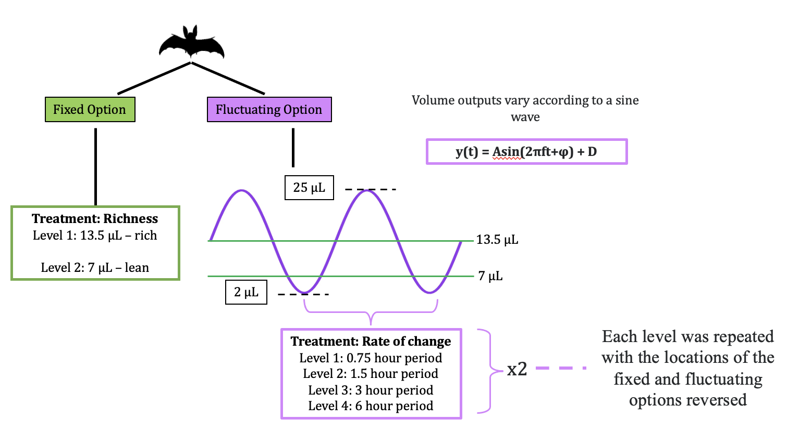

```{css style settings, echo = FALSE}
blockquote {
    margin: 0 0 20px;
    font-size: 14px;
}
```
---

Shambhavi Chidambaram^1,2^, Alex Kacelnik^3^, Vladislav Nachev^1^, York Winter^1,2**\***^ 

^1^ Institute of Biology, Humboldt University, Berlin, Germany

^2^ Berlin School of Mind and Brain, Humboldt University, Berlin, Germany

^3^ Department of Zoology, University of Oxford

^**\***^**For correspondence:** york.winter\@hu-berlin.de

**Present Address:** Institute of Biology, Humboldt University, Philippstr. 13, 10115 Berlin, Germany

```{r setup, include=FALSE}
knitr::opts_chunk$set(
  echo = FALSE, 
  message = FALSE, 
  warning = FALSE, 
  fig.align = "center", 
  fig.pos = "H")
```

```{r Reading-in-the-packages}
# clearing the environment
 rm(list = ls())

# installing the required packages if needed and loading them
if (!require(rmarkdown)) {
  install.packages("rmarkdown")
}
if (!require(reshape2)) {
  install.packages("reshape2")
}
if (!require(tufte)) {
  install.packages("tufte")
}
if (!require(rticles)) {
  install.packages("rticles")
}
if (!require(knitr)) {
  install.packages("knitr")
}
# if (!require(kableExtra)) {
#   install.packages("kableExtra")
# }
if (!require(shiny)) {
  install.packages("shiny")
}
if (!require(scales)) {
  install.packages("scales")
}
if (!require(broom)) {
  install.packages("broom")
}
if (!require(tidyverse)) {
  install.packages("tidyverse")
}
if (!require(gluedown)) {
  install.packages("gluedown")
}
if (!require(glue)) {
  install.packages("glue")
}
if (!require(ggthemes)) {
  install.packages("ggthemes")
}
if (!require(lubridate)) {
  install.packages("lubridate")
}
if (!require(ggpubr)) {
  install.packages("ggpubr")
}
if (!require(gridExtra)) {
  install.packages("gridExtra")
}
if (!require(Hmisc)) {
  install.packages("Hmisc")
}
if (!require(brms)) {
  install.packages("brms")
}
if (!require(bayesplot)) {
  install.packages("bayesplot")
}
if (!require(bayestestR)) {
  install.packages("bayestestR")
}
```

```{=html}
<style>
body {
text-align: justify}
</style>
```

```{r Themes-and-CI-functions}

# creating two themes for all the plots

theme_sine <- function() {
  theme_pubr() +
    theme(
      axis.text = element_text(size = 8, family = "Times"),
      axis.title = element_text(size = 10, family = "Times"),
      strip.text.x = element_text(size = 10, family = "Times"),
      strip.text.y = element_text(size = 10, family = "Times"),
      legend.text = element_text(size = 10, family = "Times"),
      legend.title = element_text(size = 12, face = "bold", family = "Times")
    )
}

theme_sine2 <- function() {
  theme_bw() +
    theme(
      axis.text = element_text(size = 8, family = "Times"),
      axis.title = element_text(size = 10, family = "Times"),
      strip.text.x = element_text(size = 10, family = "Times"),
      strip.text.y = element_text(size = 10, family = "Times"),
      legend.text = element_text(size = 10, family = "Times"),
      legend.title = element_text(size = 12, face = "bold", family = "Times")
    )
}

 # writing a function to automate the reporting of an estimate and error bars
report_m_ci_perc <- function(tbl, par = "_r_", brackets = "round") {
  open_bracket <- case_when(
    brackets == "round" ~ "(",
    brackets == "square" ~ "[",
    brackets == "squiggly" ~ "{",
    brackets == "none" ~ "",
    TRUE ~ str_sub(brackets, 1, 1)
  )
  
  close_bracket <- case_when(
    brackets == "round" ~ ")",
    brackets == "square" ~ "]",
    brackets == "squiggly" ~ "}",
    brackets == "none" ~ "",
    TRUE ~ str_sub(brackets, 2, 2)
  )
  
  tbl <- tbl %>% 
    mutate(CI = paste0(open_bracket, "95% CI ", ymin, ", ", ymax, close_bracket))
  
    return(glue("{tbl$y}% {tbl$CI}"))
}

# writing a function to make a table to get estimates and error bars as a model output

model_outputs <- function(model, fixed_effects) {
  
# creating a table with the required values for the forest plot
t1 <- fixef(model, 
            probs = c(0.055, 0.945)) %>%
  as_tibble() %>%
  mutate(
    `Fixed effect` = fixed_effects,
    Estimate = round(Estimate, digits = 2),
    Q5.5 = round(Q5.5, digits = 2),
    Q94.5 = round(Q94.5, digits = 2)
  ) %>%
  # renaming the credibility intervals column
  mutate("89% Credibility intervals" = paste0("[", Q5.5, ", ", Q94.5, "]")) %>%
  filter(`Fixed effect` != "Intercept") %>%
  rename(labels = `Fixed effect`) %>%
  select(labels, Estimate, `89% Credibility intervals`) %>%
  mutate(All = paste0(Estimate, " ", `89% Credibility intervals`)) %>%
  select(labels, All)
}

# setting the maximum value on the x axis to locate the labels
max_xvalue_output <- function(model, fixed_effects) {
  
max_xvalue <- fixef(model, 
                    probs = c(0.055, 0.945))%>%
  as_tibble() %>%
  mutate(
    `Fixed effect` = fixed_effects,
    Estimate = round(Estimate, digits = 2),
    Q5.5 = round(Q5.5, digits = 2),
    Q94.5 = round(Q94.5, digits = 2)
  ) %>%
  filter(`Fixed effect` != "Intercept") %>%
  select(Q94.5) %>%
  filter(Q94.5 == max(Q94.5)) %>%
  as.numeric()
}
```

# Introduction 

In many foraging environments the properties of the available food resources change. In order to adjust to and exploit changing resources, an animal can potentially learn and remember those properties. An animal can never learn everything about its environment; any learned information will always be incomplete, no matter how much effort is spent in obtaining it. One might then ask - when does the benefit of the learned information outweigh the cost of gaining it? The value of information lies in whether it can tell a forager something that changes its behaviour (Stephens, 2007). When a forager’s behaviour allows it to experience environmental change, and so gain information about the current state of the world, this might be termed ‘tracking.’ The information gained can then be translated into appropriate actions [@dunlap_tracking_2012].

It can easily be seen that the value of seeking information depends on temporal parameters. When an environment changes rapidly any information that is gained by tracking it becomes outdated very soon. When an environment changes so slowly that there is no consequence in the animal’s lifetime, any effort spent in tracking would not yield usable information. Furthermore, the benefit of tracking lies in allowing a forager to choose the best of the options available in an environment - for example, the option that results in the highest caloric gain. For certain combinations of environmental rates of change and differences in the quality of the available options, environmental tracking is both possible and beneficial, in the sense of resulting in a higher energetic net yield. Under some other circumstances it may be preferable to adopt a ‘one size fits all’ or averaging approach, where a forager applies one behavioural response that does best on average over all the possible environmental states (Stephens and Dunlap 2008). One might then ask: what sort of environmental change is tracking, rather than applying an averaging response, beneficial?

An early attempt to model such a situation was done by @stephens_economically_1987, attempting to answer the question of whether, and to what extent, a forager should modify its behaviour in response to a change in its environment. In this simple model the environment has a 'variable' option and a stable 'alternative' option. The latter has a single value, $v_a$, and the former can vary between a good state, $v_g$, and a bad state, $v_b$, such that $v_g$ > $v_a$ > $v_b$. The forager can recognise the type of resource (variable vs alternative) upon encounter, but must consume a resource to know its sub-type (good vs bad). The mechanism through which tracking happens is sampling, i.e., visiting the variable option when the last experience of it was the bad state, with the intention of learning what state it is in at the present time. The probability that the variable option stays the same from one encounter to the next is *q*. The probability that the variable option stays the same from one encounter to the next is q. A forager can make two kinds of errors, (i.e., choices for the less rewarding option) in this environment: an overrun error if the forager visits the alternative option when the variable is in its good state, and a sampling error if the forager visits the variable when it is in its bad state. The relative cost of these two errors is the ratio $\epsilon$. 

$$\mathrm{\epsilon} = \displaystyle \frac{\rm Cost \;of\; a\; sampling\; error\; }{\rm Cost \;of\; an\; overrun\; error\;} = \frac{\ v_a - v_b }{\ v_g - v_a} $$
Thus the optimal sampling period, i.e., tracking, could be solved for in terms of these two variables. This simple model had several predictions. First, tracking behaviour should decrease with a decrease in $v_a$. This is because sampling errors become more costly and overrun errors become less costly: $\epsilon$ increases. When $v_a~ \ge v_g$, tracking behaviour should stop completely. Second, and conversely, tracking behaviour should increase with $v_g$, as overrun errors become more costly, and $\epsilon$ decreases. Third, tracking behaviour should decrease as *q* decreases, as the states of the variable option become more stable.

These predictions were partially held up by some experimental studies. Hummingbirds were found to decrease their sampling rates as the probability of change of the varying option decreased, as predicted, but did not avoid the variable option when the $\epsilon$ value increased [@tamm_tracking_1987]. Similarly, the behaviour of pigeons qualitatively conformed to the predictions of the model, but quantitatively best explained by a model of choice where reward rate is maximized on a moment-to-moment basis based on scalar expectancy [@shettleworth_tracking_1988]. These experiments manipulated $\epsilon$ but not *q*. When *q* was manipulated in an experiment with blue jays, presented with either a high and a low rate of change, both sampling and learning rates - i.e., tracking - were found to increase at faster rates of environmental change [@dunlap_tracking_2012]. Similarly, bumblebees sampled the variable resource more frequently when the probability of change was high, as predicted, but did not consistently choose the more rewarding option except when the probability of change was low and the potential reward was very high [@dunlap_sampling_2017]. 

The merit of the Stephens model is that it outlines the minimum theoretical basis of the issue of environment tracking in order to generate quantitative predictions in a real environment. In a real-world context, however, it is instructive to consider the limitations of the model. A very important assumption of the model is that the forager not only knows the values of the parameters *q* and $\epsilon$, but also knows the structure of the environment: that the variable option switches between a good and a bad state. A real foraging animal can only have a distribution of values as an estimate for the parameters, and can never know the whole structure of its environment. Indeed, since *q* is the probability of change at every encounter with the variable option, knowing the current state of the variable option does not say anything about what its state will be at the next encounter.

Another caveat that affects the predictions of the model is that sampling, by definition, should never occur when the forager is exploiting the variable option. When the state of variable option is known, the state of the environment is known, so a subsequent visit to the stable alternative option will not yield any further information. Thus, the model’s predictions only apply to what a forager does when it is at the alternative option. Thus,  basic assumption of the model, namely that (a) the forager never visits the stable option when exploiting the variable one in its good state, and (b) that the forager immediately switches to the stable option when the variable option switches to its bad state are not met in any of the systems that have been studied. This is a serious issue because it means that while the conceptual contributions and rationale of the model are still valuable, its quantitative predictions are not valid because its assumptions are not fulfilled. These different kinds of foraging errors are discussed in a study by @commons_foraging_2013, which offers a series of models for a similar situation but in which the strategies are based on the observation that assumptions of the Stephens model are not met in real datasets.   
Our study consisted of two experiments inspired by the Stephens model which aimed to study the tracking behaviour of the nectar-feeding bat *Glossophaga mutica*  [@calahorra-oliart_cryptic_2021]. The natural foraging environment of these animals consists of mainly of flowers that contain varying levels of nectar. From the point of view of an individual bat that encounters a flower, the nectar levels change constantly: increasing gradually according to the flower's nectar secretion rate and decreasing according to how many competitors are present in the environment. Bats must constantly compare flowers in different states: full, partially full, or empty.

In our experiments we placed the bats in an environment containing exactly two 'flowers': a flower that always yielded the same volume of reward - a fixed option - and a flower that yielded a reward whose volume changed as a sine function of time, increasing and decreasing. We termed the latter a 'fluctuating' option instead of a 'variable' option, to differentiate it from an option that could only be in two states, good and bad. While most previous empirical tests of tracking models manipulated either the rate of environmental change (*q*) or the relative cost of the two kinds of errors ($\epsilon$), we varied the equivalents of both parameters systematically.

The average relative cost of sampling the two options was determined by the volume of the fixed option. An additional factor is that behaviour may not be driven directly by the absolute real values, but by how they are perceived, and it may be useful to take into account how perception works. In many foraging situations, animals discriminate between relevant variables such as reward magnitudes and time costs according to Weber’s Law, that states that the just-noticeable difference to a stimulus is proportional to the magnitude of the stimulus (@fechner_elemente_1860; see @kacelnik_risky_1998 for its application to foraging). In our first experiment the fixed option yielded a reward at the arithmetic mean of the maximum and minimum volumes of the fluctuating option. In the second, the fixed output was smaller than the arithmetic mean. By fixing it at the geometric mean of the variable extremes, we aimed at making the fixed volume equally discriminable from the minimum and maximum values of the fluctuating option, that is, we fixed it at the variable option’s ‘subjective’ mean.

The environmental rate of change in our experiment was determined by the period of the sine function governing the fluctuating output: the smaller the period, the faster the change. In both experiments the bats experienced the same four periods. It is important to note that in this study the rate of environmental change does not correspond exactly to *q*, as the fluctuating option changes, not probabilistically, but systematically.  From the point of view of the bats the reward on an encounter with the fluctuating option changes from the last encounter when it is discriminably different. The lower the period, the more likely it is that the the fluctuating output is different for a given encounter rate, and so is an equivalent of the parameter *q*. 

Stephens' model applies to a situation where a foraging agent that is perfectly informed about its environment would follow the model's predictions. This is because system described by the model is intrinsically stochastic: it behaves according to some probability of changing state. Therefore, even an ideal forager would show errors in its behaviour in such a system. In our experiment however the system is deterministic, so an ideal agent would in fact behave optimally without any error at all, allocating its behaviour entirely to whichever option was yielding a higher reward at any point in time. A realistic agent on the other hand, does not know everything, even in a deterministic scenario. From the point of view of a real agent, the system does behaves as if it were stochastic. For these reasons, our experiment is inspired by Stephens' model but not designed to test it. It is an empirical study aimed at understanding how and if bats exploit fluctuations in their environment.

We redefined tracking behaviour in our experiment as an outcome, along the lines of @dunlap_sampling_2017: allocating choice behaviour by matching the option yielding the larger reward at time of each choice **(see Figure whatever - I will insert an explanatory figure later in the Methods where it is appropriate)**. This is in contrast to the original mathematical model and some previous studies which put tracking in terms of sampling as its mechanism. A closer match between an animal's choice behaviour and the state of the environment meant that the animal was tracking better: a perfectly tracking bat would always choose the fluctuating
output when it was larger than the fixed, and choose the fixed when it was larger than the fluctuating.  

We predicted that tracking would be better when a) the period of the sine function was larger, i.e., the environment was changing more slowly and b) when the contrast between the fixed and fluctuating options was higher. The latter condition was satisfied, not whent the fixed output was the arithmetic mean, but when it was the subjective mean. By definition the subjective mean was equally discriminable from the best and worst fluctuating outputs, and so the arithmetic mean was less discriminable from the best fluctuating output than from the worst. We referred to the experiment where the fixed option was the subjective mean as the 'high contrast' experiment and where the fixed option was the objective mean as the 'low contrast' experiment. 

We also investigated how much the bats had learned the structure of their environment. We did not expect the bats to learn the complex rule of the environment, i.e., that fluctuating output varied sinusoidally. Instead, we thought it was possible for the bats to detect an increasing or decreasing trend in the fluctuating output and for this to influence their choice behaviour. Thus we compared the choice for fluctuating volumes when these volumes were part of a downward trend, to the same volumes when they were part of an upward trend. 

# Materials and Methods

## Subjects and housing

Both experiments were done at the Cognitive Neurobiology Lab at the Humboldt Universität zu Berlin: the high contrast experiment in December, 2019; the low contrast experiment in June and July, 2020. The experiments were performed with two different sets of individual bats, and were identical in their design and procedure except for the one critical difference of the volume of reward delivered by the fixed option (see **Experiment Schedule** below). 

Bats of the species *Glossophaga mutica* from a captive colony at the Humboldt Universität were used for the experiment. The colony was a breeding population housed at 18-24$^\circ$C and 45-70% humidity on a 12-hour light-dark cycle (light phase: 0200 to 1400 CET; 0300 to 1500 CEST). In this colony every bat older than approximately a year (judged through the ossification of the finger joint - **Brunet-Rossinni and Wilkinson, 2009**) was assigned a permanent ID number, which shall be referred to from now on in order to distinguish the individuals. The bats that were selected for the experiment were a mix of animals that had previously been exposed to the experimental apparatus, and naive ones. None of the bats had participated in such an experiment, or a similar one, before. 16 animals completed the high contrast experiment: 11 females and 5 males. 18 animals completed the low contrast experiment: 10 females and 8 males. 

## Experimental Setup

The experimental setup was common to both experiments. 

### Reward

The reward received by the bats during the experiment was also their main source of food. The reward was a 17 ± 0.2% by weight solution of sugar dissolved in water (prepared fresh everyday or every other day), hereafter referred to as 'nectar'. The sugar consisted of a 1:1:1 mass-mixture of glucose (“Traubenzucker”, Müller’s Mühle GmbH, Germany), sucrose (“Zucker”, Belbake, Südzucker AG, Germany) and fructose (“Fruchtzucker”, Hamburger Zuckerhandelsgesellschaft mbH, Germany). The nectar was thus similar in composition and concentration to the nectar produced by wild chiropterophilous plants [@baker_sugar_1998].

### Experimental Apparatus

The animals were placed in individual, adjacent cages (0.7 x 2.2 x 1.5 m) for the duration of the experiment. As there were six cages in total the experiment was carried out in batches of six bats at a time, and each individual progressed through the experiment independent of all the others. Each cage had an operant wall with two electronic reward-dispensing devices spaced approximately 30 cm apart, hereafter referred to as 'flowers' (figure \@ref(fig:operant-wall) and figure \@ref(fig:flower-cage-schematic)). Each flower had a circular head and a door controlled by a linear-actuator motor that could move up and down. Just inside the head of the flowers was an infra-red light barrier, and at the back of the flower was a Teflon tube that supplied the nectar to the flower(figure \@ref(fig:flower-parts)). Each Teflon tube was connected to a short piece of soft peroxide-silicone tube that ran through a pinch-valve. 

(ref:operant-wall) Photograph of operant wall

```{r, operant-wall, fig.cap = "(ref:operant-wall)"}
p1 <- include_graphics("images/operant_wall.png")

p1
```

(ref:flower-cage-schematic) Schematic of cage and operant wall with flowers 

```{r, flower-cage-schematic, fig.cap = "(ref:flower-cage-schematic)"}
p2 <- 

p2

```

(ref:flower-parts) Schematic of a flower with its parts

```{r flower-parts, fig.cap = "(ref: flower-parts)"}
p3 <- include_graphics("images/flower_parts.png")

p3

```

The Teflon tubes were connected to a syringe pump in a branching design that ensured the length of tube between every flower and the pump was exactly equal to 470 cm. The pump was placed outside the cages on a shelf, inaccessible to the bats. The syringe of the pump was a Hamilton 25 mL glass syringe (Sigma Aldrich, Germany) and connected to the tubing system of the flowers through five pinch valves on the pump. These pinch valves controlled the flow of liquid from the pump to the system and from a reservoir of liquid to the pump. The reservoir (500 mL thread bottle, Roth, Germany) was filled with fresh nectar every day and connected to the syringe through the valves. 

The flowers and the pump were connected by ethernet cables to a laptop computer (ThinkPad, IBM) that stood outside the cages. This computer ran the experimental schedule and the program used to clean and fill the systems using the PhenoSoft Control program (Phenosys, GmBH, Germany). To trigger a reward a bat had to place its nose inside the flower and break the infra-red light barrier. This sent a signal to the computer, which triggered the pinch-valve to open and the pump to move the correct number of steps. 

## General Experimental Procedure

Data-collection was completely automated and happened for 12 hours every day. The experimental animals were kept on the same light-dark cycle as the bats in the colony and were active during the dark phase, which is when the data were collected. The experiment was prepared everyday in the morning during the light phase. The animals were inspected everyday to make sure they were healthy and flying well. Then a preliminary analysis of the data from the previous night was done everyday on the laptop running the experimental program using a Shiny App written in R, to make sure the program had been executed correctly and the bats had drunk sufficient nectar. The minimum quantity of nectar was an amount that yielded 25 kiloJoules of energy. Any bat that drank less than this amount was given honey water for an hour before the start of the experiment. 

The old nectar was flushed from the system using the automated PhenoSoft program and fresh nectar refilled. Twice a week, the pump and tubing system was thoroughly rinsed with 70% ethanol and de-calcified water to remove pathogens. 

At approximately 1800 h the data were checked to see if all the bats had made at least two visits to the flowers, and thus learned to trigger rewards. If bats had not made visits, they received *ad-libitum* honey water for the rest of the experimental night and they were replaced with another animal on the next night. 

The bats were given supplemental food in addition to the nectar from the flowers. 0.2 g of a powdered nectar mixture (NEKTAR-Plus, NEKTON, Germany) and 0.3 g of milk powder (Milasan "Folgemilch 2", Sunval Baby Food, Germany) mixed in approximately 1 mL of water, and 2 mL of plain water were given to each bat. These supplements were put into Eppendorf tubes attached to the operant wall of the cage, about 87 cm below the flowers. The additional food was such that the bats would prefer to visit the flowers instead, both because the flowers were at a more comfortable height for the animals and because the nectar had a higher sugar content and was preferred to the milk powder-nectar supplement mix. The additional food was given firstly to supply micronutrients to the bats while they were in the experiment, and secondly to ensure the animals received a sufficient number of calories in case there was a technical system failure or the bats did not make a sufficient number of visits to the flowers. No technical failures occurred during either experiment.

Once an animal had completed the experiment, it was removed from the cage, weighed to see if it had lost weight since the start of the experiment, released back into the colony and replaced with another bat.

```{r}

# reading in the pump data from the subjective mean experiment
Pump_subjmean <- read.csv2("data/processed_data/Pump_subj.csv", sep = ";", header = TRUE)
# reading in the pump data from the objective mean experiment
Pump_objmean <- read.csv2("data/processed_data/Pump_obj.csv", sep = ";", header = TRUE)

# putting the two data-sets together 

Pump_data <- bind_rows(Pump_subjmean, Pump_objmean)

#calculating the pump fill time 
Filltime <- Pump_data %>% 
  filter(SystemMsg == "start pump" | SystemMsg == "end pump") %>% 
  mutate(interval = ifelse(SystemMsg == "start pump", as.numeric(difftime(lead(DateTime), DateTime, units = "secs")), "non-fill time")) %>% 
  select(DateTime, IdLabel, Cond, MsgValue1, interval) %>% 
  arrange(DateTime) %>% 
  filter(interval != "non-fill time", 
         interval < 300) %>% 
  mutate(interval = as.integer(interval)/60) %>% 
  summarise(mean_filltime = round(mean(interval), digits = 2),  
            sd_filltime = round(sd(interval), digits = 2))

# calculating the number of times the pump fills 
Fillnum <- Pump_data %>% 
  filter(SystemMsg == "start pump" | SystemMsg == "end pump") %>% 
  mutate(interval = ifelse(SystemMsg == "start pump", as.numeric(difftime(lead(DateTime), DateTime, units = "secs")), "non-fill time")) %>% 
  select(DateTime, Day, IdLabel, Cond, MsgValue1, interval) %>% 
  arrange(DateTime) %>% 
  filter(interval != "non-fill time", 
         interval < 300) %>%
  group_by(Day) %>% 
  summarise(pump_events = n()) %>% 
  ungroup() %>% 
  summarise(mean_fillnum = round(mean(pump_events), digits = 2), 
            sd_fillnum = round(sd(pump_events), digits = 2))
```

During the experimental night, when the syringe of the pump had been fully emptied, the pump had to refill with nectar from the reservoir. This event happened on average `r as.numeric(Filltime[1,1])` times per night (SD = ± `r as.numeric(Filltime[1,2])`), taking `r as.numeric(Fillnum[1,1])` minutes each time (SD = ± `r as.numeric(Fillnum[1,2])`). During this time, if the bats made visits to the flowers, they did not receive any reward. 

## Experiment Schedule 

In both experiments, one option was the 'fixed' option and the other was the 'fluctuating' option. The fluctuating option delivered a reward that varied as a sine function of time, starting at its maximum volume when a bat made its first visit to the fluctuating option, and proceeding through the sine-function regardless of where the bat made its subsequent visits. In the high contrast experiment the reward delivered by the fixed option was selected so that the volume pairs of the fixed option and the minimum output of the sine-wave, and the fixed option and the maximum output of the sine-wave were, in principle, equally discriminable. This was based on the relative intensity of the volume pairs, calculated as follows: 

$$\ \displaystyle \frac{\ volume_1 - volume_2 }{\ (volume_1 + volume_2)/2}  $$

In the low contrast experiment, the output of the fixed option was the arithmetic mean of the peak and trough volumes of the fluctuating option, and so was less discriminable from the peak than the trough. The maximum volume of the fluctuating option, i.e., the peak of the sine-wave, was 25 $\mu$L, and the minimum was 2 $\mu$L, so the output of the fixed option was 7 $\mu$L in the high contrast experiment and 13.5 $\mu$L in the low contrast experiment. 

The experiment proceeded through the following stages: 

### Pre-training

On the first day of the experiment the bats were placed inside the cages and allowed to acclimatize to the new environment. The flowers were covered with a towel to prevent the animals accessing them, and containers of honey water were placed on top of the covered flowers, which the bats found easily. On this day alone no other food was given, not even the supplementary mixture. Food was only available at the location of the flowers. No data were recorded by the computer on this day, and the amount of honey-water consumed was not monitored.  

### Training

Shortly before 1400 h, the towels were removed from the flowers so the bats could access them. To teach the bats to put their noses into the flower head and trigger the reward, a drop of honey was applied to the back of the flower and a drop to the top of the flower. 

The training proceeded in five phases that repeated throughout the night. Whenever the bats completed 50 visits to both flowers in total, the phase ended and the next began. 

1. **Initial:** The doors in front of the flowers remained open, and the bats could pay a visit to whichever flower they wanted. The bats received a reward volume of 25 $\mu$L at both flowers.

2. **Forced 1:** This was a phase of forced alternation. At the start of this phase, the door in front of one of the flowers moved up to prevent access to it, forcing the bat to visit the other one. After a visit was made and the reward collected, the door of the visited flower would move up to block access to it, and door of the other flower would open. In this way the bat was forced to alternate its visits to the two flowers and so ensure that the locations of both flowers were learned. In this phase there was a difference in reward volume between the two flowers. Two pairs of volumes were possible: the fixed output and 2 $\mu$L; or the fixed output and 25 $\mu$L. Depending on which experiment it was, the fixed output was either 7 $\mu$L (the subjective mean) or 13.5 $\mu$L (the objective mean). Half the bats were given one volume pair, and the other half the other volume pair. The flower on which the higher volume was given was counter-balanced across animals. 

3. **Free 1:** This was a phase of *ad-libitum* reward similar to the Initial phase: both flower doors were open so both flowers were freely accessible to the bats. The volume differences of the Forced 1 phase were maintained. As the bats were free to visit both flowers, the preference of the bats for the flower that gave the higher volume was taken as indication of the discriminability of the volumes.

4. **Forced 2:** This phase was the same as the Forced 1 phase except the volume pairs were different. Those bats that received the fixed output vs. 2 $\mu$L volume pair in the Forced 1 phase now received 25 $\mu$L vs. the fixed output and *vice versa*. Half the bats received the higher volume at the same flower as Forced 1 and the other half at the other flower.

5. **Free 2:** This was similar to the Free 1 phase, in that both flowers were accessible and reward was *ad-libitum*, but the reward volumes at the flowers were the same as those in the phase Forced 2. In this way the bats' preferences for the higher volume of both volume pairs was determined.

After the bats had completed all five phases, the schedule repeated itself  except for the Initial phase. This continued for the rest of the night. If a bat learned to trigger rewards and made visits, but not a sufficient number to experience all five phases at least once it had to repeat the Training stage on the next night. If the bat did not complete all five phases even on the second day of Training it was removed from the experiment and replaced. 

### Main Experiment

The bats experienced four experimental conditions, corresponding to four periods of the sine wave: 

* 0.75 hours
* 1.5 hours
* 3 hours
* 6 hours

The period of the wave was the time interval between two consecutive peaks or troughs. During each experimental night the bats were given free choice between the fixed option and the fluctuating option whose output varied by a sine function of time, calculaed as follows:

$$ \mathrm{y(t)} = {\rm Asin(2\pi ft + \varphi) + D} $$

where: 

* A is the Amplitude of the wave, or the distance between the peak and the mid-value of the wave
* f is the frequency of the wave, or the reciprocal of the wave period in seconds 
* t is the time point in seconds since the start of the wave
* $\varphi$ is the Phase, specifying in units of radians where the wave is when t = 0 
* D is the Displacement, or a center Amplitude that is not 0

The bats first experienced a condition for a night, during which the fixed and fluctuating options were assigned to a flower location each, and this location did not change. On the following night there was a reversal of options, i.e., a reversal of the reward contingencies of the flowers: the flower that had previously been the fixed option was now the fluctuating, and *vice versa*. This was done to control for a location preference by the bats. After the bats had experienced a condition on two successive nights in this way, the next condition was given, so there were 4x2 or 8 experimental nights in total (in addition to the training). The order of the conditions was pseudo-randomized across animals. 

On the first night of the main experiment the fluctuating option was assigned to the flower that each bat had made more visits to overall on the previous training night, as it was assumed that the animals now had a slight preference for this flower. From then on the reversal of reward contingencies between the two flowers happened every night. At the start of each experimental night, the sine-function that determined the fluctuating output did not begin until the bat made a visit to the fluctuating output. Then the bat experienced the peak of the wave, i.e., the highest possible fluctuating output (25 $\mu$L). This was a large reward, and designed to motivate the bats to make repeated visits to the fluctuating option so they could experience the change in the output (see **Supplementary Information**). 

(ref:design-schematic) Schematic of the design of the subjective mean and objective mean experiments

```{r, design-schematic, fig.cap = "(ref:design-schematic)"}
p4 <- 

p4
```

## Data analysis - WRITE THIS SECTION ALONE LATER 

The raw data from these experiments were logged as events by a computer and recorded in comma-separated value (CSV) files. Each event included the date and time of the event, the animal that made the event, the duration of interruption of the photo-gate and the volume of nectar dispensed. The CSV files were then read into R, which was used for all statistical analyses and creation of plots.

A bat had to experience the reward contingencies of both options on every night to be included for the statistical analysis. In practice this meant that the bat had to make at least one rewarded visit to both options every night. 

The bats experienced the reward volumes in the fluctuating options as part of either a downward trend, when the fluctuating output was decreasing, or part of an upward trend, when the fluctuating output was increasing. In both cases the volume difference between the fixed and the fluctuating options was exactly the same but the difference was in the volume differences experienced just before. The bats could use their past experience in one of two ways: they could either estimate an option as being more rewarding based on their reinforcement at that option in the recent past; or they could estimate an option as being more rewarding based on their experience of an increasing reward output at that option, despite the recent past reinforcement being comparatively low. In the first case, we would expect the proportion of visits to any volume of the fluctuating option to be higher when that volume was part of a downward trend; in the second case, we would expect the proportion of visits to be higher when the volume was part of an upward trend. We also considered the specific case of the volume pair 7 vs. 13.5 $\mu$L. In the subjective mean experiment this situation arose when the fluctuating output was 13.5 $\mu$L because the fixed output was always 7 $\mu$L; in the objective mean experiment it arose when the fluctuating output was 7 $\mu$L as the fixed output was always 13.5 $\mu$L. The volume pair was discriminable by the bats, and if there were no effect of trend, the preference for the higher volume should be higher than 50% in all the experimental conditions. 

In both the experiments, we investigated the effect of trend, volume of the fluctuating output and rate of change of the fluctuating option on the proportion of visits to the fluctuating option. In both the experiments we also created separate models of one specific pair of volumes: 7 and 13.5 $\mu$L. In the subjective mean experiment this was when the fluctuating output was 13.5 $\mu$L, and in the objective mean experiment this was when the fluctuating output was 7 $\mu$L. We investigated the effect of trend on the proportion of visits made to the higher volume in this pair (13.5 $\mu$L) in both experiments. The proportion of visits to the fluctuating output was calculated as the number of visits to the fluctuating output divided by the sum of the number of visits to the fluctuating output and the number of visits to the fixed option in that category. The proportion of visits to the higher volume of a volume pair was calculated in a similar manner. 

Generalized linear mixed-models were fitted in a Bayesian framework using Hamiltonian Monte Carlo in the R package `brms` [@burkner_brms_2017], which is a front-end for `rstan` [@carpenter_stan_2017]. The technical details of these models are provided in the **Supplementary section**. We present plots of the conditional effects of the predictor variables, with the parameter values of the models provided in the **Supplementary section**. We report the mean as a measure of central tendency and the 89% quantile-based credible intervals for the parameters. (89% boundaries are the default for reporting credible intervals - @mcelreath_statistical_2020). 

All statistical analyses and creation of plots were done in R.

# Results

## A majority of bats responded to the reversal of location of the two options 

```{r, reading-preparing-data}
# reading in the pump data from the subjective mean experiment
Main_all <- read.csv2("data/processed_data/Main_roc.csv", sep = ";", header = TRUE)

# setting the parameters for volume calculation, sine wave calculation and pump-step conversions
# pump steps for the maximum volume of the fluctuating option
maxsine_steps <- 76
# pump steps for the minimum volume of the fixed option
minsine_steps <- 6
# conversion factor between pump-steps and microLitres of volume
step_conv <- 0.324
# converting the rewards from pump-step units to microLitres
maxsine <- step_conv * maxsine_steps
minsine <- step_conv * minsine_steps
# setting the fixed volumes as variables
fixed1 <- step_conv * 22
fixed2 <- step_conv * 42
# setting the pump steps for the fixed option
fixed_steps <- 22 

# calculating the sine-wave for the bats, with the actual start time of the wave instead of when the bat made its first rewarded visit at the fluctuating option, as explained in the supplementary information

Main_all <- Main_all %>% 
  # adding the pump steps for the two fixed options
  mutate(Fixed_steps = ifelse(Experiment == "Subjective", 22, 42), 
         Fixed_vol = Fixed_steps * step_conv)

# inserting a space between the word "Bat" and the number of the animal
Main_all <- Main_all %>% 
  mutate(Bat_word = ifelse((str_detect(IdLabel, "Bat") == TRUE), "Bat", ""), 
         Bat_number = ifelse((str_detect(IdLabel, "Bat") == TRUE), as.integer(str_extract(IdLabel, "[0-9]+")), IdLabel), 
         IdLabel = ifelse(is.na(IdLabel), IdLabel, paste0(Bat_word, " ", Bat_number))) %>% 
  select(-Bat_word, -Bat_number)

# creating a lookup table to find the first occurrence of a visit to the flower that was fluctuating on a particular day 

fluc_visits <- Main_all %>% 
  ungroup() %>% 
  group_by(Experiment, Day, IdLabel, unitLabel) %>% 
  select(Experiment, Day, IdLabel, unitLabel, outFuncLabel) %>% 
  distinct() %>% 
  filter(str_detect(outFuncLabel, "sine") | str_detect(outFuncLabel, "fix"))

# joining the lookup table to the Main table to correctly mark the unrewarded visits as fixed or fluctuating 

Main_all <- Main_all %>% 
  # first removing the original outFuncLabel column
  select(-outFuncLabel)

Main_all <- left_join(Main_all, fluc_visits, by = c("Experiment", "Day", "IdLabel", "unitLabel")) 

# removing the now unnecessary look-up table 
rm(fluc_visits)

# adding a period-day column to the table

Main_all <- Main_all %>%
  mutate(
    Rev = "Rev",
    Period_day = ifelse(Reversal == 0, Period, paste0(as.character(Period), " ", Rev))
  ) %>%
  # removing the now redundant columns
  select(-Rev, -Reversal)

# creating a look-up table for calculating the sine wave

sinewave <- Main_all %>%
  # filtering only the visits to the fluctuating output
  filter(outFuncLabel == "sineRewOut") %>%
  # selecting relevant columns from the main table to calculate the sine wave
  select(Experiment, Day, IdLabel, Period, Period_day, timediff, Amplitude, Disp, Fixed_steps, vis_vol, Tracking) %>%
  group_by(Experiment, Day, IdLabel) %>%
  mutate(
    Period = as.numeric(str_remove(Period_day, "Rev")), 
    # adding a row counter
    rown = 1:n(),
    # adding a column with the number of points on the calculated sine wave
    reps = 360
  ) %>%
  # taking the first occurrence of the fluctuating output
  filter(rown == 1)

# noting the number of columns in the data frame
nsine <- as.numeric(ncol(sinewave))

# repeating the rows by the number of points on the wave so the whole sine wave can be calculated
sinewave <- sinewave[rep(row.names(sinewave), sinewave$reps), 1:nsine]

# adding a column with the actual time increments
sinewave <- sinewave %>%
  # removing the old row counter so it can be done over
  select(-rown) %>%
  group_by(Experiment, Day, IdLabel) %>%
   mutate(
    # calculating the row counter again
    rown = 1:n(),
    # calculating the time differences with the proper increments: 12 hours are divided among 360 points on the wave
    timediff = ifelse(rown == 1, timediff, (lag(timediff) + (12 / 360) * (rown - 1))),
    # creating a dummy time column to calculate the wave so it starts at the peak regardless of the timediff column
    wavetime = 0,
    wavetime = ifelse(rown == 1, 0, (lag(wavetime) + (12 / 360) * (rown - 1))),
    # converting the time values back to seconds
    Period = Period * 3600,
    # converting the dummy time column to seconds
    wavetime = wavetime * 3600,
    # calculating the sine wave values and converting from pump step values to microLitres
    sine_vol = (Amplitude * sin(2 * pi * (1 / Period) * wavetime + (pi / 2)) + Disp) * step_conv,
    Period = Period / 3600
  ) %>%
  # removing time points that occurred after 12 hours by the calculation
  filter(timediff <= 12) %>%
  # removing the now-unnecessary columns
  select(-wavetime, -reps, -rown)

```

```{r, echo=FALSE, warning=FALSE, message=FALSE}

# preparing the datasets with the sinewaves for the plots 
sine_tr_subj <- sinewave %>% 
  #Sinewave for the responsive bats in the subj exp
  filter(Tracking == "tracker", 
         Experiment == "Subjective") 

sine_tr_obj <- sinewave %>%
    #Sinewave for the responsive bats in the obj exp
  filter(Tracking == "tracker", 
         Experiment == "Objective")

sine_nt_subj <- sinewave %>% 
  #Sinewave for the responsive bats in the subj exp
  filter(Tracking == "non-tracker", 
         Experiment == "Subjective") 

sine_nt_obj <- sinewave %>%
    #Sinewave for the responsive bats in the obj exp
  filter(Tracking == "non-tracker", 
         Experiment == "Objective")

# preparing the right-hand axis for some of the following plots
optionchoice <- c("F", "V")
```

Two behavioural strategies were observed in the main experimental phase. The locations of the fixed and fluctuating options were always reversed between the two flowers on the second night of a condition to control for the bats' location preferences. While most of the bats made visits to both options on both nights, a minority did not. 4 out of the 16 bats in the subjective mean experiment, and 3 out of the 18 bats in the objective mean experiment, made near-exclusive visits to the same flower on both nights of a condition, regardless of whether that flower was the fixed or the fluctuating option. We designated these bats the 'reversal non-responsive' bats, as reversing the location of the fixed and fluctuating options induced no observable behavioural response. 

**explain the NRMSE criterion for  exclusion**

Figure \@ref(fig:nonresp) shows the overall activity of the reversal non-responsive bats. The first time point of the sine function was the first visit made by a bat to the fluctuating option. This meant that on those nights the fixed option was assigned to the preferred flower of a reversal non-responsive bat, the bat never experienced the changing output of the fluctuating option and was thus 'uninformed' of all the available options - these animals were excluded from statistical analyses.

(ref:nonresp) Choice behaviour of all the reversal non-responsive bats in the two experiments. Each row is one night of experimental condition, i.e., the two nights for each of the four wave periods, and each column an individual bat. The solid black line represents the output of the fluctuating option and the red points each individual visit made by a bat. The red points to the top of the plots are visits made to the fluctuating option and those at the bottom of the plots are visits made to the fixed option. The dashed horiontal line represents the volume output of the fixed option. a) Reversal non-responsive bats in the subjective mean experiment b) Reversal non-responsive bats in the objective mean experiment
 
```{r, nonresp, echo=FALSE, warning=FALSE, message=FALSE, fig.align='center', fig.width = 14, fig.height = 7, fig.cap = "(ref:nonresp)"}

Main_subj_nt <- Main_all %>% 
  filter(Tracking == "non-tracker", 
         Experiment == "Subjective")

p5 <- Main_subj_nt %>% 
  filter(Tracking == "non-tracker") %>%
  #mutate(smooth = as.numeric(tsSmooth(StructTS(chosen, type = "level")))) %>%
  ggplot(aes(timediff)) +
  geom_line(data = sine_nt_subj,  
            #%>% filter(IdLabel == c("Bat 22", "Bat 30", "Bat 67")), 
            aes(timediff, sine_vol)
            ) +
  geom_point(aes(y = chosen), colour = "red", alpha = 0.05, size = 1) +
  #geom_line(aes(y = smooth), color = "cornflowerblue") +
  scale_x_continuous(breaks = seq(0,12,1)) +
  geom_hline(yintercept = 7, linetype = 2) +
  xlab("Hour") +
  ylab(expression(paste("Volume output of the fluctuating option [", mu, "L]"))) +
  scale_y_continuous(limits = c(minsine, maxsine), 
                     sec.axis = sec_axis(~.,
                                         breaks = c(minsine, maxsine),
                                         labels = optionchoice)) + 
  facet_grid(Period_day ~ IdLabel, scales = "free_y") +
  theme_sine() +
  theme(plot.title = element_text(size=12)) +
  theme(strip.placement = "outside")

Main_obj_nt <- Main_all %>% 
  filter(Tracking == "non-tracker", 
         Experiment == "Objective")

p6 <- Main_obj_nt %>% 
  filter(Tracking == "non-tracker") %>%
  #mutate(smooth = as.numeric(tsSmooth(StructTS(chosen, type = "level")))) %>%
  ggplot(aes(timediff)) +
  geom_line(data = sine_nt_obj,  
            #%>% filter(IdLabel == c("Bat 22", "Bat 30", "Bat 67")), 
            aes(timediff, sine_vol)
            ) +
  geom_point(aes(y = chosen), colour = "red", alpha = 0.05, size = 1) +
  #geom_line(aes(y = smooth), color = "cornflowerblue") +
  scale_x_continuous(breaks = seq(0,12,1)) +
  geom_hline(yintercept = 13.5, linetype = 2) +
  xlab("Hour") +
  ylab(expression(paste("Volume output of the fluctuating option [", mu, "L]"))) +
  scale_y_continuous(limits = c(minsine, maxsine), 
                     sec.axis = sec_axis(~.,
                                         breaks = c(minsine, maxsine),
                                         labels = optionchoice)) + 
  facet_grid(Period_day ~ IdLabel, scales = "free_y") +
  theme_sine() +
  theme(plot.title = element_text(size=12)) +
  theme(strip.placement = "outside")

ggarrange(p5, p6, ncol = 2, labels = c("a)", "b)"))

```

The animals that did respond to the reversal showed a change in their choice behaviour corresponding to the output of the sine wave. This is represented in Figure \@ref(fig:responsive). 

(ref:responsive) Choice behaviour of three representative reversal responsive bats from each of the two experiments. Each row is one night of experimental condition, i.e., the two nights for each of the four wave periods, and each column an individual bat. The solid black line represents the output of the fluctuating option and the red points each individual visit made by a bat. The red points to the top of the plots are visits made to the fluctuating option and those at the bottom of the plots are visits made to the fixed option. The blue lines are a smoothing function applied to the choices of the bats. The dashed horiontal line represents the volume output of the fixed option. a) Three of the reversal responsive bats in the subjective mean experiment b) Three of the reversal responsive bats in the objective mean experiment

```{r, responsive, echo=FALSE, warning=FALSE, message=FALSE, fig.align='center', fig.width = 13, fig.height = 7, fig.cap = "(ref:responsive)"}

Main_subj_3bats <- Main_all %>% 
  filter(
    IdLabel == c("Bat 22", "Bat 30", "Bat 67"), 
         Experiment == "Subjective")

p7 <- Main_subj_3bats %>% 
  filter(Tracking == "tracker") %>%
  mutate(smooth = as.numeric(tsSmooth(StructTS(chosen, type = "level")))) %>%
  ggplot(aes(timediff)) +
  geom_line(data = sine_tr_subj  
            %>% filter(IdLabel == c("Bat 22", "Bat 30", "Bat 67")), 
            aes(timediff, sine_vol)
            ) +
  geom_point(aes(y = chosen), colour = "red", alpha = 0.05, size = 1) +
  geom_line(aes(y = smooth), color = "cornflowerblue") +
  scale_x_continuous(breaks = seq(0,12,1)) +
  geom_hline(yintercept = 7, linetype = 2) +
  xlab("Hour") +
  ylab(expression(paste("Volume output of the fluctuating option [", mu, "L]"))) +
  scale_y_continuous(limits = c(minsine, maxsine), 
                     sec.axis = sec_axis(~.,
                                         breaks = c(minsine, maxsine),
                                         labels = optionchoice)) + 
  facet_grid(Period_day ~ IdLabel, scales = "free_y") +
  theme_sine() +
  theme(plot.title = element_text(size=12)) +
  theme(strip.placement = "outside")

Main_obj_3bats <- Main_all %>% 
  filter(
    IdLabel == c("Bat 50", "Bat 101", "Bat 1"), 
         Experiment == "Objective")

p8 <- Main_obj_3bats %>% 
  filter(Tracking == "tracker") %>%
  mutate(smooth = as.numeric(tsSmooth(StructTS(chosen, type = "level")))) %>%
  ggplot(aes(timediff)) +
  geom_line(data = sine_tr_obj 
            %>% filter(IdLabel == c("Bat 50", "Bat 101", "Bat 1")), 
            aes(timediff, sine_vol)
            ) +
  geom_point(aes(y = chosen), colour = "red", alpha = 0.05, size = 1) +
  geom_line(aes(y = smooth), color = "cornflowerblue") +
  scale_x_continuous(breaks = seq(0,12,1)) +
  geom_hline(yintercept = 13.5, linetype = 2) +
  xlab("Hour") +
  ylab(expression(paste("Volume output of the fluctuating option [", mu, "L]"))) +
  scale_y_continuous(limits = c(minsine, maxsine), 
                     sec.axis = sec_axis(~.,
                                         breaks = c(minsine, maxsine),
                                         labels = optionchoice)) + 
  facet_grid(Period_day ~ IdLabel, scales = "free_y") +
  theme_sine() +
  theme(plot.title = element_text(size=12)) +
  theme(strip.placement = "outside")

ggarrange(p7, p8, ncol= 2, labels = c("a)", "b)"))

```

## Slower rates of change and higher contrast between options resulted in increased tracking

```{r binning-into-five-minute-bins}
# Binning data from the Objective mean experiment
# setting this for a binsize that is a proportion of the period - this and binsize_min 
# are the only variable that needs to be set for the analyses below:
binratio <- 1/18 
#setting this for a fixed binsize in units minutes
binsize_min <- 5 
#calculating fixed binsize in seconds
binsize_sec <- binsize_min*60 
binsize <- data.frame(Period = c(0.75, 1.5, 3, 6))
binsize <- binsize %>%
  mutate(Period_min = Period*60, 
         prop_binsize = 60*round(Period*60*binratio),
         prop_binnumber = 3600*12/prop_binsize,
         #setting a column for whichever actual fixed binsize is used 
         fixed_binsize = binsize_sec, 
         #setting an equal binsize for all the periods for now
         fixed_binnumber = 3600*12/binsize_sec) 

#Creating a table with the information about periods and days
Datetimes <- Main_all %>% 
  filter(Experiment == "Objective") %>% 
  ungroup() %>%
  select(Day, Period_day, IdLabel, DateTime, Tracking) %>%
  #mutate(day = day(DateTime)) %>%
  select(-DateTime) %>%
  distinct() %>%
  arrange(IdLabel)

# creating helper sequences of the timeseries with the Datetimes of the objective 
# mean experiment
timeseries1 <- 
  data.frame(Datetime = seq.POSIXt(from = as.POSIXct("2020-06-19 15:00:00"), to = as.POSIXct("2020-06-27 03:00:00"), by = as.numeric(binsize[1,5])))
timeseries2 <- 
  data.frame(Datetime = seq.POSIXt(from = as.POSIXct("2020-06-29 15:00:00"), to = as.POSIXct("2020-07-10 03:00:00"), by = as.numeric(binsize[1,5])))
timeseries3 <- 
  data.frame(Datetime = seq.POSIXt(from = as.POSIXct("2020-07-16 15:00:00"), to = as.POSIXct("2020-07-24 03:00:00"), by = as.numeric(binsize[1,5])))

timeseries <- bind_rows(timeseries1, timeseries2, timeseries3) %>%  
  mutate(Datetime = as.POSIXct(Datetime), 
         Hour = hour(Datetime)) %>%
  # filtering and removing the non-experimental times
  filter(Hour >= 15 | Hour < 3) %>% 
  select(-Hour) %>%
  rename(time_bins = Datetime)
timeseries <- bind_rows(replicate(8, timeseries, simplify = FALSE))

l <- nrow(timeseries)
# creating a sequence of the day numbers
seq <- c(2:9, 11:21, 23:30)

timeseries <- timeseries %>%  
  mutate(Period_day = rep(c(0.75, "0.75 Rev", 1.5, "1.5 Rev", 3, "3 Rev", 6, "6 Rev"), each = l/8)) %>%
  mutate(Day = rep(seq, each = binsize[1,6], times = 8))

# putting it all together to create one giant lookup table
timeseries <- left_join(Datetimes, timeseries, by = c("Day", "Period_day")) %>%
  filter(!is.na(IdLabel)) %>%
  arrange(IdLabel, Day, time_bins) %>% 
  filter(!is.na(time_bins)) %>% 
  mutate(time_bins = as.character(time_bins))

# removing the timeseries helper sequences
rm(timeseries1, timeseries2, timeseries3)

# binning the Main data into 5 minute bins 
Main_all <- Main_all %>%
  group_by(Period_day, IdLabel) %>%
  mutate(time_bins = floor_date(as_datetime(DateTime), unit = "5 minute"))

# creating a separate table for the workrate binning
fivemin_bins_obj_intm <- Main_all %>%
  filter(Experiment == "Objective", 
         #Tracking == "tracker"
  ) %>% 
  select(DateTime, Period, Period_day, IdLabel, outFuncLabel, sine_vol, time_bins, Tracking) %>% 
  mutate(time_bins = as.character(time_bins))

# adding the time series data to the experimental data
fivemin_bins_obj <- left_join(timeseries, fivemin_bins_obj_intm, by = c("Period_day", "Tracking", "IdLabel", "time_bins")) %>%
  mutate(time_bins = as.POSIXct(time_bins), 
         Hour = hour(time_bins)) %>%
  filter(Hour < 3 | Hour >= 15) %>%
  select(-Hour) %>% 
  mutate(Experiment = "Objective")

# Repeating the above steps for the Subjective mean experiment

# creating a table with the information about periods and days
Datetimes <- Main_all %>% 
  filter(Experiment == "Subjective") %>% 
  ungroup() %>%
  select(Day, Period_day, IdLabel, DateTime, Tracking) %>%
  #mutate(day = day(DateTime)) %>%
  select(-DateTime) %>%
  unique() %>%
  arrange(IdLabel)

timeseries_1 <- 
  data.frame(Datetime = seq.POSIXt(from = as.POSIXct("2019-12-01 14:00:00"), to = as.POSIXct("2019-12-09 02:00:00"), by = as.numeric(binsize[1,5]))) 
timeseries_2 <- 
  data.frame(Datetime = seq.POSIXt(from = as.POSIXct("2019-12-11 14:00:00"), to = as.POSIXct("2019-12-20 02:00:00"), by = as.numeric(binsize[1,5]))) 
timeseries_3 <- 
  data.frame(Datetime = seq.POSIXt(from = as.POSIXct("2019-12-22 14:00:00"), to = as.POSIXct("2019-12-31 02:00:00"), by = as.numeric(binsize[1,5]))) 

timeseries <- bind_rows(timeseries_1, timeseries_2, timeseries_3) %>%
  mutate(Datetime = as.POSIXct(Datetime), 
         Hour = hour(Datetime)) %>%
  filter(Hour >= 14 | Hour < 2) %>%
  # filtering and removing the non-experimental times
  select(-Hour) %>%
  rename(time_bins = Datetime)
timeseries <- bind_rows(replicate(8, timeseries, simplify = FALSE))

l <- nrow(timeseries)
seq <- c(2:9,11:19,21:29)

timeseries <- timeseries %>%  
  mutate(Period_day = rep(c(0.75, "0.75 Rev", 1.5, "1.5 Rev", 3, "3 Rev", 6, "6 Rev"), each = l/8)) %>%
  mutate(Day = rep(seq, each = binsize[1,6], times = 8))

# adding the information about the periods to the timeseries and removing NAs
timeseries <- left_join(Datetimes, timeseries, by = c("Day", "Period_day")) %>%
  filter(!is.na(IdLabel)) %>%
  arrange(IdLabel, Day, time_bins) %>% 
  mutate(time_bins = as.character(time_bins))

# creating a separate table for the workrate binning
fivemin_bins_subj_intm <- Main_all %>%
  filter(Experiment == "Subjective", 
         #Tracking == "tracker"
  ) %>% 
  select(DateTime, Period, Period_day, IdLabel, outFuncLabel, sine_vol, time_bins, Tracking) %>% 
  mutate(time_bins = as.character(time_bins))

# adding the time series data to the experimental data
fivemin_bins_subj <- left_join(timeseries, fivemin_bins_subj_intm, by = c("Period_day", "Tracking", "IdLabel", "time_bins")) %>%
  mutate(time_bins = as.POSIXct(time_bins), 
         Hour = hour(time_bins)) %>%
  filter(Hour < 2 | Hour >= 14) %>%
  select(-Hour) %>%
  mutate(Experiment = "Subjective")

rm(fivemin_bins_subj_intm, fivemin_bins_obj_intm)
# putting it together to create one big data frame with the binned data 
fivemin_bins <- bind_rows(fivemin_bins_subj, fivemin_bins_obj)

# setting the minimum and maximum sine volume 
min_sinevol <- 1.944
max_sinevol <- 24.624

# calculating the fixed volume 
fixed_vol_subj <- (7.128 - min_sinevol)/(max_sinevol - min_sinevol)
fixed_vol_obj <- (13.608 - min_sinevol)/(max_sinevol - min_sinevol)

fivemin_bins <- fivemin_bins %>% 
  filter(!is.na(sine_vol)) %>% 
  # adding a column with 1s and 0s for the choice to the fluctuating volume
  mutate(sine_choice = ifelse(outFuncLabel == "sineRewOut", 1, 0))

# calculating the average fluctuating choice per bin 
fivemin_bins_averages <- fivemin_bins %>% 
  ungroup() %>%
  group_by(Experiment, Tracking, Period_day, Period, IdLabel, time_bins) %>% 
  summarise(mean_sine_choice = mean(sine_choice)) %>% 
  mutate(timediff = time_bins - lag(time_bins), 
         timediff = ifelse(is.na(timediff), 0, as.numeric(str_extract(timediff, "[0-9]+"))), 
         timediff = timediff * 60,
         timediff = cumsum(timediff), 
         timediff = ifelse(timediff != 0, timediff - 150, timediff), 
         Period = Period * 3600) %>% 
  ungroup() %>%
  rowwise() %>% 
  mutate(sine_vol = 0.5 * sin(2 * pi * (1 / Period) * timediff + (pi / 2)) + 0.5,
         sine_vol_ml = 11.34 * sin(2 * pi * (1 / Period) * timediff + (pi / 2)) + 13.284,
         fixed_vol = ifelse(Experiment == "Objective", fixed_vol_obj, fixed_vol_subj),
         fixed_vol_ml = ifelse(Experiment == "Objective", fixed2, fixed1), 
         match_prop = 1/(1+(fixed_vol_ml/sine_vol_ml)), 
         ideal_bat = ifelse(sine_vol > fixed_vol, 1, 0))
```

```{r calculating-matching-proportions}

overall_pref <- Main_all %>% 
  filter(Tracking == "tracker") %>% 
  ungroup() %>% 
  mutate(volume = round(sine_vol), 
         pref_fluc = ifelse(outFuncLabel == "sineRewOut", 1, 0)) %>% 
  group_by(Experiment, Period, volume) %>% 
  group_modify(~ mean_cl_boot(.x$pref_fluc, conf.int = 0.95))

data_low <- tibble(sine_vol = seq(2,25, by = 1), 
                   low_contrast = 13.5, 
                   prop_low = 1/(1+(low_contrast/sine_vol)))

overall_pref <- overall_pref %>% 
  mutate(Experiment = ifelse(Experiment == "Objective", "Low contrast", "High contrast"),
         fixed_vol = ifelse(Experiment == "Low contrast", 13.5, 7), 
         match = 1/(1+(fixed_vol/volume)))

fixed_vol <- tibble(Experiment = c("High contrast", "Low contrast"), fixed_vol = c(7, 13.5))

overall_pref <- overall_pref %>% 
  filter(volume > 2 & volume < 25) %>% 
  mutate(Period = as.factor(Period), 
         maximize = ifelse(volume > fixed_vol, 1, 0))

p9 <- overall_pref %>% 
  ggplot(aes(volume, y)) + 
  geom_line(aes(group = Period, colour = Period)) + 
  geom_line(aes(volume, match), colour = "darkorange1") + 
  #geom_line(aes(volume, maximize), colour = "darkgrey") + 
  facet_grid(.~Experiment) + 
  ylim(0,1) + 
  ylab("Preference for the fluctuating option") + 
  xlab("Fluctuating volume") + 
  geom_vline(data = fixed_vol, aes(xintercept = fixed_vol), linetype = "dashed") + 
  geom_hline(yintercept = 0.5, linetype = "dotted") + 
  scale_color_viridis_d() + 
  theme_sine2()

p9.5 <- fivemin_bins_averages %>%
  filter(Tracking == "tracker") %>% 
  ggplot(aes(sine_vol_ml, match_prop, group = Experiment, colour = Experiment)) + 
  geom_line() + 
  ylim(0,1) + 
  geom_vline(aes(xintercept = fixed_vol_ml, colour = Experiment), linetype = "dashed") +
  geom_hline(aes(yintercept = 0.5), linetype = "dotted") + 
  xlab("Fluctuating volume") + 
  ylab("Matching outcome") + 
  theme_bw()

p9
```

```{r single-bat, echo=FALSE, warning=FALSE, message=FALSE, fig.align='center', fig.width = 4, fig.height = 3}

# creating a summary plot for a single bat at a time
p9 <- fivemin_bins_averages %>% 
  filter(IdLabel == "Bat 22", 
         #Experiment == "Objective", 
         Period == 21600
  ) %>% 
  ggplot() +
  geom_line(aes(timediff, sine_vol)) + 
  geom_line(aes(timediff, mean_sine_choice), colour = "blue") + 
  geom_line(aes(timediff, ideal_bat), colour = "darkgrey") + 
  geom_line(aes(timediff, match_prop), colour = "darkorange1") + 
  #geom_hline(yintercept = fixed_vol_subj, linetype = "dashed") + 
  geom_hline(aes(yintercept = fixed_vol), linetype = "dashed") + 
  ylab("Prop. fluctuating visits and \n choice for fluctuating option") + 
  xlab("Time [s]") + 
  facet_grid(Period_day~.) + 
  theme_sine2()

p9
```

```{r nrmse-goodness-of-fit-functions}
# helper functions for calculating goodness of fit (gof) measures
rmse <- function(obs, pred) {
  sqrt(mean(obs - pred, na.rm = TRUE)^2)
}

nrmse <- function(obs, pred) {
  denom <- sd(obs, na.rm = TRUE)
  if (denom == 0) denom <- 0.000001
  rmse(obs, pred)/denom
}

rae <- function(obs, pred) {
  mean_obs <- mean(obs, na.rm = TRUE)
  denom <- sum(abs(mean_obs - obs), na.rm = TRUE)
  if (denom == 0) denom <- 0.000001
  sum(abs(obs - pred), na.rm = TRUE) / denom
}

mape <- function(obs, pred) {
  n_min <- min(sum(!is.na(obs)),
               sum(!is.na(pred)))
  sum(abs((obs - pred) / obs), na.rm = TRUE) / n_min
}

# wrapper for calculating gof measure for given function at given lag

get_gof <- function(obs, pred, gof_func, lag_n) {
  if (length(lag_n) < 2) { # for a single lag value return simple output
    return(gof_func(obs, lag(pred, lag_n)))
    # since the observed vector could have missing values, the predicted
    # is shifted (lagged) instead
  } else { # for a range of lag values return tibble with lags
    map_dbl(lag_n, ~gof_func(obs, lag(pred, .x))) %>%
      as_tibble() %>%
      mutate(lag_n = lag_n)
  }
}
# for a range of lag values, return the lag with the best gof measure

get_best_gof <- function(obs, pred, got_func, lag_n = 0) {
  
  if (length(lag_n) == 1) {
    if (lag_n == "max") {
      n_min <- min(sum(!is.na(obs)), 
                   sum(!is.na(pred)))
      
      lag_n <- 1:n_min
    }
    
  }
  
  fun_label <- as_label(enquo(got_func))
  lag_label <- paste0(fun_label, "_lag_n")
  
  res <- get_gof(obs, pred, got_func, lag_n) %>%
    as_tibble() %>% 
    slice_min(value, with_ties = FALSE) %>%
    rename(!!fun_label := value)
  
  if (length(res) == 1) {
    return(res)
  }
  
  res %>%
    rename(!!lag_label := lag_n)
  
}

```

```{r nrmse-calculation}

# creating a lookup table to see which side was preferred overall over all the nights
# in a cumulative fashion 

side_pref_lookup <- Main_all %>% 
  ungroup() %>% 
  group_by(Experiment, Day, Period_day, IdLabel) %>% 
  # creating a column for the flower number
  mutate(flower_num = as.numeric(str_extract(unitLabel, "[0-9]+"))) %>% 
  select(Experiment, Day, Period_day, IdLabel, flower_num) %>% 
  # creating a 'side' column, dividing flower numbers into odd and even
  mutate(side = ifelse(flower_num %% 2 == 1, 1, 0)) %>%
  summarise(pref_odd = mean(side)) %>% 
  arrange(Experiment, IdLabel, Day) %>% 
  ungroup() %>% 
  group_by(Experiment, IdLabel) %>% 
  # calculating the cumulative side preference over the days 
  mutate(cum_pref_odd = cumsum(pref_odd), 
         day_n = 1:n(), 
         cum_pref_odd = cum_pref_odd/day_n, 
         preferred_side = ifelse(cum_pref_odd > 0.5, "odd", "even")) %>%
  select(Experiment, Period_day, IdLabel, preferred_side)

# creating a lookup table to see which side the fixed and fluctuating outputs occurred 
# on each day
side_output_lookup <- Main_all %>% 
  filter(outFuncLabel == "sineRewOut" | outFuncLabel == "fixRewOut") %>% 
  mutate(output = ifelse(outFuncLabel == "sineRewOut", "fluc", "fix"), 
         side = ifelse((as.numeric(str_extract(unitLabel, "[0-9]+"))) %% 2 == 1, "odd", "even")) %>% 
  select(Experiment, Period_day, IdLabel, output, side) %>% 
  distinct()

# now putting the information together to see whether the fluctuating option occurred 
# on the preferred side or not
side_output_pref_lookup <- left_join(side_output_lookup, side_pref_lookup, by = c("Experiment", "Period_day", "IdLabel")) %>% 
  #select(-pref_odd) %>% 
  filter(side == preferred_side)

fivemin_bins_averages <- 
  left_join(fivemin_bins_averages, side_output_pref_lookup, by = c("Experiment", "Period_day", "IdLabel")) %>% 
  # is the fluctuating option occurring on the preferred side? 
  mutate(congruence = case_when(side == "odd" & preferred_side == "odd" ~ 1, 
                                side == "even" & preferred_side == "even" ~ 1, 
                                side == "odd" & preferred_side == "even" ~ 0, 
                                side == "even" & preferred_side == "odd" ~ 0)) %>% 
  select(-side, -preferred_side) %>% 
  # if congruence is 1, then the output is occurring on the preferred side 
  mutate(side_pref_strategy = case_when(output == "fix" & congruence == 1 ~ 0, 
                                        output == "fix" & congruence == 0 ~ 1, 
                                        output == "fluc" & congruence == 1 ~ 1, 
                                        output == "fluc" & congruence == 0 ~ 0))

# calculating the nrmse values for a matching and side preference strategy
sidepref_rewmax_nrmse <- fivemin_bins_averages %>% 
  rename(
         matching_strategy = match_prop, 
         maximizing_strategy = ideal_bat) %>%
  ungroup() %>% 
  pivot_longer(cols = contains("_strategy"), names_to = "strategy", values_to = "prediction") %>% 
  mutate(max_lag = case_when(strategy == "matching_strategy" ~ 9,
                             strategy == "maximizing_strategy" ~ 9,
                             TRUE ~ 0)) %>%
  #filter(strategy == "maximizing_strategy" | strategy == "side_pref_strategy") %>% 
  # filter(max_lag == 9) %>%
  # filter(str_detect(strategy, "ma")) %>% 
  arrange(Experiment, Period_day, IdLabel, strategy) %>%
    group_by(Experiment, Period_day, IdLabel, strategy) %>% 
  summarise(get_best_gof(mean_sine_choice, prediction, nrmse, lag_n = 0:max(max_lag))) %>%
  ungroup() %>%
  group_by(Experiment, Period_day, IdLabel) %>%
  mutate(minimum = case_when(nrmse == min(nrmse) ~ "minimum",
                             TRUE ~ "not"))

# implementing a criterion for which bats to keep: a treatment that has at least 1 night
# with NRMSE = 0 is excluded; a bat that has this criterion fulfilled for two or more 
# treatments should be excluded
sidepref_rewmax_nrmse_keep <- sidepref_rewmax_nrmse %>%
  select(Experiment, Period_day, IdLabel, strategy, nrmse, nrmse_lag_n) %>%
  mutate(nrmse = round(nrmse, digits = 4), 
         Period = as.numeric(str_extract(Period_day, "[0-9]+")),
         Period = ifelse(Period == 0, 0.75, ifelse(Period == 1, 1.5, Period))) %>% 
  ungroup() %>% 
  # checking whether nrmse values = 0 
  mutate(check = ifelse(nrmse == 0, 0, 1)) %>% 
  group_by(Experiment, IdLabel, Period) %>% 
  # remove those treatments that had NRMSE = 0
  mutate(check_period = sum(check)) %>% 
  filter(check_period == 6) %>% 
  select(-check, -check_period) %>% 
  ungroup() %>% 
  group_by(Experiment, IdLabel) %>% 
  # remove those bats that had two or more treatments removed
  mutate(check_bats = n()) %>% 
  filter(check_bats > 12)

# checking how many bats we have left with a helper table
batlist <- sidepref_rewmax_nrmse_keep %>% select(Experiment, IdLabel) %>% distinct()

# preparing the data for the models 
nrmse_model <- sidepref_rewmax_nrmse_keep %>%
  filter(strategy == "maximizing_strategy" | strategy == "matching_strategy") %>%
  ungroup() %>%
  select(Experiment, Period, IdLabel, strategy, nrmse) %>%
  group_by(Experiment, IdLabel, Period) %>%
  #summarise(nrmse = sum(nrmse)) %>%
  mutate(Experiment = ifelse(Experiment == "Objective", "Fix = 13.5", "Fix = 7") 
         #strategy = ifelse(strategy == "maximizing_strategy", "Maximizing", "Matching")
         ) %>%
  rename(Bat = IdLabel,
         Contrast = Experiment) %>%
  mutate (Period = as.factor(Period)) %>% 
  # filtering the outliers
  filter(nrmse < 5)


```

```{r lags}
lags <- sidepref_rewmax_nrmse %>% 
  filter(strategy == "maximizing_strategy" | strategy == "matching_strategy") %>% 
  mutate(Period = as.numeric(str_extract(Period_day, "[0-9]+")), 
         Period = case_when(Period == 0 ~ 0.75, 
                            Period == 1 ~ 1.5, 
                            Period == 3 ~ 3, 
                            Period == 6 ~ 6) 
         #Period = as.factor(Period)
         ) %>% 
  ungroup() %>% 
  group_by(Experiment, Period, strategy) %>% 
  group_modify(~ mean_cl_boot(.x$nrmse_lag_n, conf.int = 0.95))

lags %>% 
  ggplot(aes(Period, y)) + 
  geom_point() + 
  geom_ribbon(aes(ymin = ymin, ymax = ymax), alpha = 0.2) + 
  facet_grid(strategy~Experiment) + 
  theme_sine2()
```

```{r extracting-cdf-values-max}

nrmse_model_max <- nrmse_model %>% 
  filter(strategy == "maximizing_strategy")

# this is a dumb way to do it but it works. Must come up with a more elegant solution when preparing this for publication
# Subjective mean
nrmse_subj_0.75 <- nrmse_model_max %>%
  ungroup() %>%
  filter(Period == 0.75,
         Contrast == "Fix = 7") %>%
  select(nrmse) %>%
  arrange(nrmse)

subj_0.75 <- 
  ecdf(nrmse_subj_0.75$nrmse)

subj_0.75_tibble <- tibble(cdf_values = subj_0.75((nrmse_subj_0.75$nrmse))) %>%
  mutate(Contrast = "Fix = 7",
         Period = 0.75) %>%
  bind_cols (nrmse_subj_0.75)

nrmse_subj_1.5 <- nrmse_model_max %>%
  ungroup() %>%
  filter(Period == 1.5,
         Contrast == "Fix = 7") %>%
  select(nrmse) %>%
  arrange(nrmse)

subj_1.5 <- ecdf(nrmse_subj_1.5$nrmse)

subj_1.5_tibble <- tibble(cdf_values = subj_1.5((nrmse_subj_1.5$nrmse))) %>%
  mutate(Contrast = "Fix = 7",
         Period = 1.5) %>%
  bind_cols (nrmse_subj_1.5)

nrmse_subj_3 <- nrmse_model_max %>%
  ungroup() %>%
  filter(Period == 3,
         Contrast == "Fix = 7") %>%
  select(nrmse) %>%
  arrange(nrmse)

subj_3 <- ecdf(nrmse_subj_3$nrmse)

subj_3_tibble <- tibble(cdf_values = subj_3((nrmse_subj_3$nrmse))) %>%
  mutate(Contrast = "Fix = 7",
         Period = 3) %>%
  bind_cols (nrmse_subj_3)

nrmse_subj_6 <- nrmse_model_max %>%
  ungroup() %>%
  filter(Period == 6,
         Contrast == "Fix = 7") %>%
  select(nrmse) %>%
  arrange(nrmse)

subj_6 <- ecdf(nrmse_subj_6$nrmse)

subj_6_tibble <- tibble(cdf_values = subj_6((nrmse_subj_6$nrmse))) %>%
  mutate(Contrast = "Fix = 7",
         Period = 6) %>%
  bind_cols (nrmse_subj_6)

cdfs <- bind_rows(subj_0.75_tibble, subj_1.5_tibble, subj_3_tibble, subj_6_tibble)

# Objective mean
nrmse_obj_0.75 <- nrmse_model_max %>%
  ungroup() %>%
  filter(Period == 0.75,
         Contrast == "Fix = 13.5") %>%
  select(nrmse) %>%
  arrange(nrmse)

obj_0.75 <- ecdf(nrmse_obj_0.75$nrmse)

obj_0.75_tibble <- tibble(cdf_values = obj_0.75((nrmse_obj_0.75$nrmse))) %>%
  mutate(Contrast = "Fix = 13.5",
         Period = 0.75) %>%
  bind_cols (nrmse_obj_0.75)

nrmse_obj_1.5 <- nrmse_model_max %>%
  ungroup() %>%
  filter(Period == 1.5,
         Contrast == "Fix = 13.5") %>%
  select(nrmse) %>%
  arrange(nrmse)

obj_1.5 <- ecdf(nrmse_obj_1.5$nrmse)

obj_1.5_tibble <- tibble(cdf_values = obj_1.5((nrmse_obj_1.5$nrmse))) %>%
  mutate(Contrast = "Fix = 13.5",
         Period = 1.5) %>%
  bind_cols (nrmse_obj_1.5)

nrmse_obj_3 <- nrmse_model_max %>%
  ungroup() %>%
  filter(Period == 3,
         Contrast == "Fix = 13.5") %>%
  select(nrmse) %>%
  arrange(nrmse)

obj_3 <- ecdf(nrmse_obj_3$nrmse)

obj_3_tibble <- tibble(cdf_values = obj_3((nrmse_obj_3$nrmse))) %>%
  mutate(Contrast = "Fix = 13.5",
         Period = 3) %>%
  bind_cols (nrmse_obj_3)

nrmse_obj_6 <- nrmse_model_max %>%
  ungroup() %>%
  filter(Period == 6,
         Contrast == "Fix = 13.5") %>%
  select(nrmse) %>%
  arrange(nrmse)

obj_6 <- ecdf(nrmse_obj_6$nrmse)

obj_6_tibble <- tibble(cdf_values = obj_6((nrmse_obj_6$nrmse))) %>%
  mutate(Contrast = "Fix = 13.5",
         Period = 6) %>%
  bind_cols (nrmse_obj_6)

cdfs_all <- bind_rows(cdfs, obj_0.75_tibble, obj_1.5_tibble, obj_3_tibble, obj_6_tibble) %>%
  mutate(Period = as.factor(Period), 
         strategy = "Maximizing") 

final_point <- tibble(Period = rep(c(0.75, 1.5, 3, 6), 2)) %>%
  mutate(Contrast = rep(c("Fix = 13.5", "Fix = 7"), each = 4),
         nrmse = 5,
         cdf_values = 1,
         Period = as.factor(Period)) %>%
  select(cdf_values, Contrast, Period, nrmse)

cdfs_all_max <- bind_rows(cdfs_all, final_point)

```

```{r extracting-cdf-values-match}

nrmse_model_match <- nrmse_model %>% 
  filter(strategy == "matching_strategy")

# this is a dumb way to do it but it works. Must come up with a more elegant solution when preparing this for publication
# Subjective mean
nrmse_subj_0.75 <- nrmse_model_match %>%
  ungroup() %>%
  filter(Period == 0.75,
         Contrast == "Fix = 7") %>%
  select(nrmse) %>%
  arrange(nrmse)

subj_0.75 <- 
  ecdf(nrmse_subj_0.75$nrmse)

subj_0.75_tibble <- tibble(cdf_values = subj_0.75((nrmse_subj_0.75$nrmse))) %>%
  mutate(Contrast = "Fix = 7",
         Period = 0.75) %>%
  bind_cols (nrmse_subj_0.75)

nrmse_subj_1.5 <- nrmse_model_match %>%
  ungroup() %>%
  filter(Period == 1.5,
         Contrast == "Fix = 7") %>%
  select(nrmse) %>%
  arrange(nrmse)

subj_1.5 <- ecdf(nrmse_subj_1.5$nrmse)

subj_1.5_tibble <- tibble(cdf_values = subj_1.5((nrmse_subj_1.5$nrmse))) %>%
  mutate(Contrast = "Fix = 7",
         Period = 1.5) %>%
  bind_cols (nrmse_subj_1.5)

nrmse_subj_3 <- nrmse_model_match %>%
  ungroup() %>%
  filter(Period == 3,
         Contrast == "Fix = 7") %>%
  select(nrmse) %>%
  arrange(nrmse)

subj_3 <- ecdf(nrmse_subj_3$nrmse)

subj_3_tibble <- tibble(cdf_values = subj_3((nrmse_subj_3$nrmse))) %>%
  mutate(Contrast = "Fix = 7",
         Period = 3) %>%
  bind_cols (nrmse_subj_3)

nrmse_subj_6 <- nrmse_model_match %>%
  ungroup() %>%
  filter(Period == 6,
         Contrast == "Fix = 7") %>%
  select(nrmse) %>%
  arrange(nrmse)

subj_6 <- ecdf(nrmse_subj_6$nrmse)

subj_6_tibble <- tibble(cdf_values = subj_6((nrmse_subj_6$nrmse))) %>%
  mutate(Contrast = "Fix = 7",
         Period = 6) %>%
  bind_cols (nrmse_subj_6)

cdfs <- bind_rows(subj_0.75_tibble, subj_1.5_tibble, subj_3_tibble, subj_6_tibble)

# Objective mean
nrmse_obj_0.75 <- nrmse_model_match %>%
  ungroup() %>%
  filter(Period == 0.75,
         Contrast == "Fix = 13.5") %>%
  select(nrmse) %>%
  arrange(nrmse)

obj_0.75 <- ecdf(nrmse_obj_0.75$nrmse)

obj_0.75_tibble <- tibble(cdf_values = obj_0.75((nrmse_obj_0.75$nrmse))) %>%
  mutate(Contrast = "Fix = 13.5",
         Period = 0.75) %>%
  bind_cols (nrmse_obj_0.75)

nrmse_obj_1.5 <- nrmse_model_match %>%
  ungroup() %>%
  filter(Period == 1.5,
         Contrast == "Fix = 13.5") %>%
  select(nrmse) %>%
  arrange(nrmse)

obj_1.5 <- ecdf(nrmse_obj_1.5$nrmse)

obj_1.5_tibble <- tibble(cdf_values = obj_1.5((nrmse_obj_1.5$nrmse))) %>%
  mutate(Contrast = "Fix = 13.5",
         Period = 1.5) %>%
  bind_cols (nrmse_obj_1.5)

nrmse_obj_3 <- nrmse_model_match %>%
  ungroup() %>%
  filter(Period == 3,
         Contrast == "Fix = 13.5") %>%
  select(nrmse) %>%
  arrange(nrmse)

obj_3 <- ecdf(nrmse_obj_3$nrmse)

obj_3_tibble <- tibble(cdf_values = obj_3((nrmse_obj_3$nrmse))) %>%
  mutate(Contrast = "Fix = 13.5",
         Period = 3) %>%
  bind_cols (nrmse_obj_3)

nrmse_obj_6 <- nrmse_model_match %>%
  ungroup() %>%
  filter(Period == 6,
         Contrast == "Fix = 13.5") %>%
  select(nrmse) %>%
  arrange(nrmse)

obj_6 <- ecdf(nrmse_obj_6$nrmse)

obj_6_tibble <- tibble(cdf_values = obj_6((nrmse_obj_6$nrmse))) %>%
  mutate(Contrast = "Fix = 13.5",
         Period = 6) %>%
  bind_cols (nrmse_obj_6)

cdfs_all <- bind_rows(cdfs, obj_0.75_tibble, obj_1.5_tibble, obj_3_tibble, obj_6_tibble) %>%
  mutate(Period = as.factor(Period), 
         strategy = "Matching")

cdfs_all_match <- bind_rows(cdfs_all, final_point)

```

``` {r gini-value-calculation, fig.width = 7, fig.height = 3.5}

max_area <- tibble(Experiment = rep(c("High contrast", "Low contrast"),each = 2),
                   Period = "Maximum area",
                   nrmse = rep(c(0,5), 2),
                   cdf_values = rep(c(1,1), 2))

# plotting the distribution of NRMSE values
p10 <- nrmse_model_max %>%
  rename(Experiment = Contrast) %>% 
  mutate(Experiment = ifelse(Experiment == "Fix = 13.5", "Low contrast", "High contrast")) %>% 
  #filter(strategy == "Maximizing") %>% 
  ungroup() %>%
  ggplot() +
  geom_density(aes(nrmse, group = Period, colour = Period)) +
  facet_grid(.~Experiment) +
  xlab("NRMSE values") +
  ylab("Density") + 
  theme_sine2()  + 
  theme(legend.position = "bottom")

p11 <- cdfs_all_max %>%
  rename(Experiment = Contrast) %>% 
  mutate(Experiment = ifelse(Experiment == "Fix = 13.5", "Low contrast", "High contrast")) %>%
  #filter(strategy == "Maximizing") %>% 
  ggplot() +
  geom_line(aes(nrmse, cdf_values, group = Period, colour = Period)) +
  geom_line(data = max_area, aes(nrmse, cdf_values)) +
  facet_grid(.~Experiment) +
  xlab("NRMSE values") + 
  ylab("Cumulative distribution") + 
  theme_sine2()  + 
  theme(legend.position = "bottom")

p12 <- nrmse_model_match %>%
  rename(Experiment = Contrast) %>% 
  mutate(Experiment = ifelse(Experiment == "Fix = 13.5", "Low contrast", "High contrast")) %>% 
  #filter(strategy == "Maximizing") %>% 
  ungroup() %>%
  ggplot() +
  geom_density(aes(nrmse, group = Period, colour = Period)) +
  facet_grid(.~Experiment) +
  xlab("NRMSE values") +
  ylab("Density") + 
  theme_sine2() + 
  scale_colour_viridis_d()

p13 <- cdfs_all_match %>%
  rename(Experiment = Contrast) %>% 
  mutate(Experiment = ifelse(Experiment == "Fix = 13.5", "Low contrast", "High contrast")) %>%
  #filter(strategy == "Maximizing") %>% 
  ggplot() +
  geom_line(aes(nrmse, cdf_values, group = Period, colour = Period)) +
  geom_line(data = max_area, aes(nrmse, cdf_values)) +
  scale_colour_viridis_b() +
  facet_grid(.~Experiment) +
  xlab("NRMSE values") + 
  ylab("Cumulative distribution") + 
  theme_sine2() + 
  scale_colour_viridis_d()
  #theme(legend.position = "right")

areas_under_curves_max <- cdfs_all_max %>%
  #bind_rows(max_area) %>%
  #filter(strategy == "Maximizing") %>% 
  ungroup() %>%
  group_by(Contrast, Period) %>%
  summarise(auc = area_under_curve(nrmse, cdf_values),
         auc = round(auc, digits = 2)) %>%
  mutate(max_area = 5,
         gini_coeff = round(auc/max_area, digits = 2)) %>% 
  rename(Experiment = Contrast) %>% 
  mutate(Experiment = ifelse(Experiment == "Fix = 13.5", "Low contrast", "High contrast")) 

areas_under_curves_match <- cdfs_all_match %>%
  #bind_rows(max_area) %>%
  #filter(strategy == "Maximizing") %>% 
  ungroup() %>%
  group_by(Contrast, Period) %>%
  summarise(auc = area_under_curve(nrmse, cdf_values),
         auc = round(auc, digits = 2)) %>%
  mutate(max_area = 5,
         gini_coeff = round(auc/max_area, digits = 2)) %>% 
  rename(Experiment = Contrast) %>% 
  mutate(Experiment = ifelse(Experiment == "Fix = 13.5", "Low contrast", "High contrast")) 

p14 <- areas_under_curves_max %>%
  #filter(strategy == "Maximizing") %>% 
  ggplot() +
  geom_point(aes(Period, gini_coeff)) +
  facet_grid(.~Experiment) +
  #ylim(0, 5) +
  ylab("Gini value") +
  xlab("Period") +
  theme_sine2()

p15 <- areas_under_curves_match %>%
  #filter(strategy == "Maximizing") %>% 
  ggplot() +
  geom_point(aes(Period, gini_coeff)) +
  facet_grid(.~Experiment) +
  #ylim(0, 5) +
  ylab("Gini value") +
  xlab("Period") +
  theme_sine2()

ggarrange(p10, p11, ncol= 2, labels = c("a)", "b)"), common.legend = TRUE)

ggarrange(p12, p13, ncol= 2, labels = c("a)", "b)"))

p14

ggarrange(p14, p15, ncol= 2, labels = c("a)", "b)"), common.legend = TRUE)

```

## Reinforcement history interacts with environmental parameters to influence choice

```{r plotting-trends, fig.width=6, fig.height = 4}
# calculating the minimum bin size for 3 microLitres - creating a function to do this for any relative intensity

# creating a function to calculate the lower volume for a volume pair for a given relative intensity

jnd_volume_lower <- function(rel_int, v1) {

  r <- rel_int/2

  numerator <- v1 - r*v1
  denominator <- (1 + (rel_int/2))

  v2 <- numerator/denominator

  v2
}

# creating a function to calculate the upper volume for a volume pair for a given
# relative intensity
jnd_volume_upper <- function(rel_int, v2) {

r <- rel_int/2
v1 <- ((r + 1)/(1- r))*v2

v1
}

# # setting the volume binsize
vol_binsize <- round(jnd_volume_upper(0.69, 3) - 3, digits = 2)
volbins_sequence <- seq(3, 27, by = vol_binsize)
 
# # cutting the time periods so that up and down trends can be classified by time and not by volume

cut_0.75 <- seq(0, 43200, by = 0.75*3600/2)
cut_1.5 <- seq(0, 43200, by = 1.5*3600/2)
cut_3 <- seq(0, 43200, by = 3*3600/2)
cut_6 <- seq(0, 43200, by = 6*3600/2)
  
Trends_data <- Main_all %>%
  # filtering out only the experimental times
  filter(timediff <= 12) %>%
  # taking the required columns
  select(DateTime, Experiment, Amplitude, Disp, Period, Period_day, Tracking, IdLabel, timediff, outFuncLabel, Fixed_steps, sine_steps, sine_vol, reinforce1value) %>%
  ungroup() %>%
  group_by(Experiment, Period_day, IdLabel, outFuncLabel) %>%
  # marking the first visit to the fluctuating option
  mutate(vis_count = 1:n(),
         # temporarily converting the period to seconds for the calculation of the wave
         Period = Period*3600) %>%
  # noting the wavetime at the first visit to the fluctuating option
  mutate(wavetime = ifelse(outFuncLabel == "sineRewOut" & vis_count == 1, 0, NA)) %>%
  ungroup() %>%
  group_by(Experiment, Period_day, Tracking, IdLabel) %>%
  # marking the visits made before the first visit to the fluctuating option
  fill(wavetime, 0, .direction = "up") %>%
  # creating a helper column to mark the visits made before and after the start of the sine
  # function
  mutate(wave_or_no = case_when(wavetime == 0 & outFuncLabel == "fixRewOut" ~ "pre-wave",
                                TRUE ~ as.character("wave"))) %>%
  ungroup() %>%
  group_by(Experiment, Period_day, Tracking, IdLabel, wave_or_no) %>%
  # creating a column with the time for the sine function
  mutate(DateTime = as.POSIXct(DateTime), 
    wavetime = case_when(wavetime == 0 ~ 0,
                              is.na(wavetime) ~ ((as.numeric(difftime(DateTime, min(DateTime), units = "secs"))))),
         # calculating the wave - a sanity check for what the program records as the wave
         calculated_wave = (Amplitude * sin(2 * pi * (1 / Period) * wavetime + (pi / 2)) + Disp) * step_conv,
         # converting the Period back to the unit of hours
         Period = Period/3600) %>%
  ungroup() %>%
  group_by(Experiment, Period_day, Tracking, IdLabel) %>%
  # cutting the time of the sine function so that the trends can be marked properly instead
  # of going by the volumes experienced
  mutate(trend_sections = case_when(Period == 0.75 ~ as.numeric(cut(wavetime, cut_0.75, include.lowest = TRUE)),
                                    Period == 1.5 ~ as.numeric(cut(wavetime, cut_1.5, include.lowest = TRUE)),
                                    Period == 3 ~ as.numeric(cut(wavetime, cut_3, include.lowest = TRUE)),
                                    Period == 6 ~ as.numeric(cut(wavetime, cut_6, include.lowest = TRUE))
                                    ),
         # marking the down and up trends
         trend = ifelse(trend_sections %% 2 == 0, "up", "down")) %>%
  # removing the extreme values of the volumes because the upward and downward trends don't
  # apply to the extreme values
  filter(sine_vol <= 24 & sine_vol >= 3) %>%
  # binning the volumes based on the minimum discriminable difference from 3 microLitres
  mutate(volume_bins_seq = cut(sine_vol, breaks=volbins_sequence)) %>%
  # taking the lower volume of the bin
  separate(volume_bins_seq, sep = ",", into = c('col1', 'col2')) %>%
  select(-col2) %>%
  mutate(volume_bins = as.numeric(str_extract(col1, "[0-9]+")),
         # calculating the choices for the fluctuating option
         choice_fluc = ifelse(outFuncLabel == "sineRewOut", 1, 0)) %>%
  select(-col1) %>% 
  mutate(Experiment = ifelse(Experiment == "Objective", "Low contrast", "High contrast"))

# plotting it all out 

Up <- Trends_data %>%
  filter(Tracking == "tracker",
         trend == "up") %>%
  ungroup() %>%
  group_by(Experiment, Period, IdLabel, trend, volume_bins) %>%
  summarise(pref_fluc = mean(choice_fluc))

fixedvol <- data.frame(Experiment = c("High contrast", "Low contrast"), fixedvol = c(7, 13.5))

p13 <- Trends_data %>%
  filter(Tracking == "tracker",
         trend == "down"
         ) %>%
  ungroup() %>%
  group_by(Experiment, Period, IdLabel, trend, volume_bins) %>%
  summarise(pref_fluc = mean(choice_fluc)) %>%
  ggplot(aes(volume_bins, pref_fluc)) +
  geom_line(aes(group = IdLabel, color = trend), alpha = 0.3, size = 0.5) +
  geom_line(data = Up 
            # %>% filter(IdLabel == "Bat 22")
            , aes(group = IdLabel, colour = trend), alpha = 0.3, size = 0.5
            ) +
  ylim(0,1.2) +
  facet_grid(Experiment ~ Period) +
  xlab ("Volume of the fluctuating option") +
  ylab("Proportion of choices to the fluctuating option") +
  #geom_vline(aes(xintercept = fix_vol), linetype = 2) +
  geom_hline(yintercept = 0.5, linetype = 3) +
  geom_vline(data = fixedvol, aes(xintercept = fixedvol), linetype = 2) + 
  theme_sine2()

p13
```

```{r trends-model-1, echo = FALSE, warning = FALSE, message = FALSE, fig.width = 12, fig.height = 4}
Trends_summ <- Trends_data %>% 
  filter(Tracking == "tracker") %>% 
  ungroup() %>% 
  group_by(Experiment, Period, trend, volume_bins) %>% 
  summarise(mean = mean(choice_fluc))

# creating a dataset for the model 
Trends_model <- Trends_data %>% 
  # taking out the tracking animals, which are also the ones that fit the NRMSE criterion for 
  # inclusion 
  filter(Tracking == "tracker") %>%
  ungroup() %>% 
  select(Experiment, Period, IdLabel, trend, volume_bins, choice_fluc) %>%
  group_by(Experiment, Period, IdLabel, trend, volume_bins) %>% 
  # calculating success and failures for each unit of the predictor variables 
  summarise(choice_fluc_success = sum(choice_fluc), 
            total_choices = n()) %>% 
  # making the Period a categorical variable
  mutate (Period = as.factor(Period))

# m.trends.volumebins.allvaryingslopes <-
#   brm(data = Trends_model, family = binomial,
#       choice_fluc_success | trials(total_choices) ~ Period:trend:Experiment:volume_bins +
#       (1 + volume_bins|IdLabel),
#       # should allow intercept to vary by bat
#       prior = c(prior(normal(0, 1), class = Intercept),
#                 prior(normal(0, 1), class = b),
#                 prior(cauchy(0, 1), class = sd),
#                 prior(lkj(2), class =cor)
#       ),
#       iter = 4000, warmup = 2000, chains = 4, cores = 4, thin = 3,
#       control = list(adapt_delta = 0.8, max_treedepth = 12),
#       seed = 12)
# 
# save(m.trends.volumebins.allvaryingslopes, file = "m.trends.volumebins.allvaryingslopes.rda")

load("m.trends.volumebins.allvaryingslopes.rda")

conditions <- 
  list(Period = rep(c(0.75, 1.5, 3, 6)), 
       Experiment = rep(c("High contrast"), each = 4))

p14 <- plot(conditional_effects(m.trends.volumebins.allvaryingslopes, "volume_bins:trend", 
                           conditions = conditions, prob = 0.89), plot = FALSE)[[1]] + 
  ylim(0,1) + 
  xlab("Fluctuating volume") + 
  ylab("Proportion of visits to the fluctuating output") + 
  theme_sine2() + 
  facet_grid(.~Period) + 
  geom_hline(yintercept = 0.5, linetype = "dashed") + 
  geom_vline(xintercept = 7, linetype = "dotted")

conditions <- 
  list(Period = rep(c(0.75, 1.5, 3, 6)), 
       Experiment = rep(c("Low contrast"), each = 4))

p15 <- plot(conditional_effects(m.trends.volumebins.allvaryingslopes, "volume_bins:trend", 
                         conditions = conditions, prob = 0.89), plot = FALSE)[[1]] + 
  ylim(0,1) + 
  xlab("Fluctuating volume") + 
  ylab("Proportion of visits to the fluctuating output") + 
  theme_sine2() + 
  facet_grid(.~Period) + 
  geom_hline(yintercept = 0.5, linetype = "dashed") + 
  geom_vline(xintercept = 13.5, linetype = "dotted") + 
  theme(legend.position = "bottom")

ggarrange(p14, p15, ncol= 2, labels = c("a)", "b)"), common.legend = TRUE)
```

```{r trends-model-2, echo = FALSE, warning = FALSE, message = FALSE, fig.width = 6, fig.height = 3}

conditions <- make_conditions(m.trends.volumebins.allvaryingslopes, "Experiment")

p16 <- plot(conditional_effects(m.trends.volumebins.allvaryingslopes, "Period:trend", 
                         conditions = conditions, prob = 0.89), cat_args = c(size = 1.5), plot = FALSE)[[1]] + 
  ylim(0,1) + 
  xlab("Period") + 
  ylab("Proportion of visits to the fluctuating output") + 
  theme_sine2() + 
  geom_hline(yintercept = 0.5, linetype = "dashed") + 
  geom_vline(xintercept = 13.5, linetype = "dotted")

p16
```

```{r theoretical matching - quick plot for Alex for now, must be expanded on later}
theoretical_matching <- Main_all %>%
  ungroup() %>%
  filter(IdLabel == "Bat 67",
         Period_day == "3") %>%
  mutate(prop_match = 1/(1+13.5/sine_vol))

theoretical_matching %>%
  ggplot(aes(sine_vol, prop_match)) +
  geom_point() +
  geom_line() +
  theme_sine2()
  
```

# Discussion and Conclusions

> "Living backwards!" Alice repeated in great astonishment. "I never heard of such a thing!"

> " — but there's one great advantage in it, that one's memory works both ways."

> "I'm sure mine only works one way," Alice remarked. "I can't remember things before they happen."

> "It's a poor sort of memory that only works backwards," the Queen remarked.

> `r quote_footer('***Alice$\'$s Adventures in Wonderland*****, Lewis Carroll**')`

## Verbal summary of the results 
1. Bats respond to time-based change 
2. How fine-grained this result is 
3. More visits to the fluctuating option when the trend is downward rather than upward 
4. A higher preference for a higher volume when that volume is part of a downward rather than an upward trend 

## Interpreting the results and tying them up with the aims and rationale 

1. Aim 1: to see if the a behavioural response corresponding to the state of the environment, i.e., is there tracking? -> Yes. Bats are capable of responding to an environment that changes in a time-based way on the order of hours, not just seconds
2. Aim 2: Refining aim 1, if there is tracking, how does the rate of change of the environment affect that?  -> The faster the change, the worse the tracking. The contrast is reflected as one might expect in the choice behaviour, but there is worse tracking when the fixed option is the subjective mean. 
3. Aim 3: What influences the bats' expectations of the current state of the environment? -> There's a higher pref for an option if its part of a downward trend rather than an upward one, meaning that the recent past experience of higher reward leads to higher expectation at an option. 
4. The role of satiation and why this is cognitive and not purely physiological. 

## Fitting it in with results of other papers 
1. Model prediction for each of q and epsilon, results from bees, hummingbirds and pigeons, and then our bats 
2. Potential explanations - eg. Weber's Law
3. Overall picture that emerges

## What is known about the bats' cognitive strategies 
1. Connecting what the bats did to what was previously known about their cognitive strategies: volume discrimination; serial reversal learning; modelling in the Science paper – modelling was done (don't oversell this one too hard); nectar secretion rates chapter from Ulf's thesis. 
2. Was timing necessary at all or just a simple tracking of environmental change? Timing *could* have been used but the bats didn't use it. 
4. A description of what we think is happening: outlining reinforcement learning in the bats 

## What these results imply for the bats' foraging ecology and nectar-feeding animals in general

1. How do nectar levels in flowers change? 
2. Patch choice and the subjective/objective mean difference
3. Cannot project, so go by recent memory because of inter-individual competition; but we know they CAN project, like in the nectar-secretion rate experiment
4. Do bats keep a running tally of what was experienced recently in each patch? 
5. Connect with what is known about patch choice strategies and the Stephens model

## Time-based environmental change

1. Intermediate time-scales can be tracked with constant environmental input
2. The state of the environment is in no doubt because it is always accessible in this case, which could be a discouragement to use an internal sense of time. 
3. Animals can respond to changes on ecologically-relevant time-scales using cognitive strategies

\newpage


# Acknowledgements

We thank Zlata Shishkina for all her help with the data-collection. We thank Alexej Schatz for the programming of the PhenoSoft Control software. We thank the members of the Winter lab,   for many useful discussions. We also thank    for their comments and suggestions for the improvement of the manuscript.

# Author Contributions

**SC**: conceptualization, experimental methodology, data-collection, formal analysis, data curation, writing - original draft, writing - review and editing. **AK**: conceptualization, formal analysis, writing - review and editing, supervision. **YW**: conceptualization, resources, formal analysis, writing - review and editing, supervision. **VN**: conceptualization, experimental methodology, writing - review and editing, supervision.

# Funding

Open Access funding enabled by ... 

# Availability of data and code

All data and code are available in the Zenodo repository ...

# Declarations

## Funding

This work was funded by a scholarship from the Deutscher Akademischer Austauschdienst (DAAD) to SC. 

## Conflict of interest

YW owns PhenoSys equity

## Code availability

All data and code are available in the Zenodo repository ...

## Open Access

Licenses

# Electronic Supplementary Material {-}

\beginsupplement

## First visits to the fluctuating option and initiating the sine function

**should we include this or does it imply the bats were endangered or something?**
The first visit to the fluctuating option every night triggered the start of the sine function that determined the volumes of the fluctuating output. Thus, the bats' first experience of the fluctuating option was the peak of the sine function, 25 $\mu$L, from which point on the fluctuating output changed regardless of where the bats made visits. Most of the bats successfully triggered the start of the sine-wave and experienced the peak fluctuating volume as intended, but for a few individuals on a few experimental nights, their first visits to the fluctuating option were not properly recognised due to a technical error. This meant that the sine wave had begun and the fluctuating output was changing, but the bats had not experienced a reward at this option during their first visit to it. This raised the possibility that during their first rewarded visit to the fluctuating option the bats experience a low reward volume and so could have been less motivated to visit it again and experience the way the fluctuating output changed. 

The bats that experienced this 'false start' to the fluctuating option are summarized in figure \@ref(fig:first-visits-sine-wave). These bats were all responsive, meaning that they made visits to both options on all the experimental nights; and each of them only experienced a non-rewarding first visit to the fluctuating option on one night each. It seemed therefore that this technical error had little to no consequence to the bats and they were included in the statistical analyses without differentiating them in any way.

(ref:first-visits-sine-wave) Volumes experienced by a small number of bats at their first rewarded visit to the fluctuating option in a) the subjective mean experiment and b) the objective mean experiment. The black line represents the fluctuating output, the red dot represents when the first rewarded visit to the fluctuating option occurred.

```{r first-visits-sine-wave, fig.cap = "(ref:first-visits-sine-wave)", fig.height = 6, fig.width = 7}

# taking the calculated sinewave for the bats that missed the start of the wave in the subjective mean experiment 
wrong_start_sinewave_subj <- sinewave %>%
  filter(Experiment == "Subjective") %>%
  mutate(wrongstart = case_when(IdLabel == "Bat 103" & Period_day == "0.75" ~ 1,
                        IdLabel == "Bat 67" & Period_day == "0.75 Rev" ~ 1,
                        IdLabel == "Bat 43" & Period_day == "6 Rev" ~ 1,
                        IdLabel == "Bat 30" & Period_day == "6 Rev" ~ 1,
                        TRUE ~ 0)) %>%
  filter(wrongstart == 1) %>%
  select(-wrongstart)

# # finding the first visit to the fluctuating option for the subjective mean bats
first_fluc_subj <- Main_all %>%
  filter(Experiment == "Subjective") %>%
  mutate(wrongstart = case_when(IdLabel == "Bat 103" & Period_day == "0.75" ~ 1,
                        IdLabel == "Bat 67" & Period_day == "0.75 Rev" ~ 1,
                        IdLabel == "Bat 43" & Period_day == "6 Rev" ~ 1,
                        IdLabel == "Bat 30" & Period_day == "6 Rev" ~ 1,
                        TRUE ~ 0)) %>%
  filter(wrongstart == 1) %>%
  select(-wrongstart) %>%
  filter(outFuncLabel == "sineRewOut",
         !is.na(reinforce1value)) %>%
  group_by(Period_day, IdLabel) %>%
  mutate(rown = 1:n()) %>%
  filter(rown == 1) %>%
  select(timediff, Period_day, IdLabel, vis_vol)

first_fluc_subj_activity <- Main_all %>%
  filter(Experiment == "Subjective") %>%
  mutate(wrongstart = case_when(IdLabel == "Bat 103" & Period_day == "0.75" ~ 1,
                        IdLabel == "Bat 67" & Period_day == "0.75 Rev" ~ 1,
                        IdLabel == "Bat 43" & Period_day == "6 Rev" ~ 1,
                        IdLabel == "Bat 30" & Period_day == "6 Rev" ~ 1,
                        TRUE ~ 0)) %>% 
  filter(wrongstart == 1) %>%
  select(-wrongstart) %>% 
  ungroup() %>% 
  group_by(IdLabel, Period_day) %>% 
  mutate(smooth = as.numeric(tsSmooth(StructTS(chosen, type = "level"))))
  
# plotting it out 
p15 <- wrong_start_sinewave_subj %>%
  ggplot() +
  geom_line(aes(timediff, sine_vol)) +
  geom_line(data = first_fluc_subj_activity, aes(timediff, smooth), colour = "cornflowerblue") + 
  geom_point(data = first_fluc_subj, aes(timediff, vis_vol), colour = "red") +
  facet_wrap(Period_day ~ IdLabel, scales = "free") +
  scale_x_continuous(breaks = seq(0, 12, by = 1)) +
  ylab("Volume output of \n the fluctuating output") +
  xlab("Hour") +
  theme_sine2()

# taking the calculated sinewave for the bats that missed the start of the wave in the objective mean experiment 
wrong_start_sinewave_obj <- sinewave %>%
  filter(Experiment == "Objective") %>%
  mutate(wrongstart = case_when(IdLabel == "Bat 39" & Period_day == "3 Rev" ~ 1,
                        IdLabel == "Bat 68" & Period_day == "0.75 Rev" ~ 1,
                        IdLabel == "Bat 43" & Period_day == "1.5" ~ 1,
                        TRUE ~ 0)) %>%
  filter(wrongstart == 1) %>%
  select(-wrongstart)
   
# # finding the first visit to the fluctuating option for the subjective mean bats
first_fluc_obj <- Main_all %>%
  filter(Experiment == "Objective") %>%
  mutate(wrongstart = case_when(IdLabel == "Bat 39" & Period_day == "3 Rev" ~ 1,
                        IdLabel == "Bat 68" & Period_day == "0.75 Rev" ~ 1,
                        IdLabel == "Bat 43" & Period_day == "1.5" ~ 1,
                        TRUE ~ 0)) %>%
  filter(wrongstart == 1) %>%
  select(-wrongstart) %>%
  filter(outFuncLabel == "sineRewOut",
         !is.na(reinforce1value)) %>%
  group_by(Period_day, IdLabel) %>%
  mutate(rown = 1:n()) %>%
  filter(rown == 1) %>%
  select(timediff, Period_day, IdLabel, vis_vol)

first_fluc_obj_activity <- Main_all %>%
  filter(Experiment == "Objective") %>%
  mutate(wrongstart = case_when(IdLabel == "Bat 39" & Period_day == "3 Rev" ~ 1,
                        IdLabel == "Bat 68" & Period_day == "0.75 Rev" ~ 1,
                        IdLabel == "Bat 43" & Period_day == "1.5" ~ 1,
                        TRUE ~ 0)) %>% 
  filter(wrongstart == 1) %>%
  select(-wrongstart) %>% 
  ungroup() %>% 
  group_by(IdLabel, Period_day) %>% 
  mutate(smooth = as.numeric(tsSmooth(StructTS(chosen, type = "level"))))

# # plotting it out
p16 <- wrong_start_sinewave_obj %>%
  ggplot() +
  geom_line(aes(timediff, sine_vol)) +
  geom_line(data = first_fluc_obj_activity, aes(timediff, smooth), colour = "cornflowerblue") + 
  geom_point(data = first_fluc_obj, aes(timediff, vis_vol), colour = "red") +
  facet_wrap(Period_day ~ IdLabel, nrow = 2, scales = "free") +
  scale_x_continuous(breaks = seq(0, 12, by = 1)) +
  ylab("Volume output of \n the fluctuating output") +
  xlab("Hour") +
  theme_sine2()
 
ggarrange(p15, p16, nrow = 2, labels = c("a)", "b)"))
```

## Details of the statistical analyses 

The Bayesian generalized linear mixed-models fitted in `brms` used weakly-informative priors. The slopes and intercepts were given a Normal distribution with a mean of 0, and a standard deviation drawn from a Cauchy distribution with a mean of 0 and a standard deviation of 1. All the models were estimated using 4 chains with a thinning interval of 3. 

The models investigating the effect of trend, fluctuating volume and rate of change on the proportion of visits to the fluctuating option used 1200 warm-up samples and 1800 post-warm-up samples. A Bernoulli likelihood function was used with trend, rate of change, fluctuating output and their 2-way interactions modelled as fixed effects, with fluctuating output as a continuous predictor and the other two as categorical predictors. Random slopes and intercepts were used to fit regression lines for the individual bats. 

The models investigating the effect of trend and rate of change on the proportion of visits to the higher option of the volume pair 7 and 13.5 $\mu$L used 1000 warm-up samples and 1000 post-warm-up samples. A Bernoulli likelihood function was used with the categorical predictors trend, rate of change and their interactions modelled as fixed effects. Random slopes and intercepts were used to fit regression lines for the individual bats. 

Visual inspection of the trace plots, the number of effective samples, the Gelman-Rubin convergence diagnostic ($\hat R$) and the calculation of posterior predictions for the same clusters were all used to assess the fit of the models. In all the models the $\hat R$ was equal to 1 for all the chains.

## Coefficient values of predictor variables in the models 

(ref:forest-plot-trends-period-models) a) Forest plot of the estimates of the effect of Period, fluctuating volume and trend of the fluctuating volume on visits to the fluctuating option in the subjective mean experiment. b) Forest plot of the estimates of the effect of rate of change, fluctuating volume and trend of the fluctuating volume on visits to the fluctuating option in the subjective mean experiment. Circles represent the means of the posterior distributions of the intercept and slope coefficients, thick horizontal lines represent 50% credible intervals, and thin horizontal lines 89% credible intervals. The numbers in bold are the means of the posterior distributions and 89% credible intervals

**Do we need to display the coefficients of the fixed effects?**

```{r forest-plot-trend-period-models, fig.cap = "(ref:forest-plot-trends-period-models)", fig.height = 7, fig.width = 9}

# setting the colour scheme
color_scheme_set("darkgray")
#
# setting the fixed effects needed from the models
fixed_effects = c("Intercept",
                  "0.75h-downward-objective-volumes",
                  "1.5h-downward-objective-volumes",
                  "3h-downward-objective-volumes",
                  "6h-downward-objective-volumes",
                  "0.75h-upward-objective-volumes",
                  "1.5h-upward-objective-volumes",
                  "3h-upward-objective-volumes",
                  "6h-upward-objective-volumes",
                  "0.75h-downward-subjective-volumes",
                  "1.5h-downward-subjective-volumes",
                  "3h-downward-subjective-volumes",
                  "6h-downward-subjective-volumes",
                  "0.75h-upward-subjective-volumes",
                  "1.5h-upward-subjective-volumes",
                  "3h-upward-subjective-volumes",
                  "6h-upward-subjective-volumes")

# taking the model outputs for the fixed effects and turning it into a table
t1_estimates <- model_outputs(m.trends.volumebins.allvaryingslopes, fixed_effects = fixed_effects)

# setting the maximum value
max_xvalue <- max_xvalue_output(m.trends.volumebins.allvaryingslopes, fixed_effects)

# creating the forest plot
p17 <- mcmc_intervals(m.trends.volumebins.allvaryingslopes,
               pars = vars(1:17),
               prob_outer = 0.89,
               point_size = 0.9
) +
  scale_y_discrete(
    labels = c(
      "b_Intercept" = "Intercept", "b_Period0.75:trenddown:ExperimentLowcontrast:volume_bins" = "0.75h-downward-lowcontrast-volumes", "b_Period1.5:trenddown:ExperimentLowcontrast:volume_bins" =
"1.5h-downward-lowcontrast-volumes",
"b_Period3:trenddown:ExperimentLowcontrast:volume_bins" =
"3h-downward-lowcontrast-volumes",
"b_Period6:trenddown:ExperimentLowcontrast:volume_bins" =
"6h-downward-lowcontrast-volumes",
"b_Period0.75:trendup:ExperimentLowcontrast:volume_bins" =
"0.75h-upward-lowcontrast-volumes",
"b_Period1.5:trendup:ExperimentLowcontrast:volume_bins" =
"1.5h-upward-lowcontrast-volumes",
"b_Period3:trendup:ExperimentLowcontrast:volume_bins" =
"3h-upward-lowcontrast-volumes",
"b_Period6:trendup:ExperimentLowcontrast:volume_bins" =
"6h-upward-lowcontrast-volumes",
"b_Period0.75:trenddown:ExperimentHighcontrast:volume_bins" = "0.75h-downward-highcontrast-volumes", "b_Period1.5:trenddown:ExperimentHighcontrast:volume_bins" =
"1.5h-downward-highcontrast-volumes",
"b_Period3:trenddown:ExperimentHighcontrast:volume_bins" =
"3h-downward-highcontrast-volumes",
"b_Period6:trenddown:ExperimentHighcontrast:volume_bins" =
"6h-downward-highcontrast-volumes",
"b_Period0.75:trendup:ExperimentHighcontrast:volume_bins" =
"0.75h-upward-highcontrast-volumes",
"b_Period1.5:trendup:ExperimentHighcontrast:volume_bins" =
"1.5h-upward-highcontrast-volumes",
"b_Period3:trendup:ExperimentHighcontrast:volume_bins" =
"3h-upward-highcontrast-volumes",
"b_Period6:trendup:ExperimentHighcontrast:volume_bins" =
"6h-upward-highcontrast-volumes"),
    limits = c(
      "b_Period6:trendup:ExperimentHighcontrast:volume_bins",
      "b_Period3:trendup:ExperimentHighcontrast:volume_bins",
      "b_Period1.5:trendup:ExperimentHighcontrast:volume_bins",
      "b_Period0.75:trendup:ExperimentHighcontrast:volume_bins",
      "b_Period6:trenddown:ExperimentHighcontrast:volume_bins",
      "b_Period3:trenddown:ExperimentHighcontrast:volume_bins",
      "b_Period1.5:trenddown:ExperimentHighcontrast:volume_bins",
      "b_Period0.75:trenddown:ExperimentHighcontrast:volume_bins",
      "b_Period6:trendup:ExperimentLowcontrast:volume_bins",
      "b_Period3:trendup:ExperimentLowcontrast:volume_bins",
      "b_Period1.5:trendup:ExperimentLowcontrast:volume_bins",
      "b_Period0.75:trendup:ExperimentLowcontrast:volume_bins",
      "b_Period6:trenddown:ExperimentLowcontrast:volume_bins",
      "b_Period3:trenddown:ExperimentLowcontrast:volume_bins",
      "b_Period1.5:trenddown:ExperimentLowcontrast:volume_bins",
      "b_Period0.75:trenddown:ExperimentLowcontrast:volume_bins",
      "b_Intercept"
      )
    ) +
  xlim(-2.5, 2) +
  geom_vline(xintercept = 0) +
   geom_text(
     data = t1_estimates,
     aes((max_xvalue + 0.1), y = c(16:1), label = All, fontface = "bold", family = "Times"), size = 3, hjust = 0
   ) +
  theme_sine2()

p17
```

## Reinforcement history of the fluctuating option - supplement to the trends analysis

# References

**Brunet-Rossini and Wilkinson**
